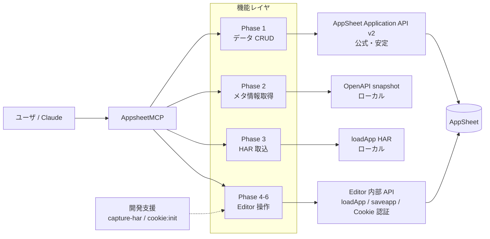
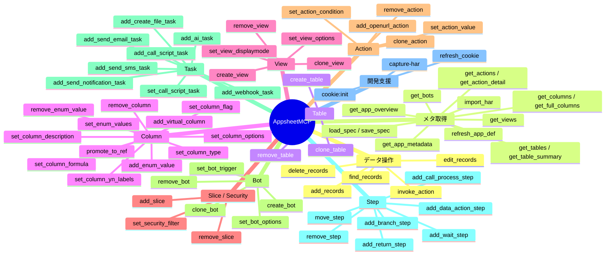

# AppsheetMCP — 機能マップ & プロンプト集

最終更新: 2026-05-06 (PR #14 / #15 反映)

このドキュメントは、AppsheetMCP が「何を」「どこまで」できるかをひと目で把握し、Claude / 他 MCP クライアントから効果的に活用するための実用例集である。

---

## 1. アーキテクチャ全体

レイヤごとの安定性:

| レイヤ | 用途 | 安定性 | 認証 |
|---|---|---|---|
| Phase 1 | レコード CRUD・Action invoke | 高 (公式 API) | Application Access Key |
| Phase 2 | メタ取得 (テーブル/列/Action/Bot 等) | 高 (snapshot) | 不要 |
| Phase 3 | アプリ定義フル取得 (HAR) | 高 (ローカル解析) | 不要 |
| Phase 4-6 | 構造変更 (write 系) | 中 (内部 API、仕様変更リスクあり) | Editor Cookie |

---

## 2. 機能マップ (mind map)

---

## 3. 出来る事 (Can do)

### 3.1 データ操作 — Application API v2 経由

| ツール | 内容 |
|---|---|
| `appsheet_find_records` | 行取得 (selector に AppSheet 式可) |
| `appsheet_add_records` | 行追加 |
| `appsheet_edit_records` | 行更新 (キー必須) |
| `appsheet_delete_records` | 行削除 |
| `appsheet_invoke_action` | 任意 Action 実行 |

### 3.2 メタ情報取得 — OpenAPI / loadApp ベース

| ツール | 内容 |
|---|---|
| `appsheet_load_spec` / `appsheet_save_spec` | snapshot 管理 |
| `appsheet_get_app_overview` | アプリ全体概要 |
| `appsheet_get_tables` / `appsheet_get_table_summary` | テーブル一覧/詳細 |
| `appsheet_get_columns` / `appsheet_get_full_columns` | 列一覧/詳細 |
| `appsheet_get_views` | View 一覧 |
| `appsheet_get_actions` / `appsheet_get_action_detail` | Action 一覧/詳細 |
| `appsheet_get_bots` | Bot 一覧 |
| `appsheet_get_app_metadata` | App 全体メタ |
| `appsheet_import_har` | DevTools HAR から定義抽出 |
| `appsheet_refresh_app_def` | Cookie 認証で loadApp |
| `appsheet_refresh_cookie` | Playwright で Cookie 自動更新 |

### 3.3 Table

| ツール | 内容 |
|---|---|
| `appsheet_create_table` | テーブル作成 |
| `appsheet_clone_table` | テーブル複製 |
| `appsheet_remove_table` | テーブル削除 |

### 3.4 Column

| ツール | 内容 |
|---|---|
| `appsheet_add_virtual_column` | 仮想列追加 |
| `appsheet_remove_column` | 列削除 |
| `appsheet_set_column_type` | 型変更 |
| `appsheet_set_column_flag` | フラグ系 (IsHidden/Searchable/IsLabel/...) |
| `appsheet_set_column_formula` | App formula / Initial value |
| `appsheet_set_column_description` | Description 更新 |
| `appsheet_set_column_options` | 任意プロパティ汎用 patch |
| `appsheet_set_column_yn_labels` | Yes/No 表示ラベル |
| `appsheet_promote_to_ref` | Ref 型昇格 |
| `appsheet_set_enum_values` / `add_enum_value` / `remove_enum_value` | Enum 値管理 |

### 3.5 View

| ツール | 内容 |
|---|---|
| `appsheet_create_view` | View 作成 (table/deck/card/detail/form/dashboard/chart/calendar/map/onboarding 全タイプ) |
| `appsheet_clone_view` | View 複製 |
| `appsheet_remove_view` | View 削除 |
| `appsheet_set_view_displaymode` | detail view DisplayMode |
| `appsheet_set_view_options` | 任意プロパティ汎用 patch |

### 3.6 Slice / Security

| ツール | 内容 |
|---|---|
| `appsheet_add_slice` | Slice 作成 |
| `appsheet_remove_slice` | Slice 削除 |
| `appsheet_set_security_filter` | Security filter 式 (仮想列自動検出) |

### 3.7 Action

| ツール | 内容 |
|---|---|
| `appsheet_clone_action` | Action クローン (5 サブタイプ複製可) |
| `appsheet_remove_action` | Action 削除 |
| `appsheet_add_openurl_action` | OpenURL Action 新規 |
| `appsheet_set_action_condition` | Condition 式更新 |
| `appsheet_set_action_value` | Value 式更新 |

### 3.8 Bot / Trigger

| ツール | 内容 |
|---|---|
| `appsheet_create_bot` | Bot 新規作成 |
| `appsheet_clone_bot` | Bot 複製 |
| `appsheet_remove_bot` | Bot 削除 |
| `appsheet_set_bot_options` | 名前/アイコン/コメント/有効無効 |
| `appsheet_set_bot_trigger` | DataChange ↔ Scheduled 切替 / cron / filterCondition |

### 3.9 Task (Bot 内処理)

| ツール | 内容 |
|---|---|
| `appsheet_add_send_email_task` | メール送信 (HTML/添付/template) |
| `appsheet_add_webhook_task` | Webhook 呼出 |
| `appsheet_add_send_notification_task` | Notification |
| `appsheet_add_send_sms_task` | SMS |
| `appsheet_add_create_file_task` | ファイル生成 (MakeDoc) |
| `appsheet_add_ai_task` | AI Task 4 タイプ (Summarize/Extract/Categorize/ExtractRows) |
| `appsheet_add_call_script_task` / `set_call_script_task` | AppsScript 呼出 |

### 3.10 Step (Bot Process フロー制御)

| ツール | 内容 |
|---|---|
| `appsheet_add_branch_step` | If/Else 分岐 |
| `appsheet_add_data_action_step` | データ操作 Step (5 サブタイプ: addRow/deleteRow/setColumn/refAction/composite) |
| `appsheet_add_call_process_step` | 別 Process 呼出 |
| `appsheet_add_return_step` | sub-process から値を返す |
| `appsheet_add_wait_step` | 待機 (Period/Condition/Event 3 サブタイプ) |
| `appsheet_remove_step` / `appsheet_move_step` | Step 削除・並び替え |

### 3.11 開発支援 (CLI)

| コマンド | 内容 |
|---|---|
| `npm run capture-har -- --label=... --app=... --app-name=...` | saveapp 自動傍受 → JSON 保存 |
| `npm run cookie:init` | 初回 Google ログイン (userDataDir 永続化) |

---

## 4. 出来ない事 (Cannot do)

### 4.1 Bot/Automation

- `add_foreach_step` — リスト/コレクション反復 Step (未実装、HAR 取得済み)
- `add_send_chat_task` — Google Chat / Slack 通知 (Email/Notification で代替可)
- 新規 Event 種別 — Forms / Gmail / Chat / AppSheetDb 等を独立 Event として追加するツール無し (DataChange / Scheduled は `set_bot_trigger` で対応)
- ネストした子 Step 操作 — Branch の IfNodes/ElseNodes 配下や ForEach 配下に Step を追加するツール無し (Editor 手動)
- Task の patch — `add_*_task` は新規作成のみ。既存 Task のプロパティ部分更新は `call_script_task` を除き未対応

### 4.2 Action

- 任意 Action の新規作成 (Add row / Set value / Delete row 等) — `clone_action` で複製してから `set_action_*` で編集する流れでカバー
- LinkToView / LinkToForm / GroupedAction の専用作成ツール無し

### 4.3 Column

- 物理列の追加 — `add_virtual_column` は仮想列のみ。物理列はデータソース (Google Sheet 等) 側で追加が必要
- 型変更時のデータマイグレーション — 型を変えるだけで既存データ変換はしない

### 4.4 View

- 各 View タイプの specialized ヘルパ無し — `create_view` + `set_view_options` で全タイプ作成可だが、type 別フィールド名を手で渡す必要あり
- Inline / Ref view の自動再生成詳細 — Editor 自動生成分は明示制御不可

### 4.5 Security / User

- Domain auth / SSO 設定 — 未対応
- Role / User group の作成・編集 — `set_security_filter` のみ。Role 単位の View/Action 制限は Editor

### 4.6 App-level Settings

- Branding / Theme / Welcome screen / Locale / Translation
- Sync settings / Offline cache
- Deploy / Stable version / 公開設定

### 4.7 物理データソース

- Google Sheet / SQL / Salesforce 接続変更 — 未対応

---

## 5. 制約・既知のリスク

| 項目 | 影響 |
|---|---|
| Phase 4 以降は AppSheet 内部 API (saveapp / loadApp) | 公式契約外。仕様変更で予告なく動かなくなる可能性 |
| Editor Cookie 認証 | 約 30 日で失効。`refresh_cookie` で自動更新可、Google OAuth 切れ時のみ手動 |
| 式は文字列ベース | サーバ側で再コンパイル。`Evaluatable` 展開は不可視 |
| 409 Version Conflict | `applyChangesAndSave` が最大 4 回までリトライ。並行 Editor 操作中は失敗の可能性 |
| dry-run / apply の二段運用 | 全書込み系ツールは既定 dry-run。`apply: true` 明示が必要 |
| 事後検証 | apply 後 loadApp で再取得して target 存在確認。不在時は `applied: false` を返す |

---

## 6. プロンプト集 100 種

実運用想定の例文集。**「テーブル名」「列名」など** はユーザのアプリに合わせて置き換えて使う。`apply: true` を付けないと dry-run になる点に注意。

### 6.1 データ操作 (10)

1. 顧客テーブルから 10 件取得して
2. 顧客テーブルから氏名に「田中」が含まれる行を全部取得
3. 売上テーブルの今月分を取得して合計金額を返して
4. ステータスが「完了」のタスクの件数を返して
5. 顧客テーブルに新規行を追加: 氏名='山田太郎', 電話='090-...'
6. 顧客 ID `123` の電話番号を `080-...` に更新 (apply: true)
7. 顧客 ID `456` を削除 (apply: true)
8. 「在庫補充」 Action を商品 ID `789` に対して実行
9. 予約テーブルの来週分を 50 件取得して CSV 形式で見せて
10. 売上テーブルの 2026-04 分のうち、ステータス='請求済' の行に対して 'マーク済' Action を一括実行

### 6.2 探索・把握 (10)

11. このアプリの全テーブル一覧と件数を見せて
12. 顧客テーブルの列構成と型を全部見せて
13. 顧客テーブルの列のうち式 (AppFormula) が入っているものだけ抽出
14. Action が一番多いテーブルは？上位 5 件を返して
15. 全 View の一覧を View タイプ別にカテゴライズして
16. 全 Bot の Trigger 種別 (DataChange / Scheduled) ごとにグループ化
17. アプリ全体の概要を 200 字以内で要約
18. 一度も参照されていない View を抽出して (Slice 経由・direct 両方含む)
19. 各 Slice の Filter 式に矛盾や非効率な OR 連鎖がないかチェック
20. アプリのデータベース ER 図を mermaid で出して (Ref 列でリレーション抽出)

### 6.3 Table / Column (15)

21. 新規テーブル '案件管理' を AppSheet 上で作成 (Google Sheet との接続別途)
22. 顧客テーブルから '一時テーブル' という名前でクローンを作って
23. 未使用の '一時テーブル' を削除 (apply: true)
24. 顧客テーブルの [年齢] 列の型を Number に変更
25. 顧客テーブルの [メモ] 列を Hidden に
26. 顧客テーブルに [合計売上] 仮想列を追加: `=SUM(関連[金額])`
27. 顧客テーブルから旧 [備考2] 列を削除
28. 顧客.[ステータス] の Valid_If を `区分 = 有効` に
29. 顧客.[電話] を Searchable にして
30. 顧客.[グレード] を Enum に変えて値リスト `['A','B','C']` を設定
31. 顧客.[グレード] に 'D' を追加
32. 案件.[担当者] を顧客テーブルへの Ref に昇格 (`promote_to_ref`)
33. 顧客.[フラグ] の Yes/No 表示を '有効/無効' に変更
34. 全テーブルの IsKey 列を一覧 (Key 設定の整合確認用)
35. 顧客.[名前] の Display name を '顧客氏名' に変更

### 6.4 View (10)

36. 顧客テーブル用の Card view '顧客カード' を Primary に作って (icon=fa-user)
37. 既存 '顧客一覧' view を 'Side-by-side' detail に変更
38. 未使用 View 'OldDashboard' を削除
39. Form View '顧客登録' で auto save を有効化
40. Dashboard View '管理画面' に View Entry を 3 個 (顧客一覧/案件一覧/今月売上) 追加
41. Detail View 'Customer_Detail' の Column order を `[氏名, 電話, メモ]` にして
42. Card View '顧客カード' のアイコンを 'fa-user' に
43. Calendar View '予約Calendar' を作成: Start=[予約日], End=[終了]
44. 顧客一覧 view から column `[内部 ID]` を非表示に
45. 顧客一覧 view を MENU 位置に移動

### 6.5 Slice / Security (7)

46. 顧客テーブルから `[ステータス = 有効]` の Slice を作成
47. Slice '無効客' を削除
48. 顧客テーブルの security filter を `担当者 = USEREMAIL()` に
49. Slice 'VIPだけ' を `[グレード = "A"]` で作成
50. 顧客テーブルから security filter を撤去 (空文字に設定)
51. 全 Slice の Filter 式を一覧してアクセス制御の網羅を確認
52. Slice 'Active' を 'Active_v2' にリネーム (clone+remove で代用)

### 6.6 Action (10)

53. 顧客.'Delete' Action を 'Soft Delete' としてクローンし、ColumnToEdit を `[論理削除フラグ]` に変更
54. 未使用 Action 'Test_Action' を削除
55. OpenURL Action '地図を開く' を `[住所]` 列で作成 (Google Maps URL)
56. Action 'Soft Delete' の Condition を `!_RowNumber = 1` に
57. Action 'Set値' の Value を `=NOW()` に変更
58. ModifiesData=true の Action だけ抽出してリストアップ
59. Action 'A 行追加' を Display_Inline 配置にしたい (clone 経由でオプション変更)
60. 顧客.Edit Action の Confirmation message を 'よろしいですか?' に
61. 顧客テーブルに紐づく Add Action と Edit Action を一覧
62. 全 Action のうち Display_Prominently のものを集計しダッシュボード化

### 6.7 Bot / Trigger (8)

63. 新 Bot '異常通知Bot' を作って Trigger は `ADDS_AND_UPDATES` で 'バイタル記録' テーブル監視
64. Bot '異常通知Bot' を 'Bak_異常通知Bot' でクローン
65. 未使用 Bot 'Test_Bot' を削除
66. Bot '異常通知Bot' を Disabled に
67. Bot '異常通知Bot' の Trigger を Scheduled に切替: cron=`0 9 * * *`, timeZone=`Tokyo Standard Time`
68. Bot '異常通知Bot' の filterCondition を `[体温] >= 38` に
69. Bot '異常通知Bot' のアイコンを 'fa-exclamation-triangle' に
70. 全 Bot を有効/無効ごとに集計、最終更新日順で並べて

### 6.8 Task (10)

71. Bot '異常通知Bot' の Process に Email Task '異常メール' を追加。To=`[担当者メール]`, Subject='異常検知', Body=template
72. Bot に Webhook Task 'Slack 通知' を追加。url=https://hooks.slack..., body=`'{"text":"異常: <<[体温]>>℃"}'`
73. Notification Task 'Push 通知' を Bot に追加 (To=`[担当者]`, Message='異常検知')
74. SMS Task '緊急SMS' を Bot に追加
75. CreateFile (PDF) Task '報告書PDF' を Bot に追加。Template=template.docx
76. AI Task 'Summarize' を Bot に追加: input=`[本文]`, output=`[要約]`, max=200字
77. AppsScript Task 'GAS 連携' を Bot に追加。functionName='postToWP'
78. AppsScript Task '既存Task' の functionName を 'newFn' に書換 (`set_call_script_task`)
79. Webhook Task 'Slack 通知' の Header に `Authorization: Bearer xxx` を追加
80. Email Task '異常メール' の本文を template.html ベースに切替

### 6.9 Step (8)

81. Process 'Process for 異常通知Bot' に Branch Step '高熱判定' (condition: `[体温] >= 38`) を追加
82. Process に DataAction Step '異常フラグON' (subtype=setColumn, `[異常フラグ]=TRUE`) を追加
83. Process に CallProcess Step '通知サブ呼出' を追加: target=`Sub_Process_通知`
84. Process に Return Step '結果返却' (returnValues=`[{name:"result", value:"ok"}]`) を追加
85. Process に Wait Step '5分待機' (waitNodeType=WaitForPeriod, period='0:05:00') を追加
86. Step 'Old_Step' を Process Nodes 内で先頭 (toIndex=0) に移動
87. Step 'Unused_Step' を削除 (依存 Task も自動削除)
88. Process の Step 一覧を順序付きで表示し、各 NodeType と StepName を一覧

### 6.10 開発支援・運用 (5)

89. AppSheet Cookie が古いので `appsheet_refresh_cookie` を実行
90. loadApp を再取得して snapshot を最新化 (`appsheet_refresh_app_def`)
91. 新ツール開発のため `npm run capture-har -- --label=add_xxx_step --app=<APP_ID> --app-name=<NAME>` を起動して saveapp を傍受
92. OpenAPI spec を最新化 (`appsheet_save_spec` 経由で snapshots/ に保存)
93. アプリ間で Action のクローン: 別 App から類似 Action を持ってくる (snapshot 比較 → clone_action)

### 6.11 複合シナリオ (12)

94. 顧客テーブルに新フィールド 3 つ追加 + 関連 view (一覧/詳細) も作って
95. 新規 Bot をゼロから構築: テーブル変更を監視 → 高熱判定 Branch → メール送信 → Slack 通知 を一括
96. 既存アプリを別 ID で雛形クローン (テーブル/View/Action を順次クローン)
97. 全 Bot に対して AI 要約 Task を一斉追加
98. 未使用 column / view / action / slice を全部洗い出して削除提案リストを作成 (apply はしない)
99. セキュリティ監査: 全 Slice + SecurityFilter の式を一覧、`USEREMAIL()` / `USERROLE()` 利用状況を集計
100. アプリ全体の月次改修ログ: Bot/Trigger/Step の add/remove 履歴を git log と照合して CSV 出力

### 6.12 高度プロンプティング Tips

- **dry-run 必須**: 書込み系は最初 `apply: false` で結果を確認、安全と判断したら `apply: true` で本番反映。
- **Process Tree 把握**: Step 追加前に `appsheet_get_bots` + `appsheet_refresh_app_def` で現状の Nodes を把握しておくと、step 名衝突や順序ミスが減る。
- **複数アプリ運用**: `.env` に `APPSHEET_ACCESS_KEY__<App ID>` を追加すれば、ツール呼出時に `appId` 引数を変えるだけで切替可能。
- **大規模変更**: 1 操作ずつ apply して loadApp で事後確認 → 次へ、の repetition を Claude に任せる方が事故が少ない (一括ロールアウトより安全)。
- **HAR 取得**: 新ツール開発時は `npm run capture-har` でユーザは Editor を普通に操作するだけ。DevTools 不要。

---

## 7. 関連 PR / ドキュメント

| 項目 | リンク |
|---|---|
| データ Action Step | [PR #14](https://github.com/lab-masuyama/AppsheetMCP/pull/14) |
| Call Process / Return / Wait Step | [PR #15](https://github.com/lab-masuyama/AppsheetMCP/pull/15) |
| README | [README.md](../README.md) |
| ベストプラクティス | [appsheet-best-practices.md](./appsheet-best-practices.md) |
| クックブック | [appsheet-mcp-cookbook.md](./appsheet-mcp-cookbook.md) |
| AppSheet 内部仕様 | [appsheet-spec.md](./appsheet-spec.md) |

---

## 8. 結論

AppSheet アプリの **データ操作 / 構造編集 / Bot 自動化** は MCP からほぼ完全に制御できるレベルに到達。残るのは:

- foreach Step (フロー制御の最後 1 ピース)
- chat task (代替手段あり)
- App-level 設定 (使用頻度低)

実運用シナリオの大半は本ドキュメント記載のツールの組合せで解決できる。
