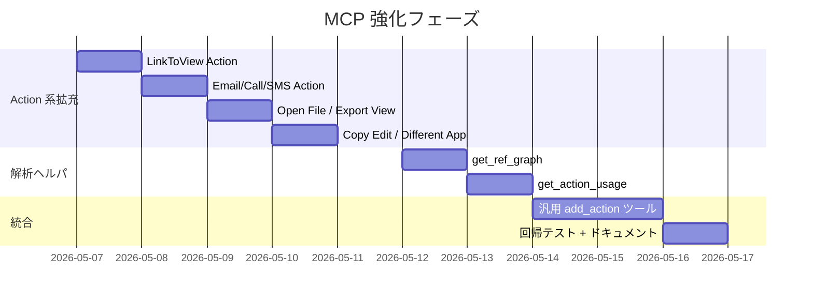

# 本番アプリ観察 — 共通パターンと MCP 強化提案

最終更新: 2026-05-06
解析対象: 歯科訪問診療システム (81 テーブル / 296 Action / 18 Bot) + HopeCareDX (72 テーブル / 290 Action / 9 Bot)

ローカル snapshot を Phase 4 (`fetchLoadApp` + Cookie 認証) で取得し、構造を集計した結果。実データ行は読み込まずスキーマ・式・関係性のみ解析。

---

## 1. エグゼクティブサマリ

```
両アプリ合算 Action 586 件、VC 334 件、Slice 52 件、Bot 27 件、関数式約 4,500 箇所
```

**最大の発見**: 現状 MCP がカバーしている Action タイプは全 16 種類中 **5 種類のみ**。実本番では `NAVIGATE_APP` (LinkToView) が **138 件**で最頻出だが、MCP に対応ツール無し。

**改善ポテンシャル**: Action 系で 7-8 個の新ツール追加で、本番アプリ Action の **約 80% を MCP から作成可能**になる。

---

## 2. (a) Action パターン解析

### 2.1 ActionType 分布 (両アプリ合算)

| ActionType | 歯科 | HopeCareDX | 合計 | 割合 | MCP 対応 |
|---|---:|---:|---:|---:|---|
| **NAVIGATE_APP** (LinkToView) | 62 | 76 | 138 | 23.5% | × **未対応** |
| **SET_COLUMN_VALUE** | 68 | 34 | 102 | 17.4% | ○ `add_data_action_step` |
| **EDIT_RECORD** (System) | 33 | 35 | 68 | 11.6% | △ system Action なので新規作成不可・編集のみ |
| **ADD_RECORD** (System) | 32 | 30 | 62 | 10.6% | △ 同上 |
| **DELETE_RECORD** (System) | 23 | 24 | 47 | 8.0% | △ 同上 (`add_data_action_step deleteRow` で別途作成可) |
| **REF_ACTION** | 27 | 1 | 28 | 4.8% | ○ `add_data_action_step refAction` |
| **NAVIGATE_URL** | 1 | 24 | 25 | 4.3% | ○ `add_openurl_action` |
| **EMAIL** (Compose Email) | 12 | 10 | 22 | 3.8% | × **未対応** |
| **CALL** (Phone dial) | 6 | 16 | 22 | 3.8% | × **未対応** |
| **SMS** (Send SMS) | 6 | 16 | 22 | 3.8% | × **未対応** |
| **OPEN_FILE** | 7 | 6 | 13 | 2.2% | × **未対応** |
| **EXPORT_VIEW** (CSV 出力) | 7 | 4 | 11 | 1.9% | × **未対応** |
| **COMPOSITE** | 7 | 2 | 9 | 1.5% | ○ `add_data_action_step composite` |
| **NAVIGATE_DIFFERENT_APP** | 1 | 5 | 6 | 1.0% | × 未対応 |
| **COPY_EDIT_ROW** | 3 | 3 | 6 | 1.0% | × **未対応** |
| **ADD_RECORD_TO** | 0 | 3 | 3 | 0.5% | ○ `add_data_action_step addRow` |
| **IMPORT_FILE** | 1 | 1 | 2 | 0.3% | × 未対応 |

**現 MCP カバレッジ**: 102+28+25+9+3 = **約 167 / 586 = 28.5%** (新規作成可能ベース)。

### 2.2 Bot 連動パターン

| 観察事項 | 数値 |
|---|---|
| Bot Process Step (RUN_ACTION) からの Action 参照 | 49 件 (歯科 37 + HopeCareDX 12) |
| 単一 Action が複数 Bot/Composite/Ref から参照される hub Action | 歯科 15 件 / HopeCareDX 0 件 |

**業務パターン例 (歯科)**:
- `入金消込フラグyes` Action: Ref から 5 回 + Bot から 1 回 = 6 経路で再利用 (フラグ変更を中央集約)
- `Action for 請求書PDFパス消去`: Bot 専用、PDF 生成完了後の状態クリア

**業務パターン例 (HopeCareDX)**:
- `Action for ケース追加処理`: Bot 専用。ケース追加後の派生処理 (展開・フラグ・通知)
- `Action for 自動フラグFALSE`: 状態リセット

→ **パターン**: Bot 専用 Action は `Action for <処理名>` の命名規約。Ref/Composite から呼ばれる Action は業務名直書き。

### 2.3 Action 命名規約 (両アプリ共通)

| 規約 | 例 | 用途 |
|---|---|---|
| `Action for <処理名>` | `Action for 自動フラグFALSE` | Bot から呼ぶ内部処理 |
| `<処理>_完` `<処理>_yes/no` | `領収出力フラグyes` / `CSV_完` | フラグ系の結果ステート遷移 |
| `Compose Email (<列名>)` | `Compose Email (UserMail)` | EMAIL Action (列指定の通信) |
| `View Ref (<参照ID列>)` | `View Ref (訪問種別ID)` | NAVIGATE_APP (詳細画面遷移) |
| `View Map (<住所列>)` | `View Map (所在地)` | NAVIGATE_APP (Map 表示) |
| `Open File (<ファイル列>)` | `Open File (請求書PDF)` | OPEN_FILE |
| `CSV出力_<対象>` | `CSV出力_ケアマネ` | EXPORT_VIEW |
| `<業務> Action - 1` | `入金消込フラグyes Action - 1` | Editor 自動命名 (Bot Process 内 Step 由来) |

---

## 3. (b) リレーション解析

### 3.1 Slice → ソーステーブル分布

| アプリ | Slice 数 | 集中ソーステーブル例 |
|---|---:|---|
| 歯科 | 30 | `請求データ` (6 件), `保留登録予定日` (4), `請求ユニーク` (3) |
| HopeCareDX | 22 | (snapshot に sliceRefs.source 検出されるテーブル) |

**業務パターン**: 1 つの "請求データ" 系テーブルから状態別 Slice (`請求＿済` / `入金＿済` / `領収＿済` / `請求＿保留` 等) を多重に派生させる構成。同じ source table から「フラグの組合せ別」Slice を量産するのが本番運用の典型。

### 3.2 Bot Process と Action のグラフ

両アプリで Bot は中規模 (歯科 18, HopeCareDX 9) ながら、Process Step から呼ばれる Action は限定的 (歯科 37, HopeCareDX 12)。多くの Action は View ボタンから直接呼ばれており、Bot は **状態遷移と通知の自動化** に集中している。

### 3.3 Ref 関係抽出 (簡易)

snapshot の `DataSchemas[].Attributes[].TypeAuxData` から `ReferencedTableName` を抽出する経路は本解析で 0 件しか取れず (snapshot 構造が想定と異なる)、Ref グラフは未生成。これは MCP 強化の解析ヘルパ追加で別途取り組む。`appsheet_get_full_columns` の result から `RefersTo` 抽出する方が確実。

---

## 4. (c) よく使われる関数式パターン

### 4.1 関数頻度トップ 20 (両アプリ合算)

| 関数 | 歯科 | HopeCareDX | 合計 | 主用途 |
|---|---:|---:|---:|---|
| **SUBSTITUTE** | 430 | 41 | **471** | テンプレート文字列置換 (Email Action / PDF body 大量利用) |
| **AND** | 232 | 350 | 582 | 条件結合 |
| **OR** | 174 | 17 | 191 | 条件分岐 |
| **IF** | 129 | 84 | 213 | 三項分岐 |
| **TEXT** | 92 | 46 | 138 | 日付・数値フォーマット |
| **NOT** | 81 | 126 | 207 | 否定 |
| **REF_ROWS** | 56 | 47 | 103 | 関連行 (VC で多用) |
| **ISBLANK** | 95 | (低) | 95+ | NULL チェック |
| **SELECT** | 85 | (中) | 85+ | リストフィルタ |
| **CONTEXT** | 66 | 7 | 73 | デバイス/Host 情報 |
| **USEREMAIL** | 48 | 14 | 62 | ログインユーザ識別 |
| **COUNT** | 42 | 22 | 64 | 件数 |
| **ANY** | 34 | 33 | 67 | リストの先頭抽出 |
| **LOOKUP** | 31 | (低) | 31 | 単一値検索 |
| **CONCATENATE** | 20 | 18 | 38 | 文字列連結 |
| **ORDERBY** | 0 | 48 | 48 | リストソート |
| **MAXROW** | 10 | (低) | 10+ | 最大値の行抽出 |
| **EOMONTH** | (低) | 12 | 12+ | 月末計算 |
| **IFS** | 13 | 10 | 23 | 多分岐 (新しい IF) |
| **NOW/TODAY** | 37 | 17 | 54 | 現在日時 |

### 4.2 イディオム (定型構文)

実運用で繰り返し現れる「型」:

#### a. 利用者識別 (Per User Settings)
```
USEREMAIL()
=ANY(SELECT(職員リスト[Row ID], [メールアドレス] = USEREMAIL()))
=LOOKUP(USEREMAIL(), "職員リスト", "メールアドレス", "氏名")
```

#### b. 関連行抽出 (RelatedX 自動生成 + 派生)
```
REF_ROWS("子テーブル", "親ID")                    -- Editor 自動生成
=SELECT(子テーブル[ID], [親ID] = [_THISROW].[ID])  -- 手動条件付き
=ORDERBY(SELECT(子テーブル[ID], 条件), [日付], TRUE)  -- ソート付き
```

#### c. 最新行ルックアップ
```
=ANY(SELECT(請求情報[支払方法], AND([利用者ID]=[_THISROW].[利用者ID], [最新(請求情報)]=TRUE)))
```
**パターン**: `[最新]=TRUE` フラグ列を更新系 Bot で立て、VC は ANY+SELECT で取得。

#### d. 日付フォーマット
```
=TEXT([日付], "YYYY/MM/DD")
=TEXT([誕生日], "yyyy")  -- 年だけ
TEXT([日付],YYYYMMDD)&"_"&[ID]&"_"&[名前]  -- 連結キー生成
```

#### e. 重複チェック (Valid_If)
```
=IF([_THISROW].[重複フラグ]<>TRUE,
    ISBLANK(LOOKUP([_THISROW].[患者番号],"患者リスト","患者番号","患者番号")),
    TRUE)
```
**パターン**: 重複登録防止の典型形。LOOKUP で同じキーを探して ISBLANK の真偽で判定。

#### f. 条件付き編集不可
```
=FALSE                 -- 完全に Editable_If = false (常に編集不可)
=IF([_THISROW].[フラグ]="終了", TRUE, FALSE)  -- 終了状態は編集不可化
```

#### g. 文字列テンプレート (Email/PDF body)
```
SUBSTITUTE(SUBSTITUTE(template, "<<患者名>>", [患者名]), "<<日付>>", TEXT([日付],"YYYY-MM-DD"))
```
歯科で SUBSTITUTE が 430 回出現 = 帳票テンプレート文字列の量産パターン。

---

## 5. (d) 仮想列 (Virtual Column) パターン

両アプリで **VC 計 334 件** (歯科 231 + HopeCareDX 103)。

### 5.1 パターン分布

| パターン | 歯科 | HopeCareDX | 合計 | 比率 | 自動 / 手動 |
|---|---:|---:|---:|---:|---|
| **REF_ROWS** (関連行) | 54 | 47 | 101 | 30% | 主に自動 (Editor 生成) |
| **LOOKUP / SELECT** (横断検索) | 42 | 16 | 58 | 17% | 手動 (業務式) |
| **CONCATENATE / TEXT** (表示文字列) | 42 | 15 | 57 | 17% | 手動 |
| **listAggregate** (SUM/COUNT/AVG/MAX/MIN) | 32 | 3 | 35 | 10% | 手動 |
| **条件分岐** (IF/IFS) | 20 | 6 | 26 | 8% | 手動 |
| **その他** | 39 | 16 | 55 | 16% | 静的文字列含む案内ガイドなど |
| **日付計算** | 2 | 0 | 2 | <1% | 手動 |

### 5.2 業務パターン (頻出順)

#### A. 関連子レコード一覧 (`Related X`s)
```
REF_ROWS("子テーブル", "親ID")
```
最頻出。Editor が Ref 列 (IsPartOf) 検出時に自動生成。MCP からは `appsheet_promote_to_ref` 後に Editor が作る (現状観測)。

#### B. 親レコードからの最新値取得
```
=ANY(SELECT(請求情報[支払方法], AND([利用者ID]=[_THISROW].[利用者ID], [最新]=TRUE)))
```
利用者 → 最新請求情報 → その支払方法、のような **クロステーブル「最新値」取得**。

#### C. 親情報のスナップショット
```
=LOOKUP([_THISROW].[患者番号], "最新請求データ", "患者番号", "担当医")
=TEXT(LOOKUP([_THISROW].[患者番号], "最新請求データ", "患者番号", "訪問先"))
```
LOOKUP 単発のシンプル参照は VC で多用される。

#### D. 表示用集約 (Detail view ヘッダ)
```
=[性] & " " & [名] & " " & [せい] & " " & [めい]
=TEXT([職員コード]) & "_" & [性] & " " & [名]
```
Detail view の上部見出し用に「氏名 + ID」の連結文字列を VC に持たせる。

#### E. UI ガイド文字列 (静的)
```
="① 生成する帳票レコード"
="④ AIへのプロンプト追加等のシステム設定を行えます"
```
HopeCareDX で多用。Form view のセクション見出し用に静的 VC を仕込んで `[VC案内]` を Show するパターン。

#### F. 条件付きステータス文字列
```
=if(isnotblank([生年月日]),
   concatenate(text([生年月日],"yyyy/mm/dd"),"（", text(floor(...年齢計算...)),"歳）"),
   "")
```
誕生日 → 年号換算・年齢計算を含む長尺フォーマット文字列。

---

## 6. MCP ツール強化提案

### 6.1 高優先 (Quick wins, 高 impact)

新規追加すべき Action 系ツール:

| ツール (案) | カバー件数 | 実装難度 | 備考 |
|---|---:|---:|---|
| `add_link_to_view_action` | **138** | 中 | NAVIGATE_APP、最頻出。target view + key 渡し |
| `add_email_action` | 22 | 低 | EMAIL、UI ボタンで Compose Email 起動 |
| `add_call_action` | 22 | 低 | CALL、電話番号列指定だけ |
| `add_sms_action` | 22 | 低 | SMS、同上 |
| `add_export_view_action` | 11 | 低 | EXPORT_VIEW、CSV 出力 |
| `add_open_file_action` | 13 | 低 | OPEN_FILE、PDF/ファイル列指定 |
| `add_copy_edit_action` | 6 | 低 | COPY_EDIT_ROW、複製ボタン |
| `add_navigate_different_app_action` | 6 | 低 | NAVIGATE_DIFFERENT_APP |

合計で **+240 件 / 586 件 = 41%** 追加カバー → 5 + 240 ≒ 70% 超に到達。

### 6.2 中優先 (アーキテクチャ整理)

- **`add_action` (汎用統合ツール)** — discriminated union で全 ActionType を 1 ツールに統合 (`add_data_action_step` と同様の設計)。引数 `actionType: "linkToView" | "email" | "call" | "sms" | ...` で分岐。

### 6.3 解析ヘルパの追加

- **`get_ref_graph`** — `appsheet_get_full_columns` の `RefersTo` から Ref グラフを抽出して mermaid 出力。本解析で漏れたレイヤを補完
- **`get_action_usage`** — 指定 Action の参照箇所 (View / Bot Step / Composite / Ref) を一覧
- **`get_formula_usage`** — 関数名指定で全式を grep (例: `USEREMAIL` 利用箇所)

### 6.4 ドキュメント拡充

- 本ファイル `docs/COMMON-PATTERNS.md` を Claude が参照する形で活用
- `docs/CAPABILITIES.md` のプロンプト集に「業務パターン頻出形」を追加 (例: 「最新請求情報の支払方法を VC に取り出す式は `=ANY(SELECT(...))` パターン」)

---

## 7. 強化 PR ロードマップ案



合計約 **1 週間程度** (1 機能 1 セッションペース) で本番アプリの Action カバレッジが 80% 以上に到達。

---

## 8. 補足: 業務パターン早見表

### 8.1 「フラグ駆動の状態管理」(歯科典型例)

```
Action: [請求＿済フラグyes]   (SET_COLUMN_VALUE [請求＿済フラグ]=TRUE)
Bot:    [請求書発行] → 請求＿済フラグyes Action 呼出
Slice:  [請求＿済]            (Filter: [請求＿済フラグ]=TRUE)
View:   "請求済一覧"          (source: [請求＿済] Slice)
```

### 8.2 「Ref + Slice + 階層 view」(両アプリ共通)

```
親テーブル "ケース記録" -- 子テーブル "支援記録マスタ" (Ref [ケース記録ID], IsPartOf=true)
                          -- 孫テーブル "支援記録マスタ子レコード" (Ref [支援記録マスタID], IsPartOf=true)
VC: 親.[Related 支援記録マスタs] = REF_ROWS("支援記録マスタ", "ケース記録ID")
View: 親 detail view -> Inline view of [Related 支援記録マスタs]
```

### 8.3 「メール / SMS / 電話の列駆動 Action」

```
列: [メールアドレス], [電話番号]
Action 自動生成: "Compose Email (メールアドレス)" / "Call Phone (電話番号)" / "Send SMS (電話番号)"
View: Detail view → 上記 3 アクション ボタン表示
```

→ 列タイプ Email/Phone を設定すると Editor が自動で 3 種類の Action 生成。**MCP からは現状こちらを再現できない** (`add_email_action` 等の追加で対応可能)。

---

## 9. 次のアクション

1. 本ドキュメント (`docs/COMMON-PATTERNS.md`) を git push
2. 高優先 Action 系ツール 5-8 個を 1-2 PR にまとめて実装着手
3. `docs/CAPABILITIES.md` のプロンプト集に「業務パターン編」セクション追加
4. 解析ヘルパ (`get_ref_graph` 等) は段階的に追加

このドキュメントは静的な観察記録ではなく、**MCP の改善ロードマップの根拠**として継続更新する想定。新しい本番アプリを観察したら追記する。
