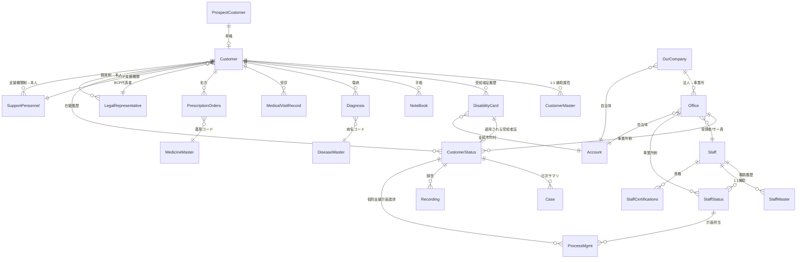

# Salesforce データモデル現状調査レポート

> **対象組織**: 社会福祉法人 愛の集い学園（`ainotudoi-prod` / Org ID `00Dd500000BHTwvEAH`）
> **取得元**: `sf sobject describe`（24 個 + 1）と SOQL（読み取り専用、合計 ~15 コール以内）
> **取得 JSON**: `C:/tmp/sf-describe-*.json`
> **調査日**: 2026-06-22

## サマリ

- 全 24 カスタムオブジェクト（命令対象）+ ForecastingItem__hd / Opportunity__hd（既存履歴オブジェクト）= **25 オブジェクトを describe 取得済み**。
- カスタム Flow / Apex Trigger は **0 件**（自動化ロジックが未実装の素の構造）。
- Validation Rule は **5 件**（DisabilityCard__c に 2 件、Office__c に 3 件・うち 1 件 inactive）。
- レコード件数は事実上空（Customer 1, Office 2, Staff 3）で **本稼働前の設計段階**。
- `ServiceType__c` ピックリストは **Office__c の 1 箇所のみが実体**（29 値）。CustomerStatus / StaffStatus の同名項目は Office から TEXT 経由で引く Formula。
- **入所系3サービス追加計画とのギャップ**: 「福祉型障害児入所施設」「日中一時支援」のいずれも 29 値の中に**現状無い**ことを実機確認。`UpperLimitMgmt__c` は有/無のみで「上限管理事業所参照」項目が無く、`FacilityPaymentAmount__c` 等は施設入所支援だけに専用フィールドが存在する非対称設計。

---

## §1. オブジェクト責務マップ

### 利用者系（5）
| Object | Label | 責務 |
|---|---|---|
| `ProspectCustomer__c` | 見込み利用者 | 相談受付段階の見込みデータ。`Customer__c` に昇格する前段 |
| `Customer__c` | 利用者 | 本人マスタ（氏名・生年月日・性別・出生地・BCP 関係者参照） |
| `CustomerMaster__c` | 利用者マスタ | 障害種別 1〜3 等の補助属性（Customer__c に 1:1 で吊るす） |
| `CustomerStatus__c` | 利用者在籍状況 | 利用者 × 事業所 × 受給者証 × 期間の **契約・在籍レコード**（事実上 SF 内の請求/実績集計の起点）|
| `LegalRepresentative__c` | 親族等関係者 | 利用者の家族・後見人など。BCP 連絡先として Customer__c から参照される |

### 障害手帳・受給者証系（2）
| Object | Label | 責務 |
|---|---|---|
| `DisabilityCard__c` | 受給者証 | 公的決定情報。種別・障害区分・有効期間・モニタリング期間・上限管理有無・各種支給額 |
| `NoteBook__c` | 手帳 | 身体・療育・精神障害者手帳（種別/等級） |

### 事業所系（2）
| Object | Label | 責務 |
|---|---|---|
| `OurCompany__c` | 自組織 | 法人本体（管理者 Staff 参照・自治体参照） |
| `Office__c` | 事業所 | 事業所（事業所番号・**サービス種別 picklist の SoR**・サービス管理責任者・管理者） |

### 職員系（5）
| Object | Label | 責務 |
|---|---|---|
| `Staff__c` | 職員 | 本人マスタ（氏名・生年月日・性別・入退社） |
| `StaffMaster__c` | 職員マスタ | 補助属性（Staff__c に 1:1） |
| `StaffStatus__c` | 職員在籍状況 | 職員 × 事業所 × 期間 × 職種（25 値の職種ピックリスト）|
| `StaffCertifications__c` | 職員資格管理 | 介護福祉士・社会福祉士など 24 種の資格を職員ごとに保持 |
| `SupportPersonnel__c` | 支援機関等関係者 | 外部支援機関の担当者連絡先（Customer 側から参照される） |

### 医療系（5）
| Object | Label | 責務 |
|---|---|---|
| `MedicalVisitRecord__c` | 受診記録 | 通院記録（32 値の診療科 picklist） |
| `Diagnosis__c` | 傷病名 | 利用者ごとの確定/疑い病名（DiseaseMaster 参照） |
| `DiseaseMaster__c` | 傷病名マスタ | 病名コード辞書 |
| `PrescriptionOrders__c` | 処方・オーダー | 服薬指示（用法・タイミング 11 値・単位 9 値） |
| `MedicineMaster__c` | 医薬品マスタ | 医薬品コード辞書 |

### 業務記録系（4）
| Object | Label | 責務 |
|---|---|---|
| `Recording__c` | 録音記録 | 録音 SoR（音声ファイルID・録音日時・処理ステータス・文字起こし結果テキスト） |
| `Case__c` | 記録 | 「今日の全ての記録」と「1日の要約」を保持する**日次サマリ**（テキスト 131,072 文字 ×2） |
| `NoteBook__c` | 手帳 | （上掲：手帳系） |
| `ProcessMgmt__c` | プロセス管理 | 個別支援計画の進捗（経過月 14 値・進捗 2 値、利用者/事業所/職員 4 参照を持つ広域オブジェクト） |

### その他（3）
| Object | Label | 責務 |
|---|---|---|
| `In_App_Checklist_Settings__c` | アプリ内チェックリスト設定 | Custom Setting（システム） |
| `ForecastingItem__hd` | 売上予測（履歴） | 標準オブジェクトのフィールド履歴 |
| `Opportunity__hd` | 商談（履歴） | 標準オブジェクトのフィールド履歴 |

---

## §2. 主要オブジェクト完全項目表（8 オブジェクト）

> Owner / CreatedBy / LastModifiedBy / IsDeleted / SystemModstamp など標準監査列は省略。`[REQ]` は NOT NULL、`[F]` は Formula、`[U]` は Unique。

### 2.1 Customer__c（利用者・38 項目）

| API Name | Label | Type | 備考 |
|---|---|---|---|
| Name | 利用者名 | string(80) | |
| CustomerCode__c | 利用者コード | string(30) [REQ] | |
| Customer_ID18__c | 利用者_ID18 | string [F] | |
| Birthday__c | 生年月日 | date | |
| Age__c | 年齢 | double [F] | TODAY() - Birthday__c |
| LastName__c / FirstName__c / MiddleName__c | 姓/名/ミドル | string(100) × 3 | |
| LastNameFurigana__c / FirstNameFurigana__c | 姓/名（ふりがな） | string(100) × 2 | |
| Furigana__c / HankakuKana__c / ZenkakuKana__c | 各種かな展開 | string [F] × 3 | |
| Gender__c | 性別 | picklist | `男性, 女性` |
| ForeignBackground__c | 外国ルーツ | picklist | `ルーツ有, ルーツ無` |
| PlaceOfBirth__c | 出生地 | picklist | `日本, 日本以外` |
| UserStatus__c | 利用者状況 | picklist | `相談受付 / 利用中（通常） / 利用中（入院） / 利用中（一時休止） / サービス利用中断 / 連絡不通 / 利用終了（自立） / 利用終了（転居） / 利用終了（他事業所へ移行） / 利用終了（施設入所） / 利用終了（医療機関入院） / 死亡` |
| PriorityBCP__c | BCP 支援優先度 | picklist | `高, 中, 低` |
| ProspectCustomer__c | 見込み利用者 | reference | → ProspectCustomer__c |
| LegalRepresentative__c | 親族等関係者（BCP） | reference | → LegalRepresentative__c |
| SupportPersonnel__c | 支援機関等関係者（BCP） | reference | → SupportPersonnel__c |
| LegalRepresentative*Name / Phone / Relationship*__c | 〃 表示用 | string [F] × 3 | |
| SupportPersonnel*Name / Phone / Relationship*__c | 〃 表示用 | string [F] × 3 | |

### 2.2 CustomerStatus__c（利用者在籍状況・32 項目）— 業務上の中心ハブ

| API Name | Label | Type | 備考 |
|---|---|---|---|
| Name | 在籍状況コード | string(80) [REQ] | |
| Customer__c | 利用者 | reference [REQ?] | → Customer__c |
| Office__c | 事業所 | reference | → Office__c |
| DisabilityCard__c | 受給者証 | reference | → DisabilityCard__c |
| StartDate__c / EndDate__c | 利用開始日 / 終了日 | date × 2 | |
| Status__c | 在籍状況 | string [F] | `StartDate <= TODAY <= EndDate → "在籍中"、EndDate < TODAY → "退所済"` |
| ServiceType__c | サービス種別 | string [F] | `TEXT(Office__r.ServiceType__c)` ← **Office から間接取得** |
| GoogleURL__c | Google フォルダ | url | |
| CustomerStatus_ID18__c / GoogleFolderName__c / Title__c | システム名称 | string [F] × 3 | |
| CustomerName__c / NameKana__c / KanaName__c / CustomerNameFurigana__c / HankakuKana__c / ZenkakuKana__c | 利用者氏名展開 | string [F] × 6 | |
| OfficeName__c | 事業所名（参照表示） | string [F] | |
| Gender__c / Age__c | 性別 / 年齢 | string [F] / double [F] | Customer__r から引く |

### 2.3 DisabilityCard__c（受給者証・61 項目）— 最多項目

| API Name | Label | Type | 備考 |
|---|---|---|---|
| Name | 受給者証コード | string(80) [REQ] | |
| Customer__c | 利用者 | reference | → Customer__c |
| JukyuNumber__c | 受給者証番号 | string(10) | **VR: 半角数字** |
| JukyuNumber_system__c | 〃 数値版 | double | |
| Type__c | 種別 | picklist | `障害福祉サービス受給者証, 障害児通所受給者証, 地域生活支援事業受給者証` |
| DisabilityCategory__c | 障害支援区分 | picklist | `非該当, 区分1〜6` |
| DisabilityCategoryStart__c / End__c | 障害区分期間 | date × 2 | |
| DeliveryDate__c | 交付年月日 | date | |
| CertPeriodStart__c / End__c | 認定期間 | date × 2 | |
| SupportStart__c / End__c | 相談支援期間 | date × 2 | |
| UserChargeStart__c / End__c | 利用負担期間 | date × 2 | |
| UpperLimitAmount__c | 負担上限月額 | string(10) | **VR: 半角数字** |
| UpperLimitAmount_system__c | 〃 数値版 | double | |
| UpperLimitMgmt__c | 上限管理 | picklist | `有, 無` ← **「どの事業所が上限管理事業所か」を保持する参照は無い** |
| MealProvisionMgmt__c | 食事加算 | picklist | `有, 無` |
| RegionalMgmt__c | 特別地域加算 | picklist | `有, 無` |
| FacilityPaymentAmount__c | 施設入所支援支給額 | currency | **施設入所支援専用フィールド** |
| GHPaymentAmount__c | 共同生活援助又は重度障害者等包括支援支給額 | currency | **GH/重度包括専用フィールド** |
| MunicipalityMaster__c | 支給市町村 | reference | → Account |
| GuardianName__c / GuardianFurigana__c | 保護者氏名 / かな | string(200) × 2 | |
| MonitoringPeriod__c | モニタリング期間 | picklist | `1ヶ月〜12ヶ月` |
| MonitoringTiming__c | モニタリング時期 | string(100) | |
| Monitoring{This,Last,1〜12}Month{Later}__c | 13 個のモニタリング状況 | picklist × 13 | 各 `〇, 〇手, 〇終` |
| Valid__c | 有効 | boolean [REQ] | |
| DisabilityCardFolder__c | 受給者証フォルダ | url | |
| 派生 Formula 6 項目 | 利用者氏名 / ふりがな / カナ / 市町村名 / 市町村番号 / Title / ID18 | string [F] | |

> **重要**: 「支給量（日数/月）」を直接保持する numeric 列が無い。代わりに `FacilityPaymentAmount__c`（円）と `GHPaymentAmount__c`（円）が **金額** で持っており、日数ベースのサービスごとの支給量管理は現状未設計。

### 2.4 Office__c（事業所・28 項目）

| API Name | Label | Type | 備考 |
|---|---|---|---|
| Name | 事業所名 | string(80) | |
| OfficeNumber__c | 事業所番号 | string(10) | **VR: 半角数字 10 桁** |
| Address__c | 住所 | textarea(255) | |
| Furigana__c | ふりがな | textarea(255) | |
| PostCode__c | 郵便番号 | string(8) | **VR: 半角 0000000 形式** |
| Phone__c / FAX__c | 電話 / FAX | phone × 2 | |
| OfficeOpeningDate__c | 開所日 | date | |
| OfficeYearsPassed__c | 経過年数 | double [F] | |
| OurCompany__c | 自組織 | reference | → OurCompany__c |
| MunicipalityMaster__c | 自治体 | reference | → Account |
| Administrator__c | 管理者 | reference | → Staff__c |
| ServiceManager__c | サービス管理責任者 | reference | → Staff__c |
| **ServiceType__c** | **サービス種別** | **picklist (29 値)** | **§3 参照。SoR はここのみ** |
| GoogleURL__c | Google フォルダ | url | |
| UseFlag__c | 使用フラグ | boolean [REQ] | |
| OurOfficeName__c | 表示名 | string [F] | |

### 2.5 Staff__c（職員・27 項目）

| API Name | Label | Type | 備考 |
|---|---|---|---|
| Name | 職員名 | string(80) | |
| StaffCode__c | 職員コード | string(30) [REQ] | |
| LastName / FirstName / *Furigana / Furigana / HankakuKana 一式 | 氏名展開 | string / string [F] | Customer と同パターン |
| Birthday__c | 生年月日 | date | |
| Age__c | 年齢 | double [F] | |
| Gender__c | 性別 | picklist | `男性, 女性` |
| EmploymentType__c | 雇用形態 | picklist | `正社員, 契約社員, 派遣社員, アルバイト, パート, 嘱託社員, その他` |
| AdmissionDate__c / LeaveDate__c | 入社日 / 退社日 | date × 2 | |
| Status__c | 在籍状況 | string [F] | 入退社日から導出 |
| UserMail__c | メール | email(80) | |

### 2.6 StaffStatus__c（職員在籍状況・30 項目）

| API Name | Label | Type | 備考 |
|---|---|---|---|
| Name | 在籍状況コード | string(80) [REQ] | |
| Staff__c | 職員 | reference | → Staff__c |
| Office__c | 事業所 | reference | → Office__c |
| StartDate__c / EndDate__c | 配属期間 | date × 2 | |
| **Post__c** | 職種 | picklist (25 値) | `代表者 / 施設長 / サービス管理責任者 / 管理者 / 相談支援専門員 / 相談員 / 賃金向上達成指導員 / 生活支援員 / 職業指導員 / 就労支援員 / 理学療法士 / 言語聴覚士 / 作業療法士 / 世話人 / 生活補助員 / 社会福祉士 / 精神保健福祉士 / 基幹相談員 / 発達障害者支援ケアマネージャー / 看護師 / 栄養士 / 事務員 / 運転手 / 調理員 / その他` |
| ServiceType__c | サービス種別 | string [F] | Office から TEXT 経由 |
| Status__c | 在籍状況 | string [F] | StartDate / EndDate から導出 |
| GoogleURL__c | Google フォルダ | url | |
| Title / GoogleFolderName / 氏名関連 Formula 多数 | 表示用 | string [F] | |

### 2.7 Case__c（記録・15 項目）— 日次サマリ

| API Name | Label | Type | 備考 |
|---|---|---|---|
| Name | 記録コード | string(80) [REQ] | |
| CustomerStatus__c | 利用者在籍状況 | reference | → CustomerStatus__c |
| Date__c | 日付 | date | |
| Today_All_Case__c | 今日の全ての記録 | textarea(131,072) | LongTextArea |
| Today_Case_Summary__c | 1日の要約 | textarea(131,072) | LongTextArea |
| Title__c | タイトル | string [F] | |

> **項目が極めて少ない**。請求の根拠となる「サービス提供時間」「実績有無」「単位数」「加算」等を構造化保持する列が **存在しない**。テキストブロックで持っている設計。

### 2.8 Recording__c（録音記録・18 項目）

| API Name | Label | Type | 備考 |
|---|---|---|---|
| Name | 録音記録名 | string(80) [REQ] | |
| CustomerStatus__c | 利用者在籍状況コード | reference | → CustomerStatus__c |
| Audio_File_ID__c | 音声ファイル ID | string(18) | |
| Recording_DateTime__c | 録音日時 | datetime | |
| Recording_Duration__c | 録音時間（秒） | double | |
| Processing_Status__c | 処理ステータス | picklist | `録音中, 処理中, 完了, エラー` |
| Transcription_Result__c | 文字起こし結果 | textarea(131,072) | LongTextArea |
| Error_Message__c | エラーメッセージ | textarea(32,768) | |
| CustomerStatusName__c | 在籍状況名 | string [F] | |

---

## §3. ServiceType__c の現状ピックリスト値（最重要）

### 配置場所

| Object | API Name | 種類 |
|---|---|---|
| **`Office__c.ServiceType__c`** | サービス種別 | **picklist（SoR・29 値）** |
| `CustomerStatus__c.ServiceType__c` | サービス種別 | string Formula: `TEXT(Office__r.ServiceType__c)` |
| `StaffStatus__c.ServiceType__c` | サービス種別 | string Formula（Office から間接取得） |

> **`Office__c` が唯一の値の源泉**。他は参照表示の Formula。

### 現状ピックリスト全 29 値（active=true、表記そのまま）

#### 相談支援系（5）
1. 計画相談支援
2. 障害児相談支援
3. 地域定着支援
4. 地域移行支援
5. 委託相談支援事業

#### 訪問系（5）
6. 居宅介護
7. 重度訪問介護
8. 行動援護
9. 重度障害者等包括支援
10. 同行援護

#### 日中活動・通所系（2）
11. 療養介護
12. 生活介護

#### 入所・短期入所系（2）
13. **短期入所**
14. **施設入所支援**

#### 居住系（3）
15. 共同生活援助
16. 宿泊型自立訓練
17. 自立生活援助

#### 訓練・就労系（7）
18. 自立訓練（機能訓練）
19. 自立訓練（生活訓練）
20. 就労移行支援
21. 就労移行支援（養成施設）
22. 就労継続支援A型
23. 就労継続支援B型
24. 就労定着支援

#### 児童系（4）
25. 児童発達支援
26. 医療型児童発達支援
27. 放課後等デイサービス
28. 保育所等訪問支援

#### 地域活動支援（1）
29. 地域活動支援センターⅠ型

### 入所系3サービス追加計画とのギャップ確認

| 計画上のサービス名 | 現状 picklist 内に存在？ | 備考 |
|---|---|---|
| 短期入所（ショートステイ） | **有り（13番）** | 既存 |
| 施設入所支援 | **有り（14番）** | 既存。`FacilityPaymentAmount__c` 専用列もあり |
| **福祉型障害児入所施設** | **無し** ❌ | 追加要 |
| **日中一時支援** | **無し** ❌ | 追加要（地域生活支援事業の区分） |

> 「入所系3サービス」が「短期入所 / 施設入所支援 / 福祉型障害児入所施設」を指す場合、追加が必要なのは「福祉型障害児入所施設」のみ。
> もし「短期入所 / 施設入所支援 / 日中一時支援」を指すなら「日中一時支援」の追加が必要。
> **planner 側で 3 サービスの定義確認が要る**。

---

## §4. リレーション図（Mermaid ER）



### 中心ハブ
- **`CustomerStatus__c`** が「利用者 × 事業所 × 受給者証 × 期間」の **契約レコード** として機能し、`Case__c` / `Recording__c` / `ProcessMgmt__c` の親。実績入力はここからぶら下がる。
- **`Office__c`** がサービス種別の SoR で、職員配属・利用者契約の双方から参照される。

---

## §5. 業務フロー視点での「利用者〜請求」経路

### 5.1 利用者ライフサイクル（SF 内）

```
[相談受付]
   ↓ レコード作成
ProspectCustomer__c
   ↓ 利用契約成立
Customer__c (基本情報)
   ├─ CustomerMaster__c (障害種別等の補助属性)
   ├─ DisabilityCard__c (受給者証 N 枚: 認定期間ごとに新レコード)
   ├─ NoteBook__c (身体/療育/精神手帳)
   ├─ Diagnosis__c (病名) → DiseaseMaster__c
   ├─ MedicalVisitRecord__c (受診履歴)
   ├─ PrescriptionOrders__c (処方) → MedicineMaster__c
   ├─ LegalRepresentative__c (家族・後見人)
   └─ SupportPersonnel__c (外部支援機関)
   ↓ 事業所と契約
CustomerStatus__c (利用者 × 事業所 × 受給者証 × 期間)
   ├─ Case__c (日次サマリ: 「今日の記録」「1日の要約」textarea)
   ├─ Recording__c (録音 + 文字起こし)
   └─ ProcessMgmt__c (個別支援計画進捗管理)
   ↓
[利用終了 (UserStatus__c で 6 種類の終了理由)]
```

`Customer.UserStatus__c` の終了系 6 値（`利用終了（自立）/転居 / 他事業所へ移行 / 施設入所 / 医療機関入院 / 死亡`）で福祉現場の出口を表現。

### 5.2 職員ライフサイクル

```
Staff__c (本人) ─┬─ StaffMaster__c (補助属性 1:1)
                ├─ StaffCertifications__c (資格 N: 24 種類のいずれか)
                └─ StaffStatus__c (配属 N: 事業所 × 期間 × 職種 25 種類)
                              └─ ProcessMgmt__c (計画担当)
```

職員は Salesforce User と直接紐づかず（`UserMail__c` がメールフィールドにあるのみ）、Staff__c → User の reference は存在しない。**ログインユーザー = 入力者 = Staff** の同期は別ロジックが必要。

### 5.3 請求への入力データはどこに溜まるか

- **構造化された実績データはほぼ未整備**。
- `Case__c` には「今日の全ての記録」と「1日の要約」を **131,072 文字の textarea** で持つ（非構造）。
- 単位数・サービス時間・加算/減算・実績有無の専用カラムは **無い**。
- `DisabilityCard__c` には「施設入所支援支給額」「GH/重度包括支給額」の **金額カラム** はあるが、`生活介護` `就労継続支援B型` 等の他サービス向けの支給量/単価カラムは無い（汎用 `UpperLimitAmount__c`：負担上限月額 のみ）。

> **結論**: 請求計算の根拠データ（サービス提供時間・実績日数・単位数）の **SoR は CloudSQL 側に置く必要がある**。Salesforce は契約マスタ（Customer / DisabilityCard / CustomerStatus / Office）と質的な記録（Case / Recording）の保管に留まる設計。

### 5.4 実績 SoR の所在（後段検証用の明示）

| データ種 | 現状 SF | あるべき SoR（仮説）|
|---|---|---|
| 利用者・職員マスタ | SF | SF |
| 受給者証 | SF | SF |
| 契約・在籍 | SF (CustomerStatus__c) | SF |
| 日々の支援記録（テキスト） | SF (Case__c textarea) | SF（or AppSheet/CloudSQL） |
| サービス提供時間・単位数 | **無し** | **CloudSQL（要新設）** |
| 加算/減算判定 | **無し** | **CloudSQL ロジック層** |
| 国保連レセプト前データ | **無し** | **CloudSQL（請求準備テーブル）** |

---

## §6. Flow / Apex / Validation Rule

### 6.1 Active Flow
`FlowDefinitionView WHERE Status='Active'` → **0 件**。

### 6.2 Apex Trigger
`ApexTrigger`（Tooling API） → **0 件**。

### 6.3 Validation Rule（5 件、対象は DisabilityCard__c / Office__c）

| Object | Rule | Active | エラーメッセージ |
|---|---|---|---|
| DisabilityCard__c | JukyuNumber_Hankaku | ✅ | 受給者証番号は半角数字で入力してください。 |
| DisabilityCard__c | UpperLimit_Hankaku | ✅ | 負担上限月額はカンマなしの半角数字で入力してください。 |
| Office__c | OfficeNumber_Hankaku10 | ✅ | 事業所番号は半角数字10桁で入力で入力してください。 |
| Office__c | PostCode_Hankaku8 | ✅ | 郵便番号は半角文字で「0000000」の形式で入力してください。 |
| Office__c | Furigana_Katakana | ❌ inactive | フリガナは全角カタカナで入力してください。 |

> Customer__c / Staff__c / Case__c / CustomerStatus__c / Recording__c / StaffStatus__c には Validation Rule が一切無い。本稼働前に最低限の必須化・整合性チェックが必要。

---

## §7. レコード件数

| Object | COUNT() | コメント |
|---|---|---|
| Customer__c | **1** | テストデータ 1 件 |
| CustomerStatus__c | **1** | |
| DisabilityCard__c | **1** | |
| Office__c | **2** | |
| Staff__c | **3** | |
| StaffStatus__c | **2** | |
| Case__c | **0** | 未稼働 |
| Recording__c | **0** | 未稼働 |
| ProspectCustomer__c | **0** | 未稼働 |

> **本稼働前の検証用データのみ**。実データ移行と業務開始は設計確定後に行う想定。

---

## §8. 入所系3サービス追加計画とのギャップ（実データ検証）

### 8.1 ServiceType ギャップ

| 計画ドラフト想定サービス | Office__c.ServiceType__c に存在 | 必要アクション |
|---|---|---|
| 短期入所 | ✅ 値 13 | なし |
| 施設入所支援 | ✅ 値 14 | なし |
| 福祉型障害児入所施設 | ❌ | **picklist 値追加**（active=true で 30 番目を追加） |
| 日中一時支援 | ❌ | **picklist 値追加**（地域生活支援事業区分） |

### 8.2 支給量（日数/月）ギャップ

`DisabilityCard__c` の現状で支給量関連の列：

| 列名 | 型 | 用途 |
|---|---|---|
| `UpperLimitAmount__c` | string(10) | 負担上限**月額**（金額。日数ではない） |
| `UpperLimitAmount_system__c` | double | 〃 数値版 |
| `FacilityPaymentAmount__c` | currency | **施設入所支援** 支給額（円） |
| `GHPaymentAmount__c` | currency | **共同生活援助/重度障害者等包括支援** 支給額（円） |

**問題点**:
1. **「日数ベースの支給量」を保持する numeric 列が存在しない**。短期入所・日中一時支援はサービスごとに「月 X 日まで」と日数で支給決定されるが、現状の列構成では金額しか持てない。
2. **サービスごとの専用列パターン**（FacilityPaymentAmount__c, GHPaymentAmount__c）が非対称。短期入所・福祉型障害児入所施設・日中一時支援を追加するなら、同じパターンで列追加するか、別途「サービス別支給量明細」テーブル（子オブジェクト）に正規化するかの設計判断が要る。

**推奨方向（planner 判断用）**:
- 子オブジェクト `DisabilityCardServiceAllocation__c`（受給者証サービス支給量明細）を新設し、`DisabilityCard__c` から 1:N で持つ。各レコードに `ServiceType__c` ピックリスト + `MonthlyDays__c` (number) + `MonthlyAmount__c` (currency) を保持。
- これなら新サービス追加時に Object 構造を変えずに対応可能。

### 8.3 上限管理事業所ギャップ

`DisabilityCard__c.UpperLimitMgmt__c` は `有, 無` の picklist のみ。**「上限管理事業所はどこか」を参照する reference 列が無い**。

**問題点**: 上限管理を「有」にしたとき、どの Office__c が上限管理事業所なのかを記録できない。複数事業所が利用者に絡む場合、請求時の上限管理ロジックが回らない。

**推奨方向**:
- `DisabilityCard__c.UpperLimitOffice__c` reference → Office__c を追加。
- もしくは前項の子オブジェクトに `UpperLimitOfficeFlag__c` (checkbox) を持たせる。

### 8.4 契約区分ギャップ

`CustomerStatus__c` には「契約区分」を表す列が**完全に欠落**：
- 契約日（StartDate__c は利用開始日であり契約日とは別概念）
- 契約期間（受給者証期間 ≠ 契約期間）
- 契約形態（措置 / 契約 / 措置から契約への切替）
- 契約代理人（保護者契約 / 後見人契約 / 本人契約の区別）

**問題点**: 入所系サービスでは「措置と契約」の区別、未成年の場合の保護者契約などが請求・記録上重要。`Customer__c.LegalRepresentative__c` は BCP 用途明示の reference であり契約代理人として再利用すると意味が混ざる。

**推奨方向**:
- `CustomerStatus__c` に `ContractType__c` (picklist: `契約 / 措置 / 措置→契約`), `ContractDate__c` (date), `ContractRepresentative__c` (reference → LegalRepresentative__c) を追加。

### 8.5 「入所系3サービス追加計画 §7 意思決定論点 #1〜#3」への必要情報

ドラフト本文は未参照（context 内未提示）だが、本調査で集まる定型的な意思決定材料：

1. **論点 #1（推定: 新サービス追加方法）**:
   現状 ServiceType は Office__c.ServiceType__c の単一 picklist。**1 事業所 = 1 サービス種別**の前提。1 事業所で複数サービス提供する場合は Office レコードを複数作る運用になっている可能性が高い。multi-select picklist への移行 or 子オブジェクト化のいずれかを planner が判断。

2. **論点 #2（推定: 支給量管理）**:
   §8.2 の通り、現状は金額のみ。日数管理を始める場合は新規列または子オブジェクトが必要。

3. **論点 #3（推定: 上限管理 / 契約区分）**:
   §8.3 / §8.4 の通り、いずれも追加列または子オブジェクトが必要。

---

## §9. 設計上の所見（参考）

1. **`CustomerStatus__c` が中心ハブ**。新規実績テーブルは原則ここを親に紐付ける。Case__c / Recording__c が既にそのパターン。
2. **Office__c のサービス種別 picklist が SoR**。CustomerStatus__c / StaffStatus__c は TEXT Formula で引いており、ピックリスト追加だけで派生 Formula が自動で値を返す（追加コスト低）。
3. **Validation Rule・Trigger・Flow が 0〜5 件レベル**でビジネスロジックは未実装。**SoT の整合性は外部（CloudSQL / AppSheet 側）で保つ前提**。
4. **要配慮個人情報**（病名・処方・録音・受給者証）が多数あるため、共有モデル設計が後段で必要（現状未確認・本調査範囲外）。
5. **Person Account は使われていない**。利用者は完全に `Customer__c` カスタムオブジェクトで実装。`Account` は自治体（市町村）専用に使われている。
