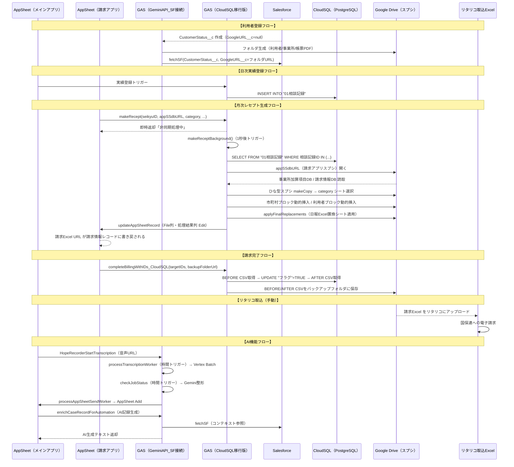

# GAS ワークフロー詳細解析レポート
## 入所系3サービス追加・6月改定対応 計画書用

作成日: 2026-06-22  
解析対象: GASファイル 58 ファイル（GeminiAPI_App_SF接続 33 + HopeCare_CloudSQL_移行版 26 + HopeAIchat 5 + HopeCareLive 8 + モデルサンプル 参考）

---

## §1. ⚠️ ユーザー警告4点の実装箇所マップ（最重要）

### §1.1 事業所情報セクションの加算項目は「請求アプリ」から取得

#### 実装箇所（`executeMakeRecept` 内、両版共通）

`001_レセプト生成.js` および `001_レセプト生成_CloudSQL.js` の `executeMakeRecept` 関数（行430〜443相当）に以下のコードが存在する：

```javascript
// ① 請求情報DBから事業所基本情報を取得（請求アプリのスプシ内）
const billingDbSheet = appDB.getSheetByName("請求情報DB");
if (billingDbSheet) {
  const bData = billingDbSheet.getDataRange().getValues();
  const bRow = bData.find(r => String(r[0]) === String(seikyuID));
  if (bRow) {
    allValues.forEach((r, i) => {
      const idx = bData[0].indexOf(String(r[0]).trim());
      if (idx !== -1) targetSheet.getRange(i + 1, 2).setValue(bRow[idx]);
    });
  }
}

// ② 事業所加算項目DBから加算項目を取得（請求アプリのスプシ内）
const kasanDbSheet = appDB.getSheetByName("事業所加算項目DB");
if (kasanDbSheet) {
  const kData = kasanDbSheet.getDataRange().getValues();
  kData.filter(r => String(r[1]) === String(seikyuID)).forEach(kr => {
    const rIdx = allValues.findIndex(r => String(r[0]).trim() === String(kr[4]).trim());
    if (rIdx !== -1) targetSheet.getRange(rIdx + 1, 2).setValue(kr[5]);
  });
}
```

**`appDB` の正体**: 関数引数 `appSSdbURL` から `SpreadsheetApp.openByUrl(appSSdbURL)` で開かれるスプレッドシート。`appSSdbURL` は AppSheet から渡される**請求アプリ（App ID `f6ddf60e-a346-4d4c-a143-eeb9aed81287`）のデータソーススプシ**である。

**AppSheetへの書き戻し経路（`updateAppSheetRecord`）**:

```javascript
function updateAppSheetRecord(seikyuID, fileUrl, logText) {
  const APP_ID = props.getProperty("APPSHEET_APP_ID_請求app"); 
  const ACCESS_KEY = props.getProperty("APPSHEET_API_KEY_請求app");
  const TABLE_NAME = props.getProperty("APPSHEET_TABLE_NAME_請求app");
  // → 請求アプリのテーブルに Edit アクションで File列・処理結果列を書き戻す
}
```

**Script Property名**: `APPSHEET_APP_ID_請求app` / `APPSHEET_API_KEY_請求app` / `APPSHEET_TABLE_NAME_請求app`

**前月分複製関数 `AddRecordCopyYYYYMM`（`002_前月分複製.js`）** も同じ `appSSdbURL` の「事業所加算項目DB」シートを読み書きしており、前月の加算項目を今月分として複製する。

**触ってはいけない箇所:**
- `appDB.getSheetByName("事業所加算項目DB")` の参照ロジック（kasanDbSheet の filter/findIndex 処理）
- `appDB.getSheetByName("請求情報DB")` の参照ロジック
- `updateAppSheetRecord` 関数のシグネチャおよびプロパティキー名
- `002_前月分複製.js` の `AddRecordCopyYYYYMM` 関数本体

**拡張すべき箇所:**
- 入所系3サービスに対応した加算項目を請求アプリの「事業所加算項目DB」に新規エントリとして追加（GAS改修なし、スプシ側の追加）
- 新ひな型スプシのシート上で加算ラベル行のA列に対応するラベル文字列を正確に記載すること（`String(kr[4]).trim()` と一致させる）

---

### §1.2 市町村情報のユニーク数で以降の行番号が動的になる

#### 実装箇所（`executeMakeRecept` 内、行444〜473相当）

```javascript
let currentA = targetSheet.getRange("A:A").getValues(); 
let cityRowIdx = currentA.findIndex(r => String(r[0]).trim() === "市町村") + 1;

if (cityRowIdx > 0 && cityDataList.length > 0) {
  const cityBlockSize = 4;              // 市町村ブロックは4行（市町村名・番号・+2行）
  if (cityDataList.length > 1) {
    const insertPosition = cityRowIdx + cityBlockSize - 1; 
    // ★ N個の市町村がある場合 (N-1)*4 行を挿入
    targetSheet.insertRowsAfter(insertPosition, (cityDataList.length - 1) * cityBlockSize);
    // 元ブロックを(N-1)回コピー
    const source = targetSheet.getRange(cityRowIdx, 1, cityBlockSize, targetSheet.getLastColumn());
    for (let i = 1; i < cityDataList.length; i++) {
      source.copyTo(targetSheet.getRange(cityRowIdx + (i * cityBlockSize), 1));
    }
  }
  // ... 市町村名・番号の書き込み ...
  
  // ★ 空の市町村ブロックを削除
  for (let i = cleanValues.length - 1; i >= 0; i--) {
    const header = String(cleanValues[i][0]).trim();
    const val = String(cleanValues[i][1]).trim();
    if ((header === "市町村" || header === "市町村番号") && val === "") {
      targetSheet.deleteRow(cityRowIdx + i);
    }
  }
}
```

**市町村処理後の利用者ブロック開始行計算:**

```javascript
// ★★★ 市町村処理後に再取得して利用者ブロック開始行を動的に決定
currentA = targetSheet.getRange("A:A").getValues();  // ← 再取得が必須！
const uBase = currentA.findIndex(r => String(r[0]).trim() === "氏名") + 1;
```

**計算式の実体**: 市町村ブロックの挿入/削除後に `getRange("A:A")` を**再取得**し、「氏名」ラベル行を文字列検索で動的に探す。ハードコードされた固定オフセットは一切使用していない。

**市町村ブロックサイズ**: `cityBlockSize = 4`（市町村名行・市町村番号行・予備2行）

**利用者ブロックサイズ計算**:
```javascript
const contentSize = (dRow - uBase) + 2;  // 「日」行 - 「氏名」行 + 2
const gapSize = 4; 
const blockSize = contentSize + gapSize;
```

**触ってはいけない箇所:**
- 市町村処理後の `currentA = targetSheet.getRange("A:A").getValues()` 再取得（これを省略すると利用者行番号がズレる）
- `cityBlockSize = 4` の定数（テンプレシートの行構造に依存）
- `cleanRange` による空市町村ブロックの削除ループ

**拡張すべき箇所:**
- 入所系新ひな型スプシを設計する際も、市町村ブロックは **4行単位** で構成し、A列ラベルに「市町村」「市町村番号」を使用すること
- 日中一時支援（市町村事業）は市町村ブロックの影響が最大のため、テンプレ設計時に既存の `cityBlockSize = 4` 構造を踏襲すること

---

### §1.3 テキスト置換処理の特殊性

#### 「日報Excel置換」シートの読込関数（`applyFinalReplacements`）

両版（`001_レセプト生成.js` および `001_レセプト生成_CloudSQL.js`）に同一実装が存在する（行781〜815相当）：

```javascript
function applyFinalReplacements(targetSpreadsheetId, configSpreadsheetId) {
  const dbSs = SpreadsheetApp.openById(configSpreadsheetId);  // ← appSSdbURLのスプシ
  const configSheet = dbSs.getSheetByName("日報Excel置換");
  if (!configSheet) return;
  const lastConfigRow = configSheet.getLastRow();
  if (lastConfigRow < 2) return; 
  const configValues = configSheet.getRange(2, 1, lastConfigRow - 1, 8).getValues();  // ← 8列取得
  
  const targetSs = SpreadsheetApp.openById(targetSpreadsheetId);
  const targetSheet = targetSs.getSheets()[0];  // ★ 常に1枚目のシートを対象
  const searchRange = targetSheet.getRange(1, 1, targetLastRow, 4);  // ★ A〜D列のみ検索
```

**「日報Excel置換」シートの構造（8列）**:

| 列 | 用途 |
|---|---|
| A (row[0]) | （内部ID/管理番号等） |
| B (row[1]) | `searchText` — 検索文字列（A列ラベルと完全一致） |
| C (row[2]) | `replaceValue` — 置換後の値 |
| D (row[3]) | `locationRule` — 「該当箇所」/「1つ右のセル」/「1つ下のセル」のいずれか |
| E〜G | （未使用） |
| H (row[7]) | `flag` — "TRUE" の場合のみ処理対象（文字列"TRUE"で比較） |

**置換処理の特殊性**:
1. **完全一致のみ**: `useRegularExpression(false).matchEntireCell(true)` — 正規表現なし、セル全体一致のみ
2. **A〜D列に限定**: `getRange(1, 1, targetLastRow, 4)` — E列以降は置換対象外
3. **3種類の書込先**: 「該当箇所」（セル自体）/「1つ右のセル」/「1つ下のセル」
4. **フラグ制御**: H列が文字列"TRUE"の行のみ処理（大文字小文字は toUpperCase() で吸収）
5. **シート取得**: `targetSs.getSheets()[0]` — インデックス0、シート名問わず常に1枚目
6. **呼出元**: `executeMakeRecept` の末尾から `applyFinalReplacements(newSS.getId(), extractIdFromUrl(appSSdbURL))` で呼ばれる

**触ってはいけない箇所:**
- `applyFinalReplacements` 関数本体全体（列インデックス・locationRule文字列・フラグ判定ロジック）
- 既存の「日報Excel置換」シートの既存エントリ（変更・削除禁止）
- `getSheets()[0]` による1枚目シート取得方式

**拡張すべき箇所:**
- 入所系新サービス用に「日報Excel置換」シートに**新行を追加する**だけでよい（既存行を変更しない）
- 6月改定の「福祉介護職員等処遇改善加算」は新行として H列に"TRUE"を設定して追加
- 入所系専用ブックを使う場合、そのブック内にも「日報Excel置換」シートを設ける（`appSSdbURL` が請求アプリスプシを指しているため、同スプシ内に置換シートを維持）

---

### §1.4 数式で曜日セルが保持される

#### 実装箇所（`executeMakeRecept` 内、行606〜628相当）

```javascript
if (memDayIdx !== -1 && user.dailies.length > 0) {
  const startD = currentStartRow + memDayIdx + 1 + addedForLimit;
  const numRows = user.dailies.length;
  const arrA = [], arrB = [], arrC = [], arrE = [], arrF = [];
  
  user.dailies.forEach((d, idx) => {
    const rowNum = startD + idx; 
    arrA.push([d.day]);
    
    // ★★★ 曜日セルは値でなく数式で書き込む
    const formula = `=IF(A${rowNum}<>"",TEXT(DATE(LEFT($B$3,4),RIGHT($B$3,2),A${rowNum}),"aaa"),"")`;
    arrB.push([formula]);
    
    arrC.push([d.kihon]);
    arrE.push([d.cost1]);
    arrF.push([d.cost2]);
  });

  targetSheet.getRange(startD, 1, numRows, 1).setValues(arrA);   // A列: 日（数値）
  targetSheet.getRange(startD, 2, numRows, 1).setFormulas(arrB); // B列: 曜日数式
  targetSheet.getRange(startD, 3, numRows, 1).setValues(arrC);   // C列: 基本報酬種別
  targetSheet.getRange(startD, 5, numRows, 1).setValues(arrE);   // E列: 実費1
  targetSheet.getRange(startD, 6, numRows, 1).setValues(arrF);   // F列: 実費2
  // ★ D列は書き込まない（種別コード等がテンプレの数式で算出される場合に対応）
}
```

**曜日数式の構造**:
- `$B$3` — サービス提供年月セル（例："202506"）。絶対参照で固定。
- `LEFT($B$3,4)` — 年（4桁）
- `RIGHT($B$3,2)` — 月（2桁）
- `A${rowNum}` — 同行のA列（日付）
- `TEXT(...,"aaa")` — 曜日の略称（月/火/水...）

**書き込み列の範囲制御**:
- 書き込む列: A（日）、B（曜日数式）、C（基本報酬）、E（実費1）、F（実費2）
- **書き込まない列**: D列（テンプレに数式がある列）
- `setFormulas` で数式として書き込むため、Googleスプシ側で `$B$3` の変更に連動して曜日が自動再計算される

**`executeRowMerge` での曜日セル保護（行684〜779）**:
```javascript
// C、E、F列のみ更新（B列の関数は触らない）
sheet.getRange(keeper.sheetRow, 3).setValue(mergedType);  // C列
sheet.getRange(keeper.sheetRow, 5).setValue(newCost1);    // E列
sheet.getRange(keeper.sheetRow, 6).setValue(newCost2);    // F列
// ← B列（曜日）には一切触れない
```

**触ってはいけない箇所:**
- 曜日数式テンプレート `=IF(A${rowNum}<>"",TEXT(DATE(LEFT($B$3,4),RIGHT($B$3,2),A${rowNum}),"aaa"),"")` の文字列
- `setFormulas(arrB)` による B列書き込み（`setValues` に変えると数式が消える）
- `executeRowMerge` の B列スキップ方針
- D列を書き込まないという現行設計

**拡張すべき箇所:**
- 入所系新ひな型スプシも同じ構造（`$B$3` にサービス提供年月、A列に日付数値、B列に曜日数式）を踏襲すること
- `$B$3` の参照はひな型シート構造に依存するため、新シート設計時は「サービス提供年月を B3 に配置する」制約を守ること（または数式の `$B$3` 部分を変更した場合は GAS も連動変更が必要）

---

## §2. GASプロジェクト責務マップ（5個）

| プロジェクト名 | 状態 | 主な責務 |
|---|---|---|
| `GeminiAPI_App_SF接続_ainotudoi` | **本番稼働（メイン）** | SF連携・利用者/職員フォルダ生成・月次レセプト生成（スプシDB版）・AI文字起こし（HopeRecorder）・AI記録生成（HopeContextRecorder）・PII マスキング・AIテキスト生成キュー |
| `HopeCare_CloudSQL_移行版_ainotudoi` | **本番稼働（CloudSQL版）** | 月次レセプト生成（CloudSQL版）・請求完了処理（CloudSQL版）・帳票生成・子項目反映・月次バックアップ・AI情報テキスト生成（CloudSQL版） |
| `HopeAIchat_ainotudoi` | **本番稼働（補助）** | AppSheet チャット UI 用バックエンド（利用者コンテキストファイル読込・Gemini呼出・CloudSQL参照） |
| `HopeCareLive_ainotudoi` | **本番稼働（補助）** | ライブチャット（リアルタイム相談対応、独立したチャット UI） |
| `モデルサンプル/HopeCare_CloudSQL_移行版` | **参考・移行用スクリプト** | CloudSQL移行時の一過性スクリプト群（`migrate_*.js` 等）。本番では不使用 |

---

## §3. エントリポイント一覧

| プロジェクト | 関数名 | 種別 | 備考 |
|---|---|---|---|
| GeminiAPI_App_SF接続 | `doGet(e)` | WebApp GET | 現在は空実装 |
| GeminiAPI_App_SF接続 | `doPost(e)` | WebApp POST | `UpdateGoogleUrl` / `enrichCaseRecord` / `ping` の3ルート。WEBAPP_SHARED_TOKEN 認証 |
| GeminiAPI_App_SF接続 | `makeRecept(...)` | AppSheet Automation（直接呼び出し） | キューに積んで非同期化。即座に「非同期処理中」を返す |
| GeminiAPI_App_SF接続 | `makeReceptBackground()` | 時間トリガー（1秒後起動） | makeRecept のバックグラウンド実行エンジン |
| GeminiAPI_App_SF接続 | `processTranscriptionWorker()` | 時間トリガー（定周期） | HopeRecorder: 音声→GCS→Vertex Batch投入 |
| GeminiAPI_App_SF接続 | `checkJobStatus()` | 時間トリガー（定周期） | HopeRecorder: Batchジョブ完了確認→テキスト整形 |
| GeminiAPI_App_SF接続 | `processAppSheetSendWorker()` | 時間トリガー（定周期） | HopeRecorder: 整形済みテキストをAppSheetへ送信 |
| GeminiAPI_App_SF接続 | `processAIContextQueue()` | 時間トリガー（5〜10分おき） | AIコンテキストキュー処理（200_AIテキスト生成キュ.js） |
| GeminiAPI_App_SF接続 | `syncDriveFoldersToSalesforce()` | 手動/トリガー | 利用者フォルダ生成→SF書き戻し |
| GeminiAPI_App_SF接続 | `syncStaffFoldersToSalesforce()` | 手動/トリガー | 職員フォルダ生成→SF書き戻し |
| GeminiAPI_App_SF接続 | `HopeRecorderStartTranscription(...)` | AppSheet Automation | 音声受付エントリポイント |
| GeminiAPI_App_SF接続 | `enrichCaseRecordForAutomation(...)` | AppSheet Automation | AI記録生成（Call a script経由）shortMode:true/timeBudgetMs:18000 |
| HopeCare_CloudSQL_移行版 | `makeRecept(...)` | AppSheet Automation（直接呼び出し） | CloudSQL版・同名関数 |
| HopeCare_CloudSQL_移行版 | `makeReceptBackground()` | 時間トリガー（1秒後起動） | CloudSQL版バックグラウンド処理 |
| HopeCare_CloudSQL_移行版 | `completeBillingWithIDs_CloudSQL(...)` | AppSheet Automation | 請求完了処理（フラグ更新+CSVバックアップ） |
| HopeCare_CloudSQL_移行版 | `postFolderUrlToExternalApp(...)` | 内部関数（SF連携GASへPOST） | 新規フォルダURL → SF側doPost へ転送 |
| HopeAIchat | `doPost(e)` | WebApp POST | AppSheetチャットUI用 |

---

## §4. 利用者登録フロー

```
1. Salesforce に ProspectCustomer__c → Customer__c のレコードを作成
2. CustomerStatus__c（在籍状況）が GoogleURL__c = null の状態で作成される
3. GAS 時間トリガー or 手動で syncDriveFoldersToSalesforce() 実行
   ↓
4. SOQL: SELECT Id, OfficeName__c, GoogleFolderName__c FROM CustomerStatus__c
         WHERE GoogleURL__c = null AND OfficeName__c != null AND GoogleFolderName__c != null LIMIT 90
5. DriveApp.getFolderById(ROOT_FOLDER_ID)  ← Script Property: USER_ROOT_FOLDER_ID
   → OfficeName__c フォルダ（事業所別）を作成/取得
   → GoogleFolderName__c フォルダ（利用者別）を作成/取得
   → 配下に「帳票PDF」フォルダを作成
6. fetchSF('CustomerStatus__c', record.Id, { "GoogleURL__c": targetUrl }) でSFに書き戻す
7. doPost 受信側（GeminiAPI_App_SF接続）の processUpdateGoogleUrl が CustomerStatus__c を更新
```

**SF API呼出経路**:
- `000_クエリ.js` の `doQuery(soql)` — OAuth2 access_token を使いSFのREST API v51.0 に GET
- `fetchSF` 関数（`000_プロパティ.js` の getProp で access_token 取得） — SF REST API でPATCH

---

## §5. 職員登録フロー

```
1. StaffStatus__c が SF に作成される（GoogleURL__c = null）
2. syncStaffFoldersToSalesforce() 実行
   ↓
3. SOQL: SELECT Id, GoogleFolderName__c, ServiceType__c FROM StaffStatus__c
         WHERE GoogleURL__c = null AND GoogleFolderName__c != null AND ServiceType__c != null LIMIT 90
4. DriveApp.getFolderById(STAFF_ROOT_ID)  ← Script Property: STAFF_ROOT_FOLDER_ID
   → ServiceType__c フォルダ（サービス種別別）
   → GoogleFolderName__c フォルダ（職員別）
5. fetchSF('StaffStatus__c', record.Id, { "GoogleURL__c": targetUrl }) で書き戻し
```

**注意**: 職員フォルダ階層は `ServiceType__c` 値でサブフォルダが分かれる。新サービス追加時に ServiceType__c に新値が追加されれば、自動的に対応フォルダが作成される（GAS改修不要）。

---

## §6. 実績登録フロー（AppSheet → CloudSQL）

```
AppSheet 実績登録 UI
  → AppSheet Automation: callAppSheetApi 経由でデータ書込みトリガー
  → HopeCare_CloudSQL_移行版_ainotudoi の POST.js または CloudSQL版GASを経由
  → JDBC: Jdbc.getConnection(url, user, pass)  ← Script Properties: CLOUDSQL_URL / CLOUDSQL_USER / CLOUDSQL_PASS
  → CloudSQL PostgreSQL の "01相談記録" テーブルへ INSERT
```

**接続ファイル**:
- `000_CloudSQL接続.js`（両プロジェクトに同一実装）: `getCloudSqlConnection_()` / `closeCloudSql_()` / `resultSetToArray_()`
- 認証情報: Script Properties `CLOUDSQL_URL` / `CLOUDSQL_USER` / `CLOUDSQL_PASS`

**`000_callAppSheetApi.js`**: AppSheet API を叩く共通関数。429エラー時に指数バックオフ（3秒→6→12→24→48秒）で最大5回リトライ。

---

## §7. 月次集計・レセプト生成フロー（最重要）

### 7.1 旧版（スプシDB）vs 新版（CloudSQL）の差分

| 項目 | 旧版 `001_レセプト生成.js` | 新版 `001_レセプト生成_CloudSQL.js` |
|---|---|---|
| 実績データ取得先 | `SpreadsheetApp.openByUrl(SSdbURL).getSheetByName(SSdbSheetName)` | CloudSQL JDBC: `SELECT * FROM "01相談記録" WHERE "相談記録ID" IN (...)` |
| データ形式 | 2次元配列（直接スプシから） | 2次元配列（JDBC ResultSet → 手動変換）で **後続ロジックは同一** |
| タスクシート変数名 | `TASK_SS_ID` | `SEIKYU_TASK_SS_ID` |
| その他 | — | CloudSQL版に test_AppSheetApi_Seikyu テスト関数が追加 |
| 集計ロジック | **完全同一** | **完全同一** |

### 7.2 category 文字列での分岐ロジック

**エントリポイント `makeRecept`** から引数 `category` が渡され、`executeMakeRecept` 内で以下の場所で分岐：

```javascript
// 分岐1: 「障害児相談支援」専用の氏名処理（行255/330相当）
if (category === "障害児相談支援") {
  if (knms[i] === "未登録") missingItems.push("保護者氏名");
  if (kkns[i] === "未登録") missingItems.push("保護者カナ");
}

// 分岐2: ひな型スプシのシート選択（行418/538相当）
const targetSheet = newSS.getSheetByName(category);
if (!targetSheet) throw new Error("シート「" + category + "」無し");

// 分岐3: 利用者氏名欄への書き込み（行560/680相当）
if (category === "障害児相談支援") {
  if(txt === "氏名") targetSheet.getRange(rowIdx, 2).setValue(user.kName);       // 保護者氏名
  else if(txt === "氏名カナ") targetSheet.getRange(rowIdx, 2).setValue(user.kKana);
  else if(txt === "児童氏名") targetSheet.getRange(rowIdx, 2).setValue(user.name);
  else if(txt === "児童氏名カナ") targetSheet.getRange(rowIdx, 2).setValue(user.kana);
} else {
  if(txt === "氏名") targetSheet.getRange(rowIdx, 2).setValue(user.name);
  else if(txt === "氏名カナ") targetSheet.getRange(rowIdx, 2).setValue(user.kana);
}
```

### 7.3 現在の category 値の全リスト（現行確認済み）

| category 値 | ひな型シート名 | 利用者欄の特殊処理 |
|---|---|---|
| `計画相談支援` | 同名シート | 氏名→user.name |
| `障害児相談支援` | 同名シート | 氏名→保護者名（kName）、児童氏名→user.name |

> ※ GAS コード内に category 値の列挙定義は存在しない。ひな型スプシのシート名と完全一致が必須。

### 7.4 処理フロー詳細

```
makeRecept(seikyuID, appSSdbURL, category, fileName, SSsourceURL, ...)
  ↓ キューに追加（SEIKYU_TASK_SS_ID スプシの「請求処理タスク」シート）
  ↓ ScriptApp.newTrigger("makeReceptBackground").timeBased().after(1000).create()
  ↓ AppSheetに「非同期処理中」を即時返却

makeReceptBackground()
  ↓ ロック取得（スプシ「実行中」判定）→ タスクを「実行中」に更新
  ↓ executeMakeRecept(全引数) 呼出

executeMakeRecept:
  1. 対象利用者リストを配列に展開
  2. 旧版: スプシから / 新版: CloudSQLから「01相談記録」を取得
  3. 「市町村情報DB」「利用者情報基本項目DB」「上限額管理状況DB」を appSSdbURL から取得
  4. city/userWriteRows を生成し、各DBシートに差分追記
  5. SSsourceURL の ひな型スプシを makeCopy(fileName, officeFolder)
  6. newSS.getSheetByName(category) でシートを開く（category と同名シートが必須）
  7. category 以外の余分なシートを削除
  8. 「請求情報DB」からseikyuIDに一致する行でA列ラベルを基にB列値を上書き（事業所情報）
  9. 「事業所加算項目DB」から seikyuID かつラベル一致で値を上書き（事業所加算）
  10. 市町村ブロックを動的挿入/削除
  11. 利用者ブロックを動的挿入（氏名・受給者証番号・市町村・上限額・加算・日次データ）
      - 日付セル: setValues（数値）
      - 曜日セル: setFormulas（=IF(A${rowNum}...)）★ 数式維持
      - 基本報酬・実費: setValues
  12. applyFinalReplacements: 「日報Excel置換」シートで最終置換
  13. executeRowMerge: 相談支援種別統合（"11"+"12"→"13", "21"+"22"→"23"）
  14. 生成ファイルURLを返す
  15. updateAppSheetRecord で 請求アプリの File列・処理結果列 を更新
```

### 7.5 スプシIDを保持するScript Property名

| Property名 | 用途 |
|---|---|
| `SEIKYU_TASK_SS_ID` | 請求処理タスク管理スプシ（両プロジェクト共通値） |
| `WAREKI_SS_ID` | 和暦変換マスタスプシ（GeminiAPI版のみ） |
| `APPSHEET_APP_ID_請求app` | 請求アプリのAppSheet APP ID |
| `APPSHEET_API_KEY_請求app` | 請求アプリ用 Access Key |
| `APPSHEET_TABLE_NAME_請求app` | 対象テーブル名（「請求情報DB」相当） |

> ※ ひな型スプシのIDはScript Propertyに保持されておらず、AppSheetの請求アプリから `SSsourceURL` パラメータとして渡される（AppSheet 側で管理）。

### 7.6 `002_前月分複製.js` の用途

`AddRecordCopyYYYYMM(seikyuID, yyyymmCategory, appSSdbURL)`:
- 請求アプリスプシの「事業所加算項目DB」シートから前月分の加算エントリを抽出
- 今月の `seikyuID` 向けに複製して追加
- `getPreviousMonthCategory("202506_計画相談支援")` → `"202505_計画相談支援"` を計算

### 7.7 `003_対象利用者増減.js` の用途

`AddKasanCoding(imputURL, targetPair)`:
- 生成済みの請求Excelスプシを開き、「特別地域加算」行をスキャン
- `targetPair` に含まれない受給者証番号の利用者の特別地域加算セルを空白にクリア

---

## §8. 請求完了処理

### 8.1 旧版（`請求完了処理.js`）

**退役済み（2026-04-23）。** コメントのみが残り、関数本体は削除済み。バージョン履歴から復元可能（"Before stage2 cleanup - retire legacy non-CloudSQL scripts"）。

### 8.2 新版（`請求完了処理_CloudSQL.js`）

```javascript
completeBillingWithIDs_CloudSQL(targetIDs, backupFolderUrl)
```

**フロー**:
1. IDリスト正規化（配列/文字列どちらでも対応）
2. CloudSQL接続
3. `SELECT * FROM "01相談記録" WHERE "相談記録ID" IN (...)` で更新前データ取得
4. `BEFORE_COMPLETE_YYYYMMDD_HHmmss.csv` として Drive に保存
5. `UPDATE "01相談記録" SET "フラグ" = TRUE WHERE "相談記録ID" = ?` をバッチ実行（commit）
6. 更新後データを再取得し `AFTER_COMPLETE_YYYYMMDD_HHmmss.csv` として保存
7. CSVバックアップ保存先: `backupFolderUrl` で指定されるDriveフォルダ

**リタリコとの接点**: 請求完了フラグ更新は「リタリコにExcelを取り込んだ後」に実行する運用。GAS は国保連CSV生成をせず、リタリコへの取込自体はユーザー手動。フラグ更新はデータの二重請求防止のためのみ。

---

## §9. AI機能

### 9.1 HopeRecorder（100〜105番台）

| ファイル | 役割 |
|---|---|
| `100_HopeRecorderPrompts.js` | バッチ処理用プロンプト定数 `HOPE_RECORDER_ACTIVE` を定義 |
| `101_HopeRecorder.js` | 本体①: 音声受付→GCSアップロード→Vertex Batch投入（Worker2） / ②: Batch完了確認→整形（Worker3） / ③: AppSheet送信（Worker4）|
| `101_HopeRecorder_02.js` | GCSアップロードヘルパー等（分割版） |
| `102_HopeContextRecorder.js` | 機能②: 文字起こし済みテキスト + 利用者コンテキスト → Gemini → AI記録生成。doPost経由で呼ばれる |
| `103_HopeContextPrompts.js` | HopeContextRecorder用プロンプト定数 `HOPE_CTX_RECORDER_ACTIVE` を定義 |
| `105_AiEnrichRetryWorker.js` | enrichCaseRecordForAutomation のタイムアウト時再処理ワーカー |
| `040_PiiMasker.js` | PII可逆マスキング層（`{{ENTITY_NN}}` トークン置換）。HopeRecorder と HopeContextRecorder の両方から呼ばれる |

**AppSheet経由での実績登録とAIが起動する経路**:
```
AppSheet で音声録音
  → HopeRecorderStartTranscription(audioFileUrl, ...) 呼出（AppSheet Automation）
  → POST履歴シートに追加
  → processTranscriptionWorker（時間トリガー）で GCS アップロード + Vertex Batch 投入
  → checkJobStatus（時間トリガー）で完了確認 + callGeminiProToCleanText_ で整形
  → processAppSheetSendWorker（時間トリガー）で AppSheet の RecordingData テーブルへ Add

AppSheet で文字起こしテキストを確認 → AI記録生成ボタン
  → enrichCaseRecordForAutomation（Call a script, shortMode:true, 18秒制限）
  → 失敗時は 105_AiEnrichRetryWorker が非同期再処理
```

### 9.2 200_AIテキスト生成キュ.js

- `enqueueAIContextTask(targetId)` — AppSheet Automation から呼ばれる。キュー（`QUEUE_SS_ID` スプシの request_queue シート）に PENDING として追加
- `processAIContextQueue()` — 時間トリガー（5〜10分おき）で実行。PENDING → `generateAIContextFile(targetId)` → COMPLETED
- `generateAIContextFile` の実体は `201_AI情報テキストFILE.js` 等（別ファイル）

---

## §10. SF接続経路

**ファイル**: `000_OAuth.js`（GeminiAPI_App_SF接続プロジェクト）

**フロー方式**: Salesforce OAuth2 認可コードフロー（My Domain 経由）

```
事前セットアップ（初回のみ）:
  tejun1() → oauth.getMyUrl() でauthorize URLを生成
  → doGet（コメントアウト状態）でコールバック受信 → oauth.getAccessToken(e) → setProp(token)

通常実行時:
  doQuery() / fetchSF() → oauth.runRefresh() でアクセストークン自動更新
    → POST to https://ainotsudoi-gakuen.my.salesforce.com/services/oauth2/token
    → getProp("access_token") で取得して Bearer ヘッダに設定

SOQL実行: getProp("instance_url") + "/services/data/v51.0/query?q=..."
```

**トークン保管 Script Property名**:
- `client_id` — Salesforce コンシューマー鍵（Script Property に保管）
- `client_secret` — Salesforce コンシューマー秘密の値（Script Property に保管）
- `redirect_uri` — WebApp デプロイURL（Script Property に保管）
- `access_token` / `refresh_token` / `instance_url` — OAuth取得後に setProp で保管

---

## §11. CloudSQL接続経路

**ファイル**: `000_CloudSQL接続.js`（両プロジェクトに同一実装）

**方式**: GAS 標準 JDBC API（`Jdbc.getConnection`）経由の PostgreSQL 接続

```javascript
function getCloudSqlConnection_() {
  var url  = props.getProperty('CLOUDSQL_URL');   // jdbc:postgresql://<IP>:5432/<DB>
  var user = props.getProperty('CLOUDSQL_USER');
  var pass = props.getProperty('CLOUDSQL_PASS');
  return Jdbc.getConnection(url, user, pass);
}
```

**認証情報保管先 Script Property**:
- `CLOUDSQL_URL` — JDBC URL（IP:PORT/DB名）（Script Property に保管）
- `CLOUDSQL_USER` — DBユーザー名（Script Property に保管）
- `CLOUDSQL_PASS` — DBパスワード（Script Property に保管）

---

## §12. 請求アプリへの接続（§1.1 と連動）

**どのGAS関数が叩くか**:
- `updateAppSheetRecord(seikyuID, fileUrl, logText)` — レセプト生成完了後に請求アプリの「File」列・「処理結果」列を Edit
- `AddRecordCopyYYYYMM(seikyuID, ...)` — 事業所加算項目の前月分を複製（スプシ経由、AppSheet API呼出なし）
- 生成処理中: `appSSdbURL`（請求アプリのデータソーススプシURL）から直接スプシ API で「事業所加算項目DB」「請求情報DB」を読み取る

**認証方式**: AppSheet Data API（ApplicationAccessKey ヘッダー）

**Script Property名**:
- `APPSHEET_APP_ID_請求app` — 請求アプリ App ID（Script Property に保管）
- `APPSHEET_API_KEY_請求app` — 請求アプリ用 Access Key（Script Property に保管）
- `APPSHEET_TABLE_NAME_請求app` — 対象テーブル名（Script Property に保管）

**事業所単位の加算項目取得方法**: AppSheet API 経由ではなく、請求アプリのデータソーススプシを `SpreadsheetApp.openByUrl(appSSdbURL)` で直接開き、「事業所加算項目DB」シートから `seikyuID` でフィルタリングして取得。

---

## §13. Slack通知

**ファイル**: `000_SLACK通知.js`（GeminiAPI版）/ `Slack通知.js`（CloudSQL版）

**トリガー条件**:
- レセプト生成エラー時（`makeReceptBackground` の catch）
- AppSheet API 書き戻し失敗時（`updateAppSheetRecord`）
- CloudSQL 接続エラー時（`getCloudSqlConnection_` の catch）
- HopeRecorder: Batch投入エラー、整形エラー、リトライ上限超過時
- PII マスキング初期化失敗時
- AIコンテキストキューのシステムエラー時

**Script Property**: `SLACK_WEBHOOK_URL`（両プロジェクトで同名）（Script Property に保管）

---

## §14. 全体シーケンス図



---

## §15. 入所系3サービス追加への影響範囲

### §15.1 category 値3つ追加のためのGAS改修箇所

`decisions-2026-06-22.md §1` で確定した category 値:
- `児童入所施設`（新規）
- `短期入所`（既存値を再利用）
- `日中一時支援`（新規）

**改修が必要な箇所**:

**`executeMakeRecept` 内の氏名処理分岐（現在2箇所）**:
```javascript
// 現行（2分岐）
if (category === "障害児相談支援") {
  // 保護者氏名・児童氏名の特殊処理
} else {
  // 通常の氏名処理
}

// ★ 追加が必要
// 児童入所施設: 「保護者氏名」「児童氏名」の取り扱いを spec 化して決定
// 短期入所: 通常の氏名処理（else ブランチ流用）
// 日中一時支援: 通常の氏名処理（else ブランチ流用）
```

**ひな型スプシのシート選択**: `newSS.getSheetByName(category)` — シート名が category 文字列と完全一致していれば自動対応。**GAS 改修なし**。

**「障害児相談支援」専用の未登録チェック箇所（行255/330付近）**:
```javascript
if (category === "障害児相談支援") {
  if (knms[i] === "未登録") missingItems.push("保護者氏名");
  if (kkns[i] === "未登録") missingItems.push("保護者カナ");
}
// ← 児童入所施設も同様のチェックが必要か spec 化必要
```

### §15.2 「6月実績分から新マスタ参照」の分岐実装案

`decisions-2026-06-22.md §2` に基づく実装案:

```javascript
// ★ 提案: executeMakeRecept の SSsourceURL 利用箇所（makeCopy の前）に条件分岐を追加
// AppSheet 側は引き続き SSsourceURL を渡してくるため、
// GAS 側で「提供年月 ≥ 2026-06 なら新マスタを使う」ロジックを追加

function getEffectiveSourceUrl(SSsourceURL, category, yyyymm, props) {
  // yyyymm: 例 "202606"
  const isNewMasterTarget = parseInt(yyyymm) >= 202606;
  
  if (isNewMasterTarget) {
    // 新Property名（既存を削除せず並列保持）
    const newPropKey = `SS_SOURCE_URL_NEW_${category}`;  // 例: SS_SOURCE_URL_NEW_計画相談支援
    const newUrl = props.getProperty(newPropKey);
    if (newUrl) return newUrl;
  }
  // 旧マスタにフォールバック
  return SSsourceURL;
}
```

ただし `SSsourceURL` は AppSheet 側から渡される形のため、**AppSheet 側の請求アプリで新旧マスタを切り替える方が整合性が高い**可能性がある。spec化で決定要。

### §15.3 専用ブックIDを保持する新Script Property名の提案

| Property名（提案） | 用途 |
|---|---|
| `SS_SOURCE_URL_NEW_計画相談支援` | 6月改定後の計画相談支援ひな型スプシID |
| `SS_SOURCE_URL_NEW_障害児相談支援` | 6月改定後の障害児相談支援ひな型スプシID |
| `SS_SOURCE_URL_児童入所施設` | 入所系専用ブック（児童入所施設シート）のスプシID |
| `SS_SOURCE_URL_短期入所` | 入所系専用ブック（短期入所シート）のスプシID |
| `SS_SOURCE_URL_日中一時支援` | 日中一時支援専用ブックのスプシID |

> ※ AppSheet 側の SSsourceURL パラメータで渡す場合はScript Property不要。どちらで管理するかは AppSheet 設計側で決定すること。

### §15.4 DisabilityCard__c 拡張項目を読み出すGAS関数の特定

現行 GAS は `DisabilityCard__c` を**直接読み出す関数を持っていない**。以下の経路で間接的に参照：
- `doQuery(SOQL)` — `CustomerStatus__c` を SOQL で取得する際に JOIN/サブクエリで参照する可能性はあるが、現行コードでは `CustomerStatus__c.GoogleURL__c` 更新が主目的
- `executeMakeRecept` の引数 `TargetNumberList`（受給者証番号）等は AppSheet が SF から取得して GAS に渡す

**追加が必要な場合**: 入所系サービスで `ContractRowNumber__c` / `MonthlyAllotmentDays__c` / `UpperLimitFacilityNumber__c` 等（§4 の新項目）を GAS 集計に利用するなら、以下のいずれかの対応が必要：
- AppSheet 側で makeRecept の引数に追加（推奨。既存パターンと一致）
- GAS 内で `doQuery` を使って直接 SF から取得する

### §15.5 3新オブジェクトを読み書きするGAS関数の追加方針

`decisions-2026-06-22.md §5` の3オブジェクト方針（`ChildCareEntryRecord__c` 等）:

- **実績の CloudSQL 書込み**: 既存の `01相談記録` テーブルを流用（category 列で識別）が最小コスト。専用テーブル新設の場合は `getCloudSqlConnection_` は流用でき、SQL のみ変更。
- **レセプト生成**: `executeMakeRecept` の引数 `SSdbSheetName` / `SSdbURL` で対象テーブル/スプシを切り替えられる設計のため、**新テーブルを使う場合は AppSheet 側からパラメータを変えて渡せばよい**。
- **請求完了フラグ更新**: `completeBillingWithIDs_CloudSQL` の `UPDATE "01相談記録" SET "フラグ"` 部分のテーブル名を category に応じて切り替えるロジックが必要（または新テーブルでも同名カラム `フラグ` を用意）。

---

## §16. リスク一覧

| リスク | 内容 | 影響 | 対処 |
|---|---|---|---|
| ひな型スプシ構造の仕様非文書化 | 「$B$3」が何のセルかはコードのコメントに記載なし | 新シート設計時の制約見落とし | 本レポートの§1.4を仕様書として扱う |
| category 値の列挙定義なし | GASコードに既存categoryの一覧がない（実行時エラーで判明する） | 新category追加時の動作確認が必須 | ひな型スプシのシート名と完全一致を単体テストで確認 |
| appSSdbURL の正体が暗黙的 | ドキュメントなし。AppSheetから渡される請求アプリスプシURLだと推定 | 誤ったURLが渡された場合サイレント失敗 | AppSheetの請求アプリ側でパラメータを明示的に設定・レビュー |
| 「日報Excel置換」シートの列8の役割 | row[7]=flag のH列の他の列（E〜G）は未使用だが定義不明 | 将来の拡張で衝突する可能性 | 新エントリ追加時はE〜G列は空欄のままとする |
| executeRowMerge の hardcode | `mergePair("11", "12", "13"); mergePair("21", "22", "23")` — 相談支援専用の種別統合ロジック | 入所系のシートに「種類」列がある場合に誤動作 | 入所系ひな型シートに「日/種類」ヘッダーを置かないよう設計する |
| 請求完了処理の旧版が退役済み | `請求完了処理.js` はコメントのみ | 意図せず古いコードを参照するリスク | `completeBillingWithIDs_CloudSQL` のみを使う |
| makeCopy後のsleep/flush | `Utilities.sleep(3000)` 等の待機がハードコード | Google側の遅延次第で失敗する可能性 | 現状維持。変更しないこと |
| 自動テストの不在 | 単体テスト関数は `test_` prefix で存在するが CI/CD なし | リグレッションが無音で発生するリスク | 新機能追加時は手動で test_ 関数を実行して確認 |
| TBDコメント | `000_クエリ.js` の `assign` 関数が使われていない可能性 | デッドコードだが削除リスクあり | 確認するまで触らない |

**「絶対に触ってはいけない箇所」集計**:
1. `applyFinalReplacements` 関数本体（置換ロジック全体）
2. 曜日数式テンプレート文字列（`=IF(A${rowNum}...TEXT(DATE(LEFT($B$3,4)...`）
3. `setFormulas(arrB)` による B列書き込み（`setValues` に変更禁止）
4. `executeRowMerge` の B列スキップ方針
5. 市町村ブロック処理後の `currentA = targetSheet.getRange("A:A").getValues()` 再取得
6. `cityBlockSize = 4` 定数
7. `updateAppSheetRecord` のシグネチャおよびプロパティキー名
8. `APPSHEET_APP_ID_請求app` 等の既存Script Property名（値の更新は可）
9. 既存「日報Excel置換」シートの既存エントリ
10. `makeCopy` 後の `SpreadsheetApp.flush() + Utilities.sleep(3000)` の待機処理
11. `cleanUpTriggers` の `makeReceptBackground` 名称（変更すると連鎖トリガーが機能しなくなる）

**計: 11箇所**（内、コードスニペット単位では§1の4点に対応する核心部分）

---

*本レポートは読み取り専用調査により作成。GASコードの改変は行っていない。*
