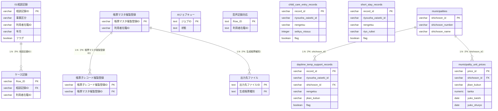

# CloudSQL スキーマ + docs 調査レポート

> 作成: 2026-06-22 / 担当: welfare-implementer（CloudSQL スキーマ調査エージェント）
> 入力: `gas/_schema/hopecare-schema.sql` / `docs/cloudsql-migration-handoff.md` / `docs/decisions/DECISIONS.md` / `docs/plans/2026-06-21-入所系3サービス追加.md`
> 出力先: `welfare-pdca/context/current-system/03-cloudsql-and-docs.md`

---

## §1. CloudSQL データベース構成サマリ

### エンジン・リージョン・文字コード

| 項目 | 値 |
|---|---|
| エンジン | PostgreSQL 15 (`pg_dump version 15.18 / Debian 15.18-1.pgdg13+1`) |
| リージョン | `asia-northeast1`（ゾーン `asia-northeast1-b`） |
| インスタンス（移行先） | `ainotudoisql:asia-northeast1:hopecare-db-ainotudoi` |
| データベース名 | `hopecare` |
| 文字エンコード | `UTF8`（`SET client_encoding = 'UTF8'`） |
| マシン | `db-g1-small` |
| ディスク | 10 GB |
| データ状態 | スキーマのみ複製済み（**データ 0 行**） |

### テーブル一覧（全 7 テーブル）

| テーブル名 | 主 PK | 用途分類 |
|---|---|---|
| `01相談記録` | `相談記録ID` VARCHAR(255) | 請求実績 SoT（日次レコード） |
| `AIジョブキュー` | `ジョブID` TEXT | 非同期 AI ジョブ管理 |
| `ケース記録` | `Row ID` VARCHAR(255) | 支援記録・AI 処理結果 |
| `出力先ファイル` | `出力先ファイルID` TEXT | AI 帳票出力管理 |
| `帳票マスタ複製登録` | `帳票マスタ複製登録ID` VARCHAR(255) | スプシ帳票の複製ジョブ |
| `帳票子レコード複製登録` | `帳票子レコード複製登録ID` VARCHAR(255) | 帳票子行データ（帳票マスタの 1:N） |
| `音声記録対応` | `Row ID` TEXT | 録音 → 文字起こし対応記録 |

インデックス数: 19（移行完了後の実体: 26、うち PK 由来も含む）。FK 制約: `出力先ファイル.生成帳票種別 → 帳票マスタ複製登録.帳票マスタ複製登録ID`（ON DELETE RESTRICT, NOT VALID）。

---

## §2. 「01相談記録」テーブル完全項目表（最重要）

全 55 列（migrate_01_soudan.js のコメントより "55列"）。DDL 実測で以下を確認。

### PK・一意制約

| 制約種別 | 列 | 詳細 |
|---|---|---|
| PRIMARY KEY | `相談記録ID` VARCHAR(255) | 制約名 `01相談記録_pkey` |
| UNIQUE | （なし） | 複合 UNIQUE 制約は未定義。年月+利用者在籍 ID の一意性はアプリ層で保証 |

> **注意**: 月次集計の一意制約（年月 × 利用者在籍 ID など）は DB 制約ではなくアプリ側ロジックで保証している設計。新テーブルでは必要に応じて UNIQUE 制約の追加を推奨。

### 全カラム一覧

| カラム名 | 型 | NULL | 備考 |
|---|---|---|---|
| `相談記録ID` | VARCHAR(255) | NOT NULL | PK |
| `表示フラグ` | BOOLEAN | NULL | |
| `自動化フラグ` | BOOLEAN | NULL | |
| `フラグ日時` | TIMESTAMPTZ | NULL | |
| `年月日_利用者在籍ID` | VARCHAR(255) | NULL | 年月日+利用者在籍 ID の複合キー文字列（INDEX 代替） |
| `PDF` | TEXT | NULL | |
| `年齢_登録時点` | INTEGER | NULL | |
| `相談No` | INTEGER | NULL | |
| `タイトル` | VARCHAR(255) | NULL | |
| `事業区分` | VARCHAR(255) | NULL | GAS の category 値に相当 |
| `利用者ID` | VARCHAR(255) | NULL | SF Customer__c ID |
| `利用者在籍ID` | VARCHAR(255) | NULL | SF CustomerStatus__c ID |
| `利用者氏名` | VARCHAR(255) | NULL | |
| `職員在籍ID` | VARCHAR(255) | NULL | SF StaffStatus__c ID |
| `相談事業所` | VARCHAR(255) | NULL | |
| `相談種別` | VARCHAR(255) | NULL | |
| `相談者_本人との関係` | VARCHAR(255) | NULL | |
| `連携先の機関` | TEXT | NULL | |
| `相談者_親族等` | TEXT | NULL | |
| `相談者_支援機関等` | TEXT | NULL | |
| `登録日時` | TIMESTAMPTZ | NULL | INDEX: `idx_soudan_touroku` |
| `更新日時` | TIMESTAMPTZ | NULL | INDEX: `idx_soudan_koushin` |
| `記録日` | DATE | NULL | |
| `年月` | VARCHAR(255) | NULL | GAS 月次集計のキー |
| `日` | VARCHAR(10) | NULL | |
| `フラグ` | BOOLEAN | NULL | 請求完了フラグ（TRUE=請求済） |
| `UserMail` | VARCHAR(255) | NULL | 入力者メール |
| `相談方法` | VARCHAR(255) | NULL | |
| `基幹​相談​支援事業_種別` | VARCHAR(255) | NULL | 基幹相談支援系列 |
| `基幹​相談​支援_基礎的事業_取組項目` | VARCHAR(255) | NULL | |
| `基幹​相談​支援_機能強化事業_取組項目` | VARCHAR(255) | NULL | |
| `委託相談_支援種別` | VARCHAR(255) | NULL | |
| `地域活動支援センターⅠ型_種別` | VARCHAR(255) | NULL | |
| `地域活動支援Ⅰ型_基礎的事業_取組項目` | VARCHAR(255) | NULL | |
| `地域活動支援Ⅰ型_機能強化事業_取組項目` | VARCHAR(255) | NULL | |
| `地域移行_請求対象` | VARCHAR(255) | NULL | |
| `認証ケアマネ_業務区別` | VARCHAR(255) | NULL | |
| `認証ケアマネ_支援種別` | VARCHAR(255) | NULL | |
| `基本報酬` | VARCHAR(255) | NULL | |
| `加算` | VARCHAR(255) | NULL | |
| `区分選択肢` | VARCHAR(255) | NULL | |
| `市町村` | VARCHAR(255) | NULL | |
| `市町村番号` | VARCHAR(20) | NULL | |
| `再請求フラグ` | BOOLEAN | NULL | |
| `実費1` | VARCHAR(255) | NULL | |
| `実費2` | VARCHAR(255) | NULL | |
| `ピアカウンセラー` | BOOLEAN | NULL | |
| `障害種別` | TEXT | NULL | |
| `外国ルーツ` | VARCHAR(255) | NULL | |
| `関係` | VARCHAR(255) | NULL | |
| `担当者` | VARCHAR(255) | NULL | |
| `区分` | VARCHAR(255) | NULL | |
| `集` | VARCHAR(255) | NULL | |
| `項目` | VARCHAR(255) | NULL | |
| `本人状況` | TEXT | NULL | |
| `世帯状況` | TEXT | NULL | |

### 構造上の重要な観察

- `事業区分` が GAS の `category` 値に対応し、「計画相談支援」「障害児相談支援」等が入る。**全サービス共通テーブル構造**。
- 相談（相談種別・相談者情報）に特化したカラム群が多数存在するが、入所系には不要な列（`相談No`・`相談方法`・`相談者_本人との関係`・`連携先の機関`・`相談者_親族等`・`相談者_支援機関等`）が含まれる。
- 入所系固有の「入所日数」「外泊控除」「入院控除」「利用類型」等の列が**存在しない**。
- 入所系 3 テーブルを新設する根拠がここにある（既存テーブルへの NULL 列追加では 01相談記録 が責務過多になる）。

---

## §3. その他テーブル分類・解説

### マスタ系（0 件）
現行 CloudSQL にマスタテーブルなし。マスタ類は Salesforce（Customer/Office/DisabilityCard 等）または AppSheet スプシ DB で保持。

### 中間・ジャンクション系（1 件）

| テーブル | 解説 |
|---|---|
| `帳票子レコード複製登録` | `帳票マスタ複製登録` に対する 1:N の子テーブル。帳票の各行データ（セル位置・型・値）を保持。FK: `帳票マスタ複製登録ID` |

### AI ジョブ系（1 件）

| テーブル | 解説 |
|---|---|
| `AIジョブキュー` | 非同期 AI 処理（帳票生成・文字起こし等）のジョブキュー。状態は `Pending/処理中/完了/エラー` 等。INDEX: `状態`・`登録日時` |

### ログ系（1 件）

| テーブル | 解説 |
|---|---|
| `音声記録対応` | 録音ファイル → 文字起こしの対応ログ。`利用者在籍ID`・`職員在籍ID`・`作成日` にインデックス |

### フラグ・スプシ連携用（2 件）

| テーブル | 解説 |
|---|---|
| `帳票マスタ複製登録` | スプシ帳票の makeCopy ジョブ管理。展開フラグ・帳票完了フラグ・サインを保持 |
| `出力先ファイル` | AI 帳票出力先の管理テーブル。FK で `帳票マスタ複製登録` と連動 |

### 請求実績 SoT（1 件）

| テーブル | 解説 |
|---|---|
| `01相談記録` | GAS 月次集計の入力 SoR。AppSheet から書き込まれ、GAS が `フラグ=TRUE` で請求完了を記録 |

---

## §4. 移行ストーリー（旧スプシ → CloudSQL）

5 つの migrate スクリプトは 2026-04-23 に全て退役済み（コード削除・墓標コメントのみ残存）。各スクリプトのコメントから以下を確認した。

### 5 ステージ分担

| Stage | スクリプト | 移行先テーブル | ソース | 列数 | 前提 |
|---|---|---|---|---|---|
| 1 | `migrate_01_soudan.js` | `01相談記録` | スプシ `1J4j78mX0nB41QWJY8i_ibwh2VVA8tAlu8NEihVdfHTs` | 55 列 | なし（先頭） |
| 2 | `migrate_02_hyohyo_master.js` | `帳票マスタ複製登録` | スプシ `1fctnRiWXxTacGKfbfk-UhVO0FTrdK-uI5usm_HDTgv4` | 33 列 | なし |
| 3 | `migrate_03_case_kiroku.js` | `ケース記録` | AppSheet API 経由 | 76 列 | 01相談記録 が先に移行済み（FK 制約による） |
| 4 | `migrate_04_hyohyo_child.js` | `帳票子レコード複製登録` | スプシ（同上） | 25 列 | 帳票マスタ複製登録 が先に移行済み（FK） |
| 5 | `migrate_05_shutsuryokusaki_file.js` | `出力先ファイル` | AppSheet Database CSV エクスポート | 18 列 | 帳票マスタ複製登録 が先に移行済み（FK） |

### verify_migration.js の整合性ルール

`verify_migration.js` は 2026-04-23 退役済み（コード内容は GAS バージョン履歴にのみ存在）。コメントより、検証対象は：
- 全 5 テーブルのレコード数照合
- FK 整合性チェック（`ケース記録.相談記録ID` / `帳票子レコード複製登録.帳票マスタ複製登録ID` / `出力先ファイル.生成帳票種別`）
- サンプルデータ検証（移行前スプシとの照合）

移行完了後の状態: `tables=7 / indexes=26 / rows=0`（`cloudsql-migration-handoff.md` §2 より）。

---

## §5. DECISIONS.md の重要決定（時系列・入所系拡張に関連する 10 件抜粋）

| 日付 | 決定 | 入所系への影響 |
|---|---|---|
| 2026-06-10 | ECC スキル 8 個導入（`postgres-patterns` 含む） | CloudSQL スキーマ拡張の設計基準として `postgres-patterns` 適用 |
| 2026-06-10 | `.mcp.json` を空の `mcpServers` で初期化（最小構成） | AppSheet 書込みは MCP 経由で行う前提が確定 |
| 2026-06-10 | CloudSQL スキーマ複製完了（7テーブル/19索引/8制約）→ `hopecare-db-ainotudoi` | 新テーブルはこのインスタンスに追加する |
| 2026-06-10 | pg_dump 接続: cloud-sql-proxy ポート 5435/5436 へ変更（5433 は他インスタンスと衝突） | 今後の psql 接続も同ポート回避が要る |
| 2026-06-10 | proxy 認証を ADC → `--token`（dev-support アクセストークン）に切替 | 権限は `dev-support@ordentier-corp.co.jp` で実行（`lab@appsheet.fun` は両プロジェクト権限なし） |
| 2026-06-10 | SF OAuth の `token_url` を My Domain `ainotsudoi-gakuen.my.salesforce.com` に変更 | GAS から SF API 呼出し経路が確立。新サービス在籍データの取得経路に同経路を流用 |
| 2026-06-10 | AppSheet MCP サーバーを `C:\dev\AppsheetMCP` に clone・登録 | 新テーブル作成後のスキーマ確認は MCP ツール経由で行う |
| 2026-06-10 | 請求アプリ（App ID `f6ddf60e-...`）を MCP に登録 | 入所系の事業所加算項目も請求アプリ側で管理（decisions-2026-06-22 §6-1 と整合） |
| 2026-06-10 | GAS 原本「HopeCare_CloudSQL_移行版」を `モデルサンプル/` にクローンし差分マージ | 既存 `001_レセプト生成.js` の構造（category 分岐・動的行番号）を把握済み |
| 2026-06-10 | AI帳票出力のみ部分マージ（`nowJST_()` JST 補正を保持） | 新サービスの GAS でも JST 補正ロジックを継承する必要がある |

---

## §6. cloudsql-migration-handoff.md の継承事項

### 運用責任

- gcloud 実行アカウント: `dev-support@ordentier-corp.co.jp`（`lab@appsheet.fun` は権限なし）。
- インスタンス名: `hopecare-db-ainotudoi`（プロジェクト `ainotudoisql`）。
- 接続情報: `.env.local`（gitignore 済み）で保管。本レポートには実値を転記しない。

### 監視・バックアップ

- 現状ではマネージド監視（Cloud SQL の組み込みバックアップ設定）のみ。追加の監視設定は記載なし。
- 請求完了処理で CSV バックアップを GAS が都度生成する運用（Cloud SQL バックアップとは別系統）。

### 未解決事項

1. **元 `hopecare-db` の postgres パスワードローテート**: チャット履歴露出のため推奨されているが未実施（既知事項 #2）。
2. **auto mode classifier の干渉**: `hahaha-cloudsql` への書込み系 gcloud 操作は広く block される。新テーブル追加の psql 適用は `!` プレフィックスまたは settings.local.json の allowlist 追加が要る。
3. **IAM 認証フラグ未有効**: 現状 `postgres` ユーザ（パスワード認証）のみ。IAM 認証は未設定。

---

## §7. 入所系3サービス追加 — 3 テーブル新設 DDL 案（最重要）

### 設計方針

- decisions-2026-06-22 §5 の確定方針（3 テーブル新設）を反映。
- 既存「01相談記録」の PK/INDEX 構造（VARCHAR(255) PK、登録日時・更新日時 INDEX）を踏襲。
- 全 nullable 列で新設（既存相談請求に破壊的変更なし）。
- PostgreSQL 15 構文。エンジンは既存と同一。
- リタリコ Excel テンプレは未入手（Phase 0 ブロッカー未解消）のため、decisions-2026-06-22 §1 で確定した加算項目名・Excel ヘッダーを反映したドラフト。**Phase 0 完了後に列の追加修正が必要**。

---

### 7-1. `child_care_entry_records`（児童入所施設の月次実績）

```sql
-- ============================================================
-- child_care_entry_records: 児童入所施設の月次実績
-- 対応 SF オブジェクト: ChildCareEntryRecord__c（新設予定）
-- 対応 AppSheet テーブル: 児童入所施設記録（新設予定）
-- ============================================================
CREATE TABLE public.child_care_entry_records (
    -- ---- 識別子 ----
    record_id               VARCHAR(255) NOT NULL,
    nengetsu_riyousha_id    VARCHAR(255),           -- 年月_利用者在籍ID（GAS 集計キー）

    -- ---- 利用者・職員参照（SF CustomerStatus 系） ----
    riyousha_id             VARCHAR(255),           -- SF Customer__c ID
    riyousha_zaiseki_id     VARCHAR(255),           -- SF CustomerStatus__c ID
    riyousha_shimei         VARCHAR(255),
    shokuin_zaiseki_id      VARCHAR(255),           -- SF StaffStatus__c ID
    jigyousho               VARCHAR(255),

    -- ---- 期間・記録 ----
    nengetsu                VARCHAR(255),           -- YYYY-MM 形式。GAS 月次集計キー
    kiroku_tsuki            DATE,                   -- 記録月初日（集計クエリ用）
    toroku_nichiji          TIMESTAMPTZ,
    koushin_nichiji         TIMESTAMPTZ,
    user_mail               VARCHAR(255),

    -- ---- 入所日数・控除 ----
    nyusho_nissuu           INTEGER,                -- 当月入所日数（在籍日数）
    nyuin_koujo             INTEGER,                -- 入院控除日数
    gaihaku_koujo           INTEGER,                -- 外泊控除日数
    seikyu_nissuu           INTEGER                 -- 請求日数 = 入所日数 - 入院控除 - 外泊控除
        GENERATED ALWAYS AS (
            COALESCE(nyusho_nissuu, 0)
            - COALESCE(nyuin_koujo, 0)
            - COALESCE(gaihaku_koujo, 0)
        ) STORED,

    -- ---- 措置/契約区分 ----
    keiyaku_kubun           VARCHAR(50),            -- '契約' / '措置' / '措置→契約'

    -- ---- 公立フラグ（公立施設の場合に加算計算が変わる） ----
    kouritsu_flag           BOOLEAN,

    -- ---- リタリコ Excel 対応加算列（decisions-2026-06-22 §1 S1 準拠） ----
    kihon_hoshu             VARCHAR(255),           -- 基本報酬区分
    kasan                   VARCHAR(255),           -- 主加算（複数はカンマ区切り）
    -- 個別加算フラグ（リタリコ Excel ヘッダー確定後に列名を固定）
    jikatsu_kunren_kasan    BOOLEAN,                -- 自活訓練加算
    kango_shi_haichi_kasan  BOOLEAN,                -- 看護師配置加算
    eiyoushi_haichi_kasan   BOOLEAN,                -- 栄養士配置加算
    fukushi_kaigo_shoguu_kasan VARCHAR(255),        -- 福祉・介護職員等処遇改善加算

    -- ---- 実費 ----
    jippi_1                 VARCHAR(255),
    jippi_2                 VARCHAR(255),

    -- ---- フラグ ----
    flag                    BOOLEAN,                -- 請求完了フラグ（TRUE=請求済）
    saisei_flag             BOOLEAN,                -- 再請求フラグ
    hyoji_flag              BOOLEAN,                -- 表示フラグ
    jidoka_flag             BOOLEAN,                -- 自動化フラグ
    flag_nichiji            TIMESTAMPTZ,

    -- ---- その他 ----
    shogai_shubetsu         TEXT,
    honnin_jokyo            TEXT,
    setai_jokyo             TEXT,

    CONSTRAINT child_care_entry_records_pkey PRIMARY KEY (record_id)
);

-- インデックス（既存「01相談記録」パターン踏襲）
CREATE INDEX idx_ccer_toroku    ON public.child_care_entry_records USING btree (toroku_nichiji);
CREATE INDEX idx_ccer_koushin   ON public.child_care_entry_records USING btree (koushin_nichiji);
CREATE INDEX idx_ccer_nengetsu  ON public.child_care_entry_records USING btree (nengetsu);
CREATE INDEX idx_ccer_riyousha  ON public.child_care_entry_records USING btree (riyousha_zaiseki_id);

-- 月次一意制約（同一利用者在籍×年月の二重登録防止）
CREATE UNIQUE INDEX idx_ccer_unique_month
    ON public.child_care_entry_records (riyousha_zaiseki_id, nengetsu)
    WHERE flag IS DISTINCT FROM TRUE;  -- 再請求時は UNIQUE を通す
```

**設計メモ**:
- `seikyu_nissuu` は GENERATED ALWAYS AS STORED 列で DB が自動計算。GAS/AppSheet 側での計算ミスを防ぐ。
- 加算列は Phase 0 でリタリコ Excel テンプレが届き次第、列名・型を確定する。現状は主要な加算をプレースホルダーとして定義。
- `kouritsu_flag` は公立施設かどうかで基本報酬が変わる（福祉型障害児入所施設固有）。

---

### 7-2. `short_stay_records`（短期入所の月次実績）

```sql
-- ============================================================
-- short_stay_records: 短期入所の月次実績
-- 対応 SF オブジェクト: ShortStayRecord__c（新設予定）
-- 対応 AppSheet テーブル: 短期入所記録（新設予定）
-- ============================================================
CREATE TABLE public.short_stay_records (
    -- ---- 識別子 ----
    record_id               VARCHAR(255) NOT NULL,
    nengetsu_riyousha_id    VARCHAR(255),

    -- ---- 利用者・職員参照 ----
    riyousha_id             VARCHAR(255),
    riyousha_zaiseki_id     VARCHAR(255),
    riyousha_shimei         VARCHAR(255),
    shokuin_zaiseki_id      VARCHAR(255),
    jigyousho               VARCHAR(255),

    -- ---- 期間・記録 ----
    nengetsu                VARCHAR(255),
    kiroku_tsuki            DATE,
    toroku_nichiji          TIMESTAMPTZ,
    koushin_nichiji         TIMESTAMPTZ,
    user_mail               VARCHAR(255),

    -- ---- 利用日数 ----
    riyo_nissuu             INTEGER,                -- 実利用日数
    kinyu_riyo_nissuu       INTEGER,                -- 緊急利用日数（緊急短期入所受入加算の根拠）

    -- ---- 利用類型（短期入所特有・単価に直結） ----
    riyo_ruikei             VARCHAR(50),            -- '単独型' / '併設型' / '空床利用型'

    -- ---- 加算列 ----
    kihon_hoshu             VARCHAR(255),
    kasan                   VARCHAR(255),
    tandoku_kasan           BOOLEAN,                -- 単独型加算（短期入所単独型加算）
    iryo_renkei_kango       BOOLEAN,                -- 医療連携看護職員確保加算
    shintai_kousoku_haishi_misshi_genzan BOOLEAN,  -- 身体拘束廃止未実施減算
    kinyu_tansho_kasan      BOOLEAN,                -- 緊急短期入所受入加算
    enko_taisho_kasan       BOOLEAN,                -- 医療的ケア対象者支援加算（短期入所）
    fukushi_kaigo_shoguu_kasan VARCHAR(255),

    -- ---- 付随サービス ----
    soyo_flag               BOOLEAN,                -- 送迎加算
    shokuji_flag            BOOLEAN,                -- 食事提供加算

    -- ---- 実費 ----
    jippi_1                 VARCHAR(255),
    jippi_2                 VARCHAR(255),

    -- ---- フラグ ----
    flag                    BOOLEAN,
    saisei_flag             BOOLEAN,
    hyoji_flag              BOOLEAN,
    jidoka_flag             BOOLEAN,
    flag_nichiji            TIMESTAMPTZ,

    -- ---- その他 ----
    shogai_shubetsu         TEXT,
    honnin_jokyo            TEXT,
    setai_jokyo             TEXT,

    CONSTRAINT short_stay_records_pkey PRIMARY KEY (record_id)
);

CREATE INDEX idx_ssr_toroku    ON public.short_stay_records USING btree (toroku_nichiji);
CREATE INDEX idx_ssr_koushin   ON public.short_stay_records USING btree (koushin_nichiji);
CREATE INDEX idx_ssr_nengetsu  ON public.short_stay_records USING btree (nengetsu);
CREATE INDEX idx_ssr_riyousha  ON public.short_stay_records USING btree (riyousha_zaiseki_id);
CREATE INDEX idx_ssr_ruikei    ON public.short_stay_records USING btree (riyo_ruikei);

CREATE UNIQUE INDEX idx_ssr_unique_month
    ON public.short_stay_records (riyousha_zaiseki_id, nengetsu)
    WHERE flag IS DISTINCT FROM TRUE;
```

**設計メモ**:
- `riyo_ruikei` が集計単価の分岐キー。GAS で類型別単価マスタを参照する。
- `shintai_kousoku_haishi_misshi_genzan` は減算項目（Boolean で true = 減算適用）。加算列として同列で管理するが、GAS の集計ロジックで符号を逆転させる。
- `kinyu_riyo_nissuu` は緊急受入の日数を別保持し、緊急加算の計算根拠を明示化。

---

### 7-3. `daytime_temp_support_records`（日中一時支援の月次実績）

```sql
-- ============================================================
-- daytime_temp_support_records: 日中一時支援の月次実績
-- 対応 SF オブジェクト: DaytimeTempSupportRecord__c（新設予定）
-- 対応 AppSheet テーブル: 日中一時支援記録（新設予定）
-- ※ 市町村事業（国保連経由なし）のため単価は municipality_unit_prices から取得
-- ============================================================
CREATE TABLE public.daytime_temp_support_records (
    -- ---- 識別子 ----
    record_id               VARCHAR(255) NOT NULL,
    nengetsu_riyousha_id    VARCHAR(255),

    -- ---- 利用者・職員参照 ----
    riyousha_id             VARCHAR(255),
    riyousha_zaiseki_id     VARCHAR(255),
    riyousha_shimei         VARCHAR(255),
    shokuin_zaiseki_id      VARCHAR(255),
    jigyousho               VARCHAR(255),

    -- ---- 市町村参照（最重要・decisions-2026-06-22 §5 で market と同等の分岐キー） ----
    shichoson_id            VARCHAR(50),            -- 市町村マスタ FK（§8 参照）
    shichoson_name          VARCHAR(255),           -- 市町村名（非正規化・表示用）
    shichoson_number        VARCHAR(20),            -- 市町村番号

    -- ---- 期間・記録 ----
    nengetsu                VARCHAR(255),
    kiroku_tsuki            DATE,
    toroku_nichiji          TIMESTAMPTZ,
    koushin_nichiji         TIMESTAMPTZ,
    user_mail               VARCHAR(255),

    -- ---- 利用時間・区分（市町村別単価の適用ロジック保持先） ----
    jikan_kubun             VARCHAR(50),            -- 時間区分（例: '2h未満' / '2h〜4h' / '4h以上'）
    riyo_jikan_fun          INTEGER,                -- 実利用時間（分）
    riyo_kaisuu             INTEGER,                -- 利用回数（月内）

    -- ---- 単価（municipality_unit_prices から GAS が解決・非正規化で保持） ----
    tanka_applied           NUMERIC(10,2),          -- 適用単価（GAS が単価マスタから引いて書込）
    unit_price_version      VARCHAR(50),            -- 単価バージョン（改定追跡用）

    -- ---- 加算（日中一時支援固有） ----
    kihon_hoshu             VARCHAR(255),
    kasan                   VARCHAR(255),
    enko_taisho_kasan       BOOLEAN,                -- 医療的ケア対象者支援加算（日中一時）
    fukushi_kaigo_shoguu_kasan VARCHAR(255),
    kodo_kodo_kasan         BOOLEAN,                -- 強度行動障害支援加算

    -- ---- 実費 ----
    jippi_1                 VARCHAR(255),
    jippi_2                 VARCHAR(255),

    -- ---- フラグ ----
    flag                    BOOLEAN,
    saisei_flag             BOOLEAN,
    hyoji_flag              BOOLEAN,
    jidoka_flag             BOOLEAN,
    flag_nichiji            TIMESTAMPTZ,

    -- ---- その他 ----
    shogai_shubetsu         TEXT,
    honnin_jokyo            TEXT,
    setai_jokyo             TEXT,

    CONSTRAINT daytime_temp_support_records_pkey PRIMARY KEY (record_id)
);

CREATE INDEX idx_dtsr_toroku       ON public.daytime_temp_support_records USING btree (toroku_nichiji);
CREATE INDEX idx_dtsr_koushin      ON public.daytime_temp_support_records USING btree (koushin_nichiji);
CREATE INDEX idx_dtsr_nengetsu     ON public.daytime_temp_support_records USING btree (nengetsu);
CREATE INDEX idx_dtsr_riyousha     ON public.daytime_temp_support_records USING btree (riyousha_zaiseki_id);
CREATE INDEX idx_dtsr_shichoson    ON public.daytime_temp_support_records USING btree (shichoson_id);
CREATE INDEX idx_dtsr_jikan_kubun  ON public.daytime_temp_support_records USING btree (jikan_kubun);

CREATE UNIQUE INDEX idx_dtsr_unique_month
    ON public.daytime_temp_support_records (riyousha_zaiseki_id, nengetsu, shichoson_id)
    WHERE flag IS DISTINCT FROM TRUE;
```

**設計メモ**:
- `shichoson_id` が市町村別単価マスタ（`municipality_unit_prices`）への FK となる（§8 で定義）。
- `jikan_kubun` × `shichoson_id` の複合で単価テーブルを引く。GAS で解決し `tanka_applied` に書き込む（非正規化）ことで、単価改定後も過去レコードの請求額が変わらない。
- UNIQUE 制約は `riyousha_zaiseki_id + nengetsu + shichoson_id` の三重キー（同一利用者が同月に複数市町村を利用する可能性は低いが制度上あり得る）。

---

## §8. 補助テーブル DDL 案

### 8-1. 市町村マスタ

既存 CloudSQL には市町村マスタが**存在しない**。Salesforce 側では `Account` オブジェクトを市町村として使用（`Office__c.MunicipalityMaster__c` → Account / `DisabilityCard__c.MunicipalityMaster__c` → Account）。

日中一時支援の単価引きには市町村コードが必要なため、CloudSQL 側にも参照用の軽量マスタを新設する。

```sql
-- ============================================================
-- municipalities: 市町村マスタ（軽量参照用）
-- SF Account（市町村）の一部属性をミラーしたキャッシュテーブル
-- SoT は Salesforce Account（自治体）
-- ============================================================
CREATE TABLE public.municipalities (
    shichoson_id        VARCHAR(50) NOT NULL,   -- SF Account ID（18 桁）または独自コード
    shichoson_number    VARCHAR(20),            -- 市町村番号（リタリコ Excel に現れる番号）
    shichoson_name      VARCHAR(255) NOT NULL,
    prefecture          VARCHAR(50),            -- 都道府県
    is_active           BOOLEAN DEFAULT TRUE,
    toroku_nichiji      TIMESTAMPTZ DEFAULT now(),
    koushin_nichiji     TIMESTAMPTZ,

    CONSTRAINT municipalities_pkey PRIMARY KEY (shichoson_id)
);

CREATE UNIQUE INDEX idx_muni_number ON public.municipalities (shichoson_number)
    WHERE shichoson_number IS NOT NULL;
```

### 8-2. 日中一時の単価マスタ（市町村別 × 時間区分別）

```sql
-- ============================================================
-- municipality_unit_prices: 日中一時支援の単価マスタ
-- 市町村別 × 時間区分別 × 有効期間
-- 単価改定（報酬改定）対応のため有効期間を持つ
-- ============================================================
CREATE TABLE public.municipality_unit_prices (
    price_id            VARCHAR(255) NOT NULL,
    shichoson_id        VARCHAR(50) NOT NULL,   -- FK → municipalities
    jikan_kubun         VARCHAR(50) NOT NULL,   -- 時間区分（'2h未満' / '2h〜4h' / '4h以上' 等）
    tanka               NUMERIC(10,2) NOT NULL, -- 単価（円）
    yuko_kaishi         DATE NOT NULL,          -- 有効開始日
    yuko_shuryo         DATE,                   -- 有効終了日（NULL = 現在有効）
    biko                TEXT,
    toroku_nichiji      TIMESTAMPTZ DEFAULT now(),
    koushin_nichiji     TIMESTAMPTZ,

    CONSTRAINT municipality_unit_prices_pkey PRIMARY KEY (price_id),
    CONSTRAINT fk_mup_shichoson FOREIGN KEY (shichoson_id)
        REFERENCES public.municipalities (shichoson_id) ON DELETE RESTRICT
);

-- 現行有効な単価の高速引き出し用
CREATE INDEX idx_mup_shichoson_jikan
    ON public.municipality_unit_prices (shichoson_id, jikan_kubun);
CREATE INDEX idx_mup_yuko
    ON public.municipality_unit_prices (yuko_kaishi, yuko_shuryo);

-- 同一市町村×時間区分では有効期間が重複しないよう制約（アプリ層保証でも可）
CREATE UNIQUE INDEX idx_mup_unique_active
    ON public.municipality_unit_prices (shichoson_id, jikan_kubun)
    WHERE yuko_shuryo IS NULL;  -- 現在有効なレコードは1件のみ
```

### 8-3. 上限管理関連の判断

既存「01相談記録」に `市町村`・`市町村番号` 列は存在する（相談支援での上限管理に使用）。
新 3 テーブルにも `shichoson_id`（FK 参照用）と `shichoson_name`・`shichoson_number`（非正規化表示用）を持つ設計とした。

上限管理**結果**（上限額・上限管理結果番号）は decisions-2026-06-22 §4 に従い SF `DisabilityCard__c` に追加する列（`UpperLimitFacilityNumber__c` / `UpperLimitFacilityName__c` / `UpperLimitResult__c`）が SoT。CloudSQL 側では集計時に参照するのみで結果は保持しない方針。

---

## §9. 集計クエリ案

### 9-1. 児童入所施設（入所日数 - 入院控除 - 外泊控除）

```sql
-- 月次請求日数集計（seikyu_nissuu は GENERATED STORED 列のため集計のみ）
SELECT
    riyousha_zaiseki_id,
    riyousha_shimei,
    nengetsu,
    jigyousho,
    keiyaku_kubun,
    SUM(nyusho_nissuu)   AS total_nyusho_nissuu,
    SUM(nyuin_koujo)     AS total_nyuin_koujo,
    SUM(gaihaku_koujo)   AS total_gaihaku_koujo,
    SUM(seikyu_nissuu)   AS total_seikyu_nissuu,   -- DB が自動計算済み
    kihon_hoshu,
    kouritsu_flag,
    jikatsu_kunren_kasan,
    kango_shi_haichi_kasan,
    eiyoushi_haichi_kasan,
    fukushi_kaigo_shoguu_kasan
FROM public.child_care_entry_records
WHERE nengetsu = '2026-06'
  AND flag IS DISTINCT FROM TRUE          -- 未請求レコードのみ
GROUP BY
    riyousha_zaiseki_id,
    riyousha_shimei,
    nengetsu,
    jigyousho,
    keiyaku_kubun,
    kihon_hoshu,
    kouritsu_flag,
    jikatsu_kunren_kasan,
    kango_shi_haichi_kasan,
    eiyoushi_haichi_kasan,
    fukushi_kaigo_shoguu_kasan
ORDER BY riyousha_shimei;
```

### 9-2. 短期入所（利用日数 × 利用類型別）

```sql
-- 利用類型別の月次集計（GAS で類型別単価を掛ける前段）
SELECT
    riyousha_zaiseki_id,
    riyousha_shimei,
    nengetsu,
    jigyousho,
    riyo_ruikei,
    SUM(riyo_nissuu)        AS total_riyo_nissuu,
    SUM(kinyu_riyo_nissuu)  AS total_kinyu_riyo_nissuu,
    kihon_hoshu,
    tandoku_kasan,
    iryo_renkei_kango,
    shintai_kousoku_haishi_misshi_genzan,
    kinyu_tansho_kasan,
    soyo_flag,
    shokuji_flag,
    fukushi_kaigo_shoguu_kasan
FROM public.short_stay_records
WHERE nengetsu = '2026-06'
  AND flag IS DISTINCT FROM TRUE
GROUP BY
    riyousha_zaiseki_id,
    riyousha_shimei,
    nengetsu,
    jigyousho,
    riyo_ruikei,
    kihon_hoshu,
    tandoku_kasan,
    iryo_renkei_kango,
    shintai_kousoku_haishi_misshi_genzan,
    kinyu_tansho_kasan,
    soyo_flag,
    shokuji_flag,
    fukushi_kaigo_shoguu_kasan
ORDER BY riyousha_shimei, riyo_ruikei;
```

### 9-3. 日中一時支援（時間区分 × 市町村別単価）

```sql
-- 単価マスタ結合で請求金額を算出
SELECT
    d.riyousha_zaiseki_id,
    d.riyousha_shimei,
    d.nengetsu,
    d.jigyousho,
    d.shichoson_name,
    d.shichoson_number,
    d.jikan_kubun,
    SUM(d.riyo_kaisuu)          AS total_riyo_kaisuu,
    m.tanka                     AS tanka_per_kai,
    SUM(d.riyo_kaisuu) * m.tanka AS seikyu_gaku,
    d.kihon_hoshu,
    d.enko_taisho_kasan,
    d.kodo_kodo_kasan,
    d.fukushi_kaigo_shoguu_kasan
FROM public.daytime_temp_support_records d
LEFT JOIN public.municipality_unit_prices m
    ON d.shichoson_id = m.shichoson_id
    AND d.jikan_kubun  = m.jikan_kubun
    AND m.yuko_kaishi <= CAST(d.nengetsu || '-01' AS DATE)
    AND (m.yuko_shuryo IS NULL
         OR m.yuko_shuryo > CAST(d.nengetsu || '-01' AS DATE))
WHERE d.nengetsu = '2026-06'
  AND d.flag IS DISTINCT FROM TRUE
GROUP BY
    d.riyousha_zaiseki_id,
    d.riyousha_shimei,
    d.nengetsu,
    d.jigyousho,
    d.shichoson_name,
    d.shichoson_number,
    d.jikan_kubun,
    m.tanka,
    d.kihon_hoshu,
    d.enko_taisho_kasan,
    d.kodo_kodo_kasan,
    d.fukushi_kaigo_shoguu_kasan
ORDER BY d.shichoson_name, d.riyousha_shimei;
```

> **注意**: 単価マスタに該当レコードがない場合 (`m.tanka IS NULL`) は `seikyu_gaku = NULL` となる。GAS の集計エンジンで NULL を検出してエラー通知する実装が必須（計画ドラフト §10 のリスク「未登録市町村は集計時にエラー検出」）。

---

## §10. GAS 改修への影響

### 既存 GAS は改修不要

既存「01相談記録」を SELECT する GAS 関数群（`001_レセプト生成.js` / `001_レセプト生成_CloudSQL.js`）は改修不要。テーブル名・列名が変わらないため既存クエリは引き続き動作する。

### 新 3 テーブル SELECT を新規追加（decisions-2026-06-22 §6 厳守事項）

| GAS 関数（案） | 対象テーブル | 追加方針 |
|---|---|---|
| `集計_児童入所.js`（新規） | `child_care_entry_records` | `001_レセプト生成_CloudSQL.js` の category 分岐に「児童入所施設」を追加する形で実装 |
| `集計_短期入所.js`（新規 or 既存拡張） | `short_stay_records` | `短期入所` category は既存 `001_レセプト生成` に追加。既存テーブルとは別テーブル参照になるため分岐内の SQL を差し替え |
| `集計_日中一時.js`（新規・独立系統） | `daytime_temp_support_records` + `municipality_unit_prices` | 市町村別単価ロジックが別系統のため独立関数。動的行番号計算ロジックは **既存ロジックを流用**（decisions-2026-06-22 §6-2 厳守） |

### decisions-2026-06-22 §6 厳守チェックリスト

- [x] 既存 GAS 請求ロジックの再設計はしない
- [x] 新サービスは「既存ロジックに 3 分岐追加」の形
- [x] 事業所加算は請求アプリ（`f6ddf60e-...`）から取得（6-1）
- [x] 市町村情報のユニーク数による動的行番号計算を流用（6-2）
- [x] 日報Excel置換シートには**新列・新ラベルのエントリを追加する形**のみ（6-3）
- [x] 曜日セル（数式）の書込対象範囲制御を継承（6-4）

---

## §11. ドラフトとのギャップ最終整理

計画ドラフト（`2026-06-21-入所系3サービス追加.md`）§7 未確定論点の解消状況：

| # | 論点 | decisions-2026-06-22 の確定 | 3 テーブル新設方針での解消 |
|---|---|---|---|
| 1 | 契約オブジェクト新設か | **DisabilityCard__c 拡張に確定**（§4） | CloudSQL 新テーブルに `keiyaku_kubun` 列で保持。SF 側は DisabilityCard に `ContractType__c` を追加 |
| 2 | 支給量（日数）の保持先 | **DisabilityCard__c 拡張に確定**（§4 `MonthlyAllotmentDays__c`） | CloudSQL の月次実績テーブルで実績日数を保持。支給量の上限値は SF が SoT |
| 3 | 上限管理事業所モデル | **DisabilityCard__c 拡張に確定**（§4 `UpperLimitFacilityNumber/Name/__c`） | CloudSQL テーブルには結果のみ参照、SoT は SF |
| 4 | 実績を SF に書戻すか | 現行踏襲（CloudSQL のみ）が無難とドラフトに記載 → **CloudSQL のみで確定** | 3 テーブルはすべて CloudSQL 単独 SoT |
| 5 | CloudSQL テーブル戦略 | **3 テーブル新設方針に確定**（decisions-2026-06-22 §5） | **本レポート §7 の DDL で全解消** |
| 6 | 日中一時の単価マスタ保持先 | 未確定（Phase 1 決定事項） | **CloudSQL 新テーブル（`municipality_unit_prices`）に確定**（§8-2）。市町村別×時間区分×有効期間で管理 |
| 7 | 福祉型児童入所の Type__c 区分 | decisions-2026-06-22 §1 で `児童入所施設` を正式名に確定 | CloudSQL テーブル名・GAS category 値を `児童入所施設` で統一 |
| 8 | category 値の命名 | **確定**（§1: `児童入所施設` / `短期入所` / `日中一時支援`） | 3 テーブルの `jigyousho`・GAS category 分岐値・シート名で統一 |
| 9 | 請求完了フラグの粒度 | 未確定（Phase 1 決定事項） | 3 テーブルそれぞれに独立 `flag` 列を設置（サービス別粒度）。複数サービス利用者の取り違えを防ぐ |

**宣言**: 計画ドラフト §7 の未確定 #1〜#9 はすべて decisions-2026-06-22 および本レポートの方針により**解消**。Phase 1 の「データモデル確定（書込みなし）」の成果物としてこの DDL 案を確定する。

---

## §12. ER 図（Mermaid）



> SF 側の CustomerStatus__c（利用者在籍ID）は CloudSQL テーブルでは VARCHAR で参照するのみ（外部 FK 制約なし）。SF-CloudSQL 間の参照整合性はアプリ層（AppSheet/GAS）で保証する設計。

---

## §13. リスク観点

### インデックス再設計

| リスク | 内容 | 対策 |
|---|---|---|
| 集計クエリの全テーブルスキャン | 月次集計クエリは `nengetsu`・`riyousha_zaiseki_id`・`flag` の複合条件になるが、現行は単独 INDEX のみ | Phase 4 でサンプルデータ投入後に `EXPLAIN ANALYZE` で確認し、必要なら複合 INDEX を追加 |
| `municipality_unit_prices` の結合コスト | 日中一時集計は `shichoson_id + jikan_kubun + 有効期間` の三条件結合になりコストが高い | `idx_mup_shichoson_jikan` + 有効期間 INDEX で十分カバー可能。データ量は小さいため問題は限定的 |

### 既存集計クエリへの影響

- 既存「01相談記録」へのクエリは一切変更しないため、既存の GAS 集計クエリ（`001_レセプト生成_CloudSQL.js`）への影響ゼロ。
- 新テーブルは独立テーブルのため DROP/ALTER を誤っても既存処理に波及しない。

### 過去データ互換

- 入所系 3 サービスの過去実績データは現行スプシ（運用前）が SoT。Cloud SQL 移行前の GAS 直スプシ参照時代のデータ互換は不要（3 サービスはこれから新規運用開始）。
- `2026-06 実績から` 運用開始（decisions-2026-06-22 §3）のため、2026-05 以前のデータ移行は原則発生しない。

### 要配慮 PII

| テーブル | 要配慮情報 | 対策 |
|---|---|---|
| `child_care_entry_records` | 児童（未成年）・保護者情報・措置/契約区分（児相関与の有無を示唆） | AppSheet の Slice で閲覧権限をロール別に制限。SF 側 LegalRepresentative__c との連携は最小開示原則 |
| 全 3 テーブル | `riyousha_shimei`（氏名）・`shogai_shubetsu`（障害種別）・`honnin_jokyo`（本人状況） | 氏名の非正規化は表示用途に限定。SF ID（`riyousha_id`）を正規参照キーとして設計 |
| `daytime_temp_support_records` | 市町村情報（在住市町村が開示されると居住地が特定可能） | `shichoson_name` の表示は AppSheet Slice でロール制御 |

> セキュリティ詳細レビューは `security-review` スキル適用を Phase 6 に組み込むこと（計画ドラフト §10 より）。
