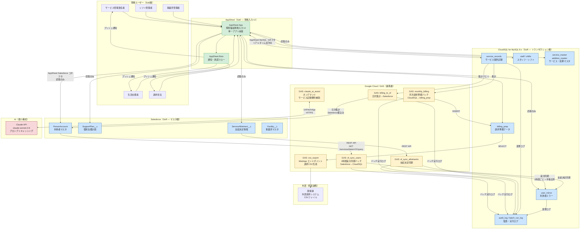

# 01. 全体アーキテクチャ設計

> 対応 spec.md: §4（高レベルアーキテクチャ方針）/ §5（技術選定）/ §6.Must.7（Salesforce ⇄ CloudSQL 同期バッチ設計）

---

## 1. システム全体構成図（Mermaid）

---

## 2. 責務分担表

> spec §4「System of Record / System of Engagement」対応

| 層 | コンポーネント | 責務 | 書込可否 | 備考 |
|---|---|---|---|---|
| **SoR（マスタ）** | Salesforce PersonAccount | 利用者基本情報・障害種別・受給者証番号 | ○（Salesforce 側のみ）| AppSheet からは読取専用 |
| **SoR（マスタ）** | Salesforce SupportPlan__c | 個別支援計画・支援目標 | ○（Salesforce 側のみ）| |
| **SoR（マスタ）** | Salesforce ServiceAllotment__c | 支給決定情報 | ○（Salesforce 側のみ）| GAS で CloudSQL にキャッシュ |
| **SoR（トランザクション）** | CloudSQL service_records | 日次サービス提供記録 | ○（AppSheet 経由）| 主業務データ |
| **SoR（トランザクション）** | CloudSQL staff / shifts | スタッフ・シフト情報 | ○（AppSheet 経由）| |
| **SoR（トランザクション）** | CloudSQL billing_prep | 月次請求準備データ | ○（GAS バッチ）| AppSheet から確認・ステータス更新 |
| **SoR（マスタ参照）** | CloudSQL service_master | サービスコード・単位数 | ○（管理者のみ）| 報酬改定時に更新 |
| **SoE（UI）** | AppSheet | 現場入力 / 利用者検索 / シフト / 集計プレビュー | CloudSQL のみ | SF は読取専用 |
| **連携** | GAS V8 | Salesforce ⇄ CloudSQL 差分同期、月次バッチ、CSV 生成 | CloudSQL 書込・SF 読取（+ 日次集計 SF 書込）| |
| **AI（最小）** | Claude API Sonnet 4.6 | サービス記録要約補助（Cycle 1 スコープ最小）| なし | Should 扱い、PII マスキング前提 |

---

## 3. 連携経路サマリ

> spec §4「連携経路と頻度」表を実装視点で補足

| From | To | 方向 | 頻度 | 手段 | 冪等性 |
|---|---|---|---|---|---|
| Salesforce | CloudSQL | 一方向（マスタ配信）| 1時間ごと差分 + 手動全件 | GAS V8 + UrlFetchApp + Salesforce REST API v61 | `sf_account_id` UNIQUE で重複排除 |
| CloudSQL | Salesforce | 一方向（集計連携）| 日次バッチ（夜間）| GAS V8 + UrlFetchApp | Upsert（ExternalId）|
| AppSheet | CloudSQL | 双方向 CRUD | リアルタイム | AppSheet 公式 MySQL コネクタ | 楽観ロック（`updated_at`）|
| AppSheet | Salesforce | 読取のみ | リアルタイム | AppSheet 公式 Salesforce コネクタ | — |
| GAS | CloudSQL | バッチ書込 | 月次（月初 3 日以内）| MySQL socket 経由（Cloud SQL Auth Proxy / Public IP 許可）| `batch_run_id` UNIQUE KEY |
| GAS | Claude API | オンデマンド | 必要時 | UrlFetchApp HTTPS | — |

---

## 4. インフラ構成

### 4.1 CloudSQL インスタンス仕様

| 項目 | 値 |
|---|---|
| エンジン | MySQL 8.x |
| エディション | Enterprise |
| リージョン | asia-northeast1（東京）|
| インスタンスタイプ | db-custom-2-7680（2vCPU / 7.5GB RAM）|
| ストレージ | SSD 自動拡張（初期 50GB）|
| バックアップ | 自動バックアップ 毎日 1:00 JST（保持 7 世代）|
| PITR | 有効（保持 7 日間）|
| 高可用性 | HA 構成（Cycle 1 は Single-zone で開始、SLA 強化要件発生時に Regional へ移行）|
| 暗号化 | GCP デフォルト暗号化（CMEK は Cycle 2 で再評価）|

### 4.2 ネットワーク・アクセス制御

| アクセス元 | 接続方式 | 認証 |
|---|---|---|
| AppSheet | Public IP 許可 + SSL（AppSheet サービス IP レンジ）| データベースユーザー + TLS |
| GAS（バッチ）| Cloud SQL Auth Proxy（推奨）or 固定 IP 許可 | サービスアカウント（最小権限）|
| 管理者（手動）| Cloud SQL Auth Proxy + IAM | 事業所管理者の Google アカウント |

---

## 5. Salesforce Connected App 設定方針

> spec §4 / tech-research-notes.md R3 / `04-salesforce-objects.md` §10 参照

| 設定項目 | 値 |
|---|---|
| App 名 | `WelfareGASIntegration` |
| OAuth フロー | JWT Bearer（Server-to-Server）|
| スコープ | `api`, `refresh_token`, `offline_access` |
| IP 制限 | GAS 実行 IP レンジ（または IP 制限解除後に Salesforce Event Monitoring で補完）|
| 秘密鍵 | GCP Secret Manager に保管 |

---

## 6. GAS 実行環境

| 項目 | 値 |
|---|---|
| ランタイム | V8（Rhino は 2026-01-31 停止済み — tech-research-notes.md R3）|
| 実行上限 | 6分/回（spec §8 R-06 — 月次バッチはチャンク分割で対応）|
| タイムゾーン | Asia/Tokyo（スクリプト設定 + CloudSQL 接続時 SET time_zone）|
| 秘密情報管理 | Properties Service（Script Properties）に Salesforce credentials を保管 |

---

## 7. AI 機能（最小構成）

> spec §5 R5 / §8 R-09 対応

| 項目 | 値 |
|---|---|
| モデル | `claude-sonnet-4-6`（Cycle 1）|
| 用途 | サービス記録要約補助（Should 扱い — Cycle 1 スコープ最小）|
| PII 取扱 | **要配慮 PII を Claude API に送信しない**。Cycle 2 で「PII マスキング前提」設計（spec §8 R-09）|
| プロンプトキャッシング | 有効化（繰り返しシステムプロンプトのキャッシュ）|
| 呼び出し | GAS UrlFetchApp HTTPS — `https://api.anthropic.com/v1/messages` |
