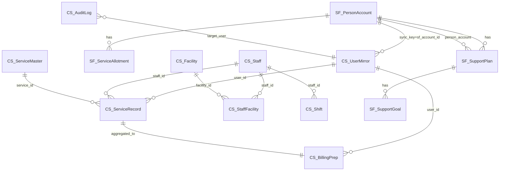

# 02. データモデル（ER図・エンティティ定義）

> 対応 spec.md: §6.Must.1（利用者マスタ）/ §6.Must.2（個別支援計画）/ §6.Must.3（日次サービス提供記録）/ §6.Must.5（スタッフ・シフト）/ §6.Must.6（請求準備）
>
> **正スキーマの所在**: Salesforce オブジェクトの正スキーマは `04-salesforce-objects.md`、CloudSQL の正スキーマは `03-cloudsql-ddl.sql` に置く。本ファイルはそれらへの参照を持つ概念モデルおよび属性一覧。

---

## 1. ER図（Mermaid）

**凡例**:
- `SF_` プレフィックス → Salesforce オブジェクト（正スキーマ: `04-salesforce-objects.md`）
- `CS_` プレフィックス → CloudSQL テーブル（正スキーマ: `03-cloudsql-ddl.sql`）

---

## 2. エンティティ一覧

### 2.1 Salesforce エンティティ（System of Record: マスタ系）

#### SF_PersonAccount（利用者マスタ）

> spec §6.Must.1 対応

| 属性名（API名）| 型 | 必須 | PII区分 | 説明 |
|---|---|---|---|---|
| `Id` | ID(18) | ○ | - | SF 標準主キー（同期キー） |
| `LastName` | Text(80) | ○ | 基本 | 姓 |
| `FirstName` | Text(40) | ○ | 基本 | 名 |
| `LastNameKana__c` | Text(40) | - | 基本 | 姓（フリガナ）|
| `FirstNameKana__c` | Text(40) | - | 基本 | 名（フリガナ）|
| `BirthDate` | Date | - | 基本 | 生年月日 |
| `PersonMailingStreet` | TextArea | - | 基本 | 住所（番地）|
| `PersonMailingCity` | Text(40) | - | 基本 | 市区町村 |
| `PersonMailingState` | Text(80) | - | 基本 | 都道府県 |
| `PersonMobilePhone` | Phone | - | 基本 | 携帯電話 |
| `DisabilityType__c` | Picklist | ○ | **要配慮** | 障害種別（身体・知的・精神・発達等）|
| `DisabilityGrade__c` | Text(10) | - | **要配慮** | 障害等級 |
| `RecipientCertNo__c` | Text(20) | ○ | **特定機微** | 受給者証番号 |
| `RecipientCertExpiry__c` | Date | ○ | **特定機微** | 受給者証有効期限 |
| `EmergencyContactName__c` | Text(80) | - | 基本 | 緊急連絡先氏名 |
| `EmergencyContactPhone__c` | Phone | - | 基本 | 緊急連絡先電話番号 |
| `EmergencyContactRelation__c` | Picklist | - | 基本 | 緊急連絡先続柄 |
| `FacilityId__c` | Lookup(Facility__c) | ○ | - | 所属事業所 |
| `IsActive__c` | Checkbox | ○ | - | 在籍フラグ |

**PII 3分類**:
- 基本: 氏名・住所・電話番号・生年月日
- 要配慮: 障害種別・等級（個人情報保護法 第2条第3項）
- 特定機微: 受給者証番号（障害者総合支援法上の識別子）— **法務レビュー要フラグ**

---

#### SF_SupportPlan（個別支援計画）

> spec §6.Must.2 対応

| 属性名（API名）| 型 | 必須 | PII区分 | 説明 |
|---|---|---|---|---|
| `Id` | ID(18) | ○ | - | SF 標準主キー |
| `Name` | AutoNumber | ○ | - | 計画番号（自動採番）|
| `PersonAccount__c` | Lookup(PersonAccount) | ○ | - | 利用者（Person Account）への参照 |
| `PlanStartDate__c` | Date | ○ | - | 計画開始日 |
| `PlanEndDate__c` | Date | ○ | - | 計画終了日 |
| `ServiceManager__c` | Lookup(User) | ○ | - | サービス管理責任者（SF User）|
| `MonitoringCycle__c` | Picklist | ○ | - | モニタリング周期（月次/2か月/3か月/6か月/12か月）|
| `Status__c` | Picklist | ○ | - | ステータス（draft/active/closed）|
| `LongTermGoal__c` | LongTextArea(1000) | - | **要配慮** | 長期目標 |
| `ShortTermGoal__c` | LongTextArea(1000) | - | **要配慮** | 短期目標 |

**バリデーション**:
- `PlanEndDate__c >= PlanStartDate__c` を Validation Rule で強制（spec §6.Must.2 受入基準）
- 同一利用者・同一期間の重複 active 計画を禁止（Duplicate Rule / VLOOKUP Validation）

---

#### SF_SupportGoal（支援目標）

| 属性名（API名）| 型 | 必須 | 説明 |
|---|---|---|---|
| `Id` | ID(18) | ○ | 主キー |
| `SupportPlan__c` | MasterDetail(SupportPlan__c) | ○ | 個別支援計画（親）|
| `GoalTitle__c` | Text(100) | ○ | 目標タイトル |
| `GoalDetail__c` | LongTextArea(500) | - | 目標詳細 |
| `TargetDate__c` | Date | - | 達成目標日 |
| `SortOrder__c` | Number(3,0) | - | 表示順 |

---

#### SF_ServiceAllotment（支給決定情報）

> spec §6.Must.1 受入基準の「支給決定情報」対応

| 属性名（API名）| 型 | 必須 | PII区分 | 説明 |
|---|---|---|---|---|
| `Id` | ID(18) | ○ | - | 主キー |
| `PersonAccount__c` | Lookup(PersonAccount) | ○ | - | 利用者 |
| `ServiceType__c` | Picklist | ○ | - | サービス種別（生活介護/就B/GH等）|
| `AllotmentQty__c` | Number(6,1) | ○ | - | 支給量（時間数 or 回数）|
| `AllotmentUnit__c` | Picklist | ○ | - | 支給単位（hour/times/day）|
| `ValidFrom__c` | Date | ○ | **特定機微** | 有効開始日 |
| `ValidTo__c` | Date | ○ | **特定機微** | 有効終了日 |
| `WelfareOffice__c` | Text(50) | - | - | 支給決定した市区町村福祉事務所名 |

---

### 2.2 CloudSQL エンティティ（System of Record: トランザクション系）

> 正スキーマ（DDL）は `03-cloudsql-ddl.sql` を参照。本節は属性仕様の補足。

#### CS_UserMirror（利用者ミラー）

> Salesforce PersonAccount を CloudSQL に同期したテーブル。SoE（AppSheet）からの参照・JOIN 用。

| 列名 | 型 | 必須 | PII区分 | 説明 |
|---|---|---|---|---|
| `id` | BIGINT UNSIGNED AUTO_INCREMENT | ○ | - | CloudSQL 内部主キー |
| `sf_account_id` | VARCHAR(18) | ○ | - | **同期キー**（Salesforce Id 18桁）|
| `last_name` | VARCHAR(80) | ○ | 基本 | 姓 |
| `first_name` | VARCHAR(40) | ○ | 基本 | 名 |
| `disability_type` | VARCHAR(20) | ○ | **要配慮** | 障害種別 |
| `recipient_cert_no` | VARCHAR(20) | ○ | **特定機微** | 受給者証番号（暗号化カラム）|
| `recipient_cert_expiry` | DATE | ○ | **特定機微** | 受給者証有効期限 |
| `facility_id` | BIGINT UNSIGNED | ○ | - | FK → `facilities.id` |
| `is_active` | TINYINT(1) | ○ | - | 在籍フラグ |
| `sf_synced_at` | DATETIME | ○ | - | 最終 SF 同期日時（JST）|
| `created_at` | DATETIME | ○ | - | 作成日時 |
| `updated_at` | DATETIME | ○ | - | 更新日時 |

---

#### CS_ServiceRecord（日次サービス提供記録）

> spec §6.Must.3 対応

| 列名 | 型 | 必須 | PII区分 | 説明 |
|---|---|---|---|---|
| `id` | BIGINT UNSIGNED AUTO_INCREMENT | ○ | - | 主キー |
| `user_id` | BIGINT UNSIGNED | ○ | - | FK → `user_mirror.id` |
| `staff_id` | BIGINT UNSIGNED | ○ | - | FK → `staff.id` |
| `service_id` | BIGINT UNSIGNED | ○ | - | FK → `service_master.id` |
| `facility_id` | BIGINT UNSIGNED | ○ | - | FK → `facilities.id` |
| `service_date` | DATE | ○ | - | 提供日（INDEX 対象）|
| `start_time` | TIME | ○ | - | 開始時刻（Asia/Tokyo）|
| `end_time` | TIME | ○ | - | 終了時刻 |
| `duration_minutes` | SMALLINT UNSIGNED | ○ | - | 提供時間（分）— `end_time - start_time` で算出して保存 |
| `location_type` | ENUM('facility','home','other') | ○ | - | 提供場所 |
| `location_note` | VARCHAR(100) | - | - | 場所補足（'other'時に使用）|
| `notes` | TEXT | - | **要配慮** | 特記事項（支援内容詳細）|
| `is_approved` | TINYINT(1) | ○ | - | 承認フラグ（請求対象判定に使用）|
| `approved_by` | BIGINT UNSIGNED | - | - | FK → `staff.id`（承認者）|
| `approved_at` | DATETIME | - | - | 承認日時 |
| `created_at` | DATETIME | ○ | - | 作成日時 |
| `updated_at` | DATETIME | ○ | - | 更新日時（楽観ロック比較用）|

**INDEX**: `(user_id, service_date)` — spec §6.Must.3 受入基準の「利用者 ID + 提供日」インデックス要件を充足。

---

#### CS_Staff（スタッフ基本情報）

> spec §6.Must.5 対応

| 列名 | 型 | 必須 | PII区分 | 説明 |
|---|---|---|---|---|
| `id` | BIGINT UNSIGNED AUTO_INCREMENT | ○ | - | 主キー |
| `sf_user_id` | VARCHAR(18) | - | - | Salesforce User Id（連携時に設定）|
| `last_name` | VARCHAR(40) | ○ | 基本 | 姓 |
| `first_name` | VARCHAR(40) | ○ | 基本 | 名 |
| `email` | VARCHAR(100) | ○ | 基本 | メールアドレス（UNIQUE）|
| `qualification` | VARCHAR(50) | - | - | 資格区分（例: 社会福祉士、介護福祉士等）|
| `is_active` | TINYINT(1) | ○ | - | 在職フラグ |
| `created_at` | DATETIME | ○ | - | 作成日時 |
| `updated_at` | DATETIME | ○ | - | 更新日時 |

---

#### CS_StaffFacility（スタッフ × 事業所 兼務テーブル）

> spec §6.Must.5 受入基準「1スタッフが複数事業所兼務可能なリレーション」対応

| 列名 | 型 | 必須 | 説明 |
|---|---|---|---|
| `id` | BIGINT UNSIGNED AUTO_INCREMENT | ○ | 主キー |
| `staff_id` | BIGINT UNSIGNED | ○ | FK → `staff.id` |
| `facility_id` | BIGINT UNSIGNED | ○ | FK → `facilities.id` |
| `primary_flag` | TINYINT(1) | ○ | 主所属フラグ（1=主、0=兼務）|
| `start_date` | DATE | ○ | 兼務開始日 |
| `end_date` | DATE | - | 兼務終了日（NULLは継続中）|

UNIQUE KEY: `(staff_id, facility_id)` — 同一スタッフ・同一事業所の重複行を防止。

---

#### CS_Shift（シフト）

> spec §6.Must.5 対応

| 列名 | 型 | 必須 | 説明 |
|---|---|---|---|
| `id` | BIGINT UNSIGNED AUTO_INCREMENT | ○ | 主キー |
| `staff_id` | BIGINT UNSIGNED | ○ | FK → `staff.id` |
| `facility_id` | BIGINT UNSIGNED | ○ | FK → `facilities.id` |
| `shift_date` | DATE | ○ | シフト日 |
| `start_time` | TIME | ○ | 開始時刻 |
| `end_time` | TIME | ○ | 終了時刻 |
| `shift_type` | ENUM('normal','overtime','holiday') | ○ | シフト種別 |
| `created_at` | DATETIME | ○ | 作成日時 |
| `updated_at` | DATETIME | ○ | 更新日時 |

**シフト衝突検出ルール**（spec §6.Must.5 受入基準）:  
同一 `staff_id` × `shift_date` で時刻範囲が重複するレコードを AppSheet 登録時に拒否する。  
実装手段: AppSheet Valid_If 式または GAS バッチによる事後チェック（詳細は `05-appsheet-tables.md` / `06-gas-integrations.md` 参照）。

---

#### CS_ServiceMaster（サービスマスタ）

> spec §8 R-04「サービスコード・単位数をハードコードしない」対応

| 列名 | 型 | 必須 | 説明 |
|---|---|---|---|
| `id` | BIGINT UNSIGNED AUTO_INCREMENT | ○ | 主キー |
| `service_code` | VARCHAR(20) | ○ | 国保連サービスコード（UNIQUE）|
| `service_name` | VARCHAR(100) | ○ | サービス名称 |
| `service_type` | VARCHAR(30) | ○ | サービス種別（生活介護/就B/GH等）|
| `unit_per_minute` | DECIMAL(8,4) | - | 分あたり単位数（null=時間非依存）|
| `unit_fixed` | SMALLINT | - | 固定単位数（null=時間依存）|
| `valid_from` | DATE | ○ | 有効開始日 |
| `valid_to` | DATE | - | 有効終了日（NULLは継続）|

---

#### CS_AdditionMaster（加算・減算マスタ）

> spec §8 R-04 対応（加算減算ハードコード禁止）

| 列名 | 型 | 必須 | 説明 |
|---|---|---|---|
| `id` | BIGINT UNSIGNED AUTO_INCREMENT | ○ | 主キー |
| `addition_code` | VARCHAR(20) | ○ | 加算コード（UNIQUE）|
| `addition_name` | VARCHAR(100) | ○ | 加算名称 |
| `service_type` | VARCHAR(30) | ○ | 対象サービス種別 |
| `unit_diff` | SMALLINT | ○ | 単位数増減（正=加算、負=減算）|
| `valid_from` | DATE | ○ | 有効開始日 |
| `valid_to` | DATE | - | 有効終了日 |

---

#### CS_BillingPrep（請求準備データ）

> spec §6.Must.6 対応

| 列名 | 型 | 必須 | 説明 |
|---|---|---|---|
| `id` | BIGINT UNSIGNED AUTO_INCREMENT | ○ | 主キー |
| `user_id` | BIGINT UNSIGNED | ○ | FK → `user_mirror.id` |
| `facility_id` | BIGINT UNSIGNED | ○ | FK → `facilities.id` |
| `billing_year_month` | CHAR(6) | ○ | 対象年月（YYYYMM形式）|
| `service_id` | BIGINT UNSIGNED | ○ | FK → `service_master.id` |
| `service_days` | TINYINT UNSIGNED | ○ | 提供日数 |
| `total_units` | DECIMAL(10,2) | ○ | 合計単位数 |
| `addition_units` | DECIMAL(10,2) | ○ | 加算合計単位数 |
| `deduction_units` | DECIMAL(10,2) | ○ | 減算合計単位数 |
| `net_units` | DECIMAL(10,2) | ○ | 請求単位数（= total + addition - deduction）|
| `batch_run_id` | VARCHAR(50) | ○ | バッチ実行ID（冪等性キー）|
| `status` | ENUM('draft','confirmed','submitted') | ○ | ステータス |
| `created_at` | DATETIME | ○ | 作成日時 |
| `updated_at` | DATETIME | ○ | 更新日時 |

UNIQUE KEY: `(user_id, billing_year_month, service_id, batch_run_id)` — 冪等性確保（spec §6.Must.6 受入基準）。

---

#### CS_Facility（事業所）

| 列名 | 型 | 必須 | 説明 |
|---|---|---|---|
| `id` | BIGINT UNSIGNED AUTO_INCREMENT | ○ | 主キー |
| `sf_account_id` | VARCHAR(18) | - | SF Account Id（事業所が SF にある場合）|
| `facility_code` | VARCHAR(20) | ○ | 事業所番号（UNIQUE）|
| `facility_name` | VARCHAR(100) | ○ | 事業所名 |
| `service_type` | VARCHAR(30) | ○ | 対象サービス種別 |
| `prefecture` | VARCHAR(10) | ○ | 都道府県 |
| `is_active` | TINYINT(1) | ○ | 稼働フラグ |

---

#### CS_AuditLog（システム監査ログ）

> spec §6.Must.8 受入基準「監査ログ要件」対応

| 列名 | 型 | 必須 | 説明 |
|---|---|---|---|
| `id` | BIGINT UNSIGNED AUTO_INCREMENT | ○ | 主キー |
| `event_type` | VARCHAR(50) | ○ | イベント種別（CREATE/UPDATE/DELETE/LOGIN/EXPORT等）|
| `table_name` | VARCHAR(50) | - | 操作対象テーブル名 |
| `record_id` | VARCHAR(50) | - | 操作対象レコードID |
| `actor_type` | ENUM('staff','gas_batch','system') | ○ | 操作者種別 |
| `actor_id` | VARCHAR(50) | ○ | 操作者ID（スタッフID / バッチ名等）|
| `before_json` | JSON | - | 変更前スナップショット（UPDATE/DELETE 時）|
| `after_json` | JSON | - | 変更後スナップショット（CREATE/UPDATE 時）|
| `ip_address` | VARCHAR(45) | - | クライアントIPアドレス |
| `created_at` | DATETIME | ○ | ログ記録日時 |

保持期間: 最低 **5年**（個人情報保護法ガイドライン準拠 — **法務レビュー要フラグ**）。  
削除: 保持期間経過後に定期バッチで物理削除（詳細は `08-security-and-privacy.md` 参照）。

---

## 3. 同期キー一覧（Salesforce ⇄ CloudSQL）

> spec §7「データ整合性」/ spec §6.Must.7 受入基準対応

| Salesforce オブジェクト | SF フィールド | CloudSQL テーブル | CloudSQL 列 |
|---|---|---|---|
| PersonAccount | `Id` (18桁) | `user_mirror` | `sf_account_id` |
| ServiceAllotment__c | `Id` (18桁) | ※ Cycle 1 は AppSheet が SF を直参照 | — |
| User（SF スタッフ）| `Id` (18桁) | `staff` | `sf_user_id` |

**競合解決ルール**: Salesforce を SoR（真のマスタ）とする。同期バッチは `sf_synced_at` と SF の `LastModifiedDate` を比較し、SF の方が新しい場合のみ CloudSQL を上書き。逆方向への書き戻しはしない。

---

## 4. 法務レビュー要フラグ一覧

| # | 対象 | フラグ理由 |
|---|---|---|
| L-01 | `RecipientCertNo__c`（受給者証番号） | 障害者総合支援法上の識別情報。保管・提供に関する法的根拠の確認要 |
| L-02 | `DisabilityType__c`（障害種別）| 個人情報保護法 §2-3「要配慮個人情報」に該当。収集時の本人同意取得手続きの確認要 |
| L-03 | `notes`（特記事項）| 支援内容詳細は要配慮個人情報に相当しうる。アクセス制御・保持期間の法務確認要 |
| L-04 | `CS_AuditLog` 保持期間 | 5年の根拠法令確認要（個人情報保護法 / 障害者総合支援法の記録保存義務）|
