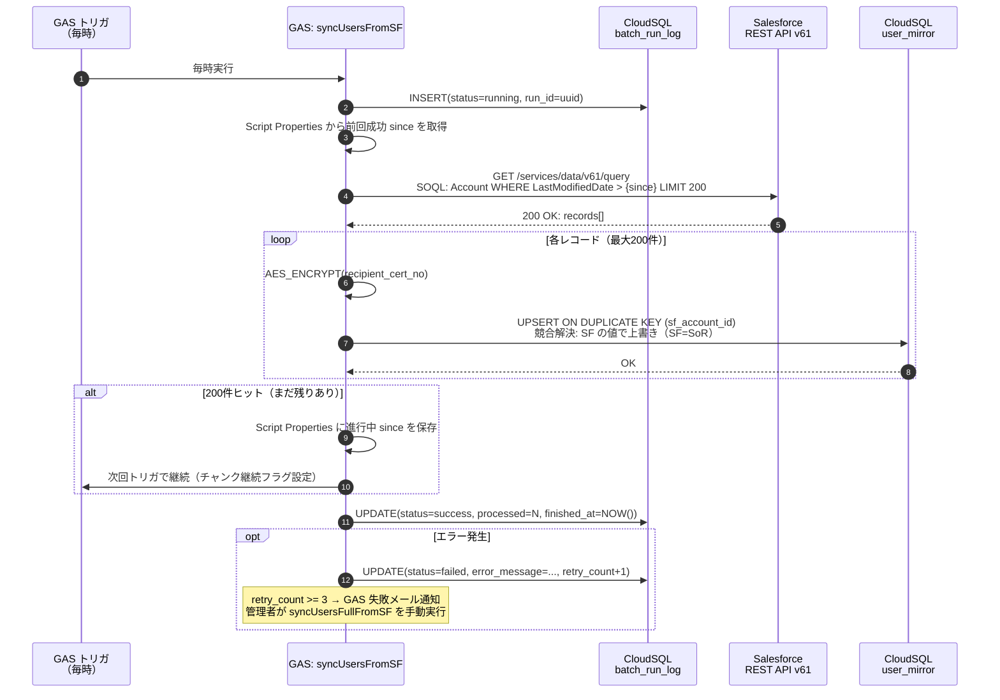
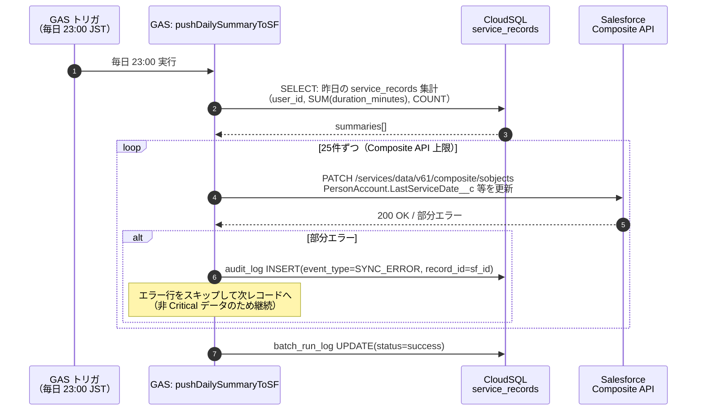
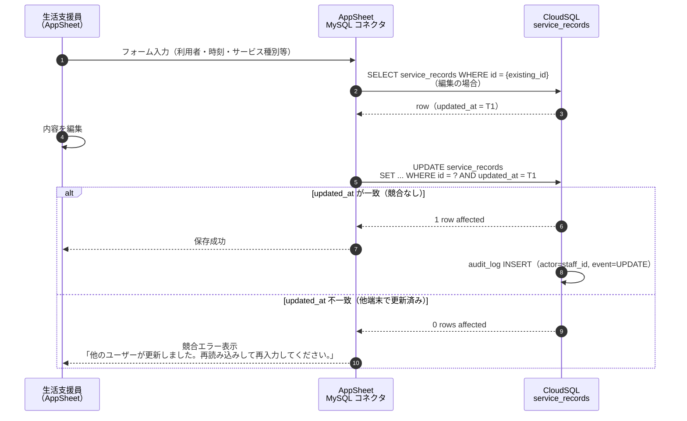
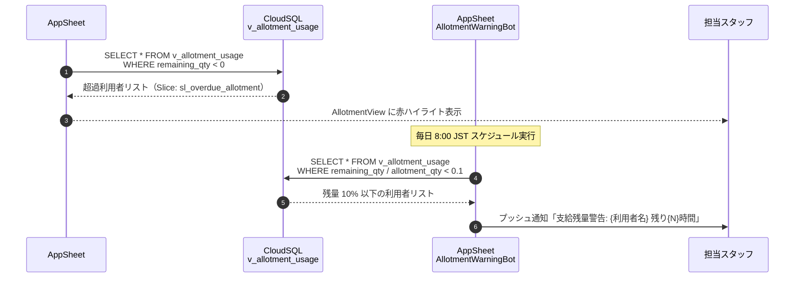
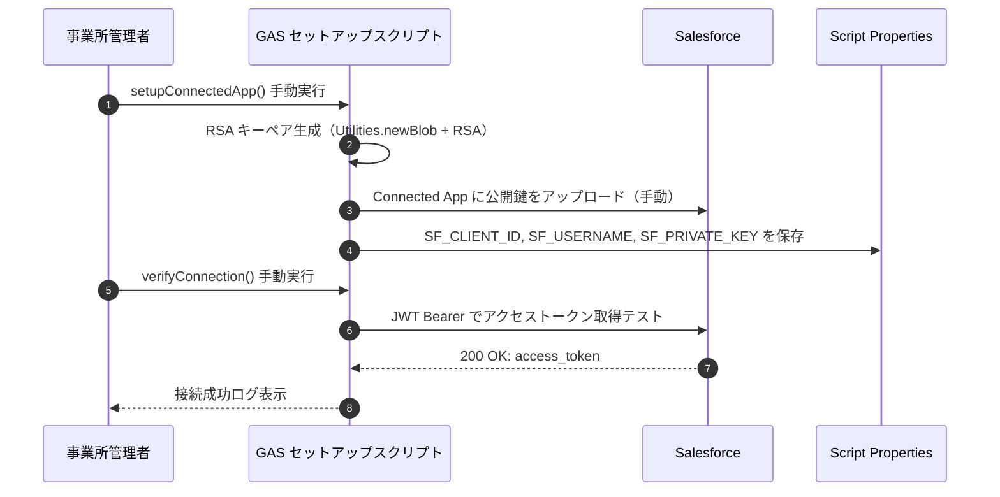

# 07. 連携フロー（シーケンス図）

> 対応 spec.md: §6.Must.7（Salesforce ⇄ CloudSQL 同期バッチ）/ §6.Must.6（月次請求準備）/ §6.Must.4（支給決定残量）/ §4（連携経路）
>
> **リトライ方針・冪等性確保手段** を各フローに明記。

---

## Flow 1: Salesforce → CloudSQL 差分同期（毎時）

> spec §6.Must.7 受入基準「同期キー・競合解決ルール・失敗時リトライ方針・実行ログ保存先」対応



**冪等性確保**: `user_mirror.sf_account_id` に UNIQUE KEY → 同一レコードの重複 UPSERT は安全に上書き。  
**競合解決ルール**: Salesforce の `LastModifiedDate` が CloudSQL の `sf_synced_at` より新しい場合のみ上書き（UPSERT の ON DUPLICATE KEY UPDATE 句で担保）。  
**実行ログ保存先**: CloudSQL `batch_run_log`（spec §6.Must.7 受入基準）。

---

## Flow 2: CloudSQL → Salesforce 日次集計連携

> spec §4「CloudSQL → Salesforce 日次バッチ」対応



---

## Flow 3: AppSheet からのサービス記録入力・楽観ロック

> spec §6.Must.3「AppSheet から入力」/ spec §8 R-08「楽観ロック」対応



**冪等性**: 新規 INSERT は service_date・user_id・staff_id での重複チェック（AppSheet Valid_If）で重複を防止。

---

## Flow 4: 月次請求準備バッチ

> spec §6.Must.6 受入基準「I/O 仕様・冪等性・エラー再実行手順」対応

```mermaid
sequenceDiagram
    autonumber
    participant Trigger as GAS トリガ<br/>（月初 2 日 0:00 JST）
    participant GAS as GAS: runMonthlyBilling
    participant DB as CloudSQL
    participant Admin as 請求担当<br/>（AppSheet）

    Trigger ->> GAS: 月初 2 日 0:00 実行
    GAS ->> DB: INSERT batch_run_log(status=running, run_id=new_uuid)
    GAS ->> DB: SELECT DISTINCT user_id FROM service_records<br/>WHERE year_month = 前月 AND is_approved = 1

    loop 利用者 50件チャンク
        GAS ->> DB: SELECT service_records JOIN service_master<br/>集計: service_days, total_units
        GAS ->> DB: SELECT addition_master（加算・減算骨子）
        GAS ->> GAS: net_units = total + addition - deduction

        GAS ->> DB: INSERT billing_prep<br/>ON CONFLICT(uq_billing_idempotent) → SKIP
        note over GAS,DB: batch_run_id で冪等性担保<br/>再実行時は新 batch_run_id → 追記

        alt 残り実行時間 < 60秒
            GAS ->> GAS: Script Properties にチャンクオフセット保存
            GAS ->> Trigger: 継続トリガ設定（5分後）
            GAS ->> DB: UPDATE batch_run_log(status=partial)
            break
        end
    end

    GAS ->> DB: UPDATE batch_run_log(status=success)
    DB -->> Admin: AppSheet BillingPrepView で draft 一覧を確認可能

    Admin ->> DB: UPDATE billing_prep SET status='confirmed'<br/>（AppSheet ConfirmBilling Action）
```

**エラー再実行手順**（spec §6.Must.6 受入基準）:
1. 管理者が `batch_run_log` で `status=failed` を確認（AppSheet AuditLogView）
2. `runMonthlyBilling('YYYYMM')` を手動実行
3. 新 `batch_run_id` が生成され前回 draft とは別行として INSERT
4. 請求担当が正しいバッチの行を `confirmed` に変更
5. 前回 `draft` 行は別途 `status=void` に手動更新

---

## Flow 5: 支給決定残量計算と超過警告

> spec §6.Must.4 受入基準「集計 SQL と AppSheet Slice/View 設計・超過時警告ルール」対応



**超過警告ルール**（spec §6.Must.4 受入基準）:
- `remaining_qty < 0`: 支給量超過 → AppSheet AllotmentView 赤ハイライト
- `remaining_qty / allotment_qty < 0.1`: 残量 10% 未満 → AppSheet Bot でプッシュ通知
- 超過後の新規サービス記録登録は警告を表示するが**ブロックしない**（現場判断を尊重。ブロック要否は Cycle 2 で検討）

---

## Flow 6: Cookie 取得・GAS 認証初期化（初期セットアップ）



---

## リトライ・冪等性・障害時挙動まとめ

| フロー | リトライ方針 | 冪等性確保手段 | 障害時最大影響 |
|---|---|---|---|
| SF → CS 差分同期 | 次回定期トリガで自動再試行。3回連続失敗でメール通知 | `sf_account_id` UNIQUE KEY + ON DUPLICATE KEY UPDATE | 最大 1 時間のマスタ差分（sync 頻度に依存）|
| CS → SF 日次集計 | エラー行をスキップして継続。翌日の同期で補完 | SF Upsert（ExternalId）| 集計値のずれ（翌日補完）|
| AppSheet CRUD | AppSheet が自動的にエラー表示。ユーザーが再試行 | 楽観ロック（`updated_at`）/ 一意制約 | 編集競合時は再入力 |
| 月次バッチ | 管理者が手動再実行。新 batch_run_id で安全に追記 | `billing_prep` UNIQUE KEY `(user_id, ym, service_id, batch_run_id)` | 請求準備データの一時的な不完全状態 |
| 支給決定同期 | SF → CS 差分同期と同一方針 | `user_allotment_cache` upsert | 残量計算が旧データに基づく（最大 1 時間）|
