# 01. 全体アーキテクチャ設計

> 対応 spec.md: §4（高レベルアーキテクチャ方針）/ §5（技術選定）/ §4「SoR の単一化（C-04）」/ §4「Facility マスタの連携（C-06）」/ §4「鍵管理経路（C-01）」/ §6.Must.7（Salesforce ⇄ CloudSQL 同期バッチ設計）
>
> **Cycle 2 主要変更**:
> - C-04: AppSheet が Salesforce 直参照と CloudSQL 経路を同時に使う設計を**全廃**。全 SF 由来データは CloudSQL 経由のみ。
> - C-06: `facility_id_map` テーブル新設、`syncFacilitiesFromSF` GAS 関数新設。
> - C-01: `AES_ENCRYPT` 廃止 → Cloud KMS Application-level 暗号化へ変更。
> - C-20 / R-06: 月次重量バッチを Cloud Run jobs に分離。GAS は軽量バッチ専任。

---

## 1. システム全体構成図（Mermaid）

```mermaid
graph TB
    subgraph "現場ユーザー（SoE層）"
        U1[サービス管理責任者\nサビ管]
        U2[生活支援員]
        U3[シフト管理者]
        U4[請求担当]
        U5[事業所管理者]
        U6[サービス提供責任者\nサ提責]
    end

    subgraph "AppSheet（SoE — 現場入力 UI）"
        AS[AppSheet\nHopeCareDX\nb9e4f84d-f9b9-4376-97f1-83e3b07122e3\n単一アプリ]
        AS_BOT[AppSheet Bots\n通知・承認フロー]
    end

    subgraph "GAS（軽量連携層 — 6分以内ジョブ）"
        GAS1[GAS: syncUsersFromSF\n1時間差分同期]
        GAS2[GAS: syncAllotmentsFromSF\n支給決定同期]
        GAS3[GAS: syncFacilitiesFromSF\n日次+変更時即時\nC-06解消]
        GAS4[GAS: syncContractsFromSF\n日次差分]
        GAS5[GAS: pushDailySummaryToSF\n日次集計→SF]
        GAS6[GAS: triggerBillingBatch\nCloud Tasksへキック]
        GAS7[GAS: checkContractExpiry\n日次・契約満了前30日検出]
        GAS8[GAS: checkRecordCompleteness\n記録欠落検出・減算リスク警告]
    end

    subgraph "Cloud Run jobs（月次重量バッチ）"
        CRJ1[generateBillingPrep\n月次請求準備集計\n上限管理反映込み\nC-20解消]
    end

    subgraph "Cloud Tasks"
        CT[Cloud Tasks Queue\nGASからのジョブ投入\n認証: IAM]
    end

    subgraph "Salesforce（SoR — マスタ層）"
        SF_PA[PersonAccount\n利用者マスタ]
        SF_SP[IndividualSupportPlan__c\n個別支援計画\n親子構造C-08]
        SF_SA[ServiceAllotment__c\n支給決定情報]
        SF_FAC[Facility__c\n事業所マスタ\nSoR C-06]
        SF_SC[ServiceContract__c\n契約書 Must.10]
        SF_IM[ImportantMatterDocument__c\n重要事項説明書]
        SF_CF[ConsentForm__c\n同意書]
    end

    subgraph "CloudSQL for MySQL 8.x（SoR — トランザクション層）"
        CS_FIM[facility_id_map\nSF ID⇄CS ID変換\nC-06]
        CS_UM[user_mirror\n利用者ミラー\nCloudKMS暗号化]
        CS_CM[contract_mirror\n契約ミラー Must.10]
        CS_AC[user_allotment_cache\n支給決定キャッシュ]
        CS_SR[service_records\nサービス提供記録]
        CS_ST[staff / staff_facility_map\nスタッフ・兼務管理\nSecurity Filter参照 C-05]
        CS_SH[shifts\n夜勤対応\nis_overnight C-07]
        CS_BP[billing_prep\n請求準備データ\n上限管理FK Must.11]
        CS_UL[upper_limit_facility\nupper_limit_decision\nupper_limit_result_sheet\n上限管理3テーブル Must.11]
        CS_MS[service_master\naddition_master\nサービス・加算マスタ]
        CS_AL[audit_log\nappend-only C-10\nbatch_run_log]
    end

    subgraph "Google Cloud Infrastructure"
        KMS[Cloud KMS\nasia-northeast1\nkeyRings/welfare/cryptoKeys/cloudsql-kek\nC-01解消]
        SM[Secret Manager\nSF credentials\nGAS / Cloud Run keys]
        GCS[Cloud Storage\nWORM バケット\n監査ログ保存 5年\nC-10]
        CMEK[CMEK\nCloudSQL at-rest暗号化\nKEK=cloudsql-kek]
    end

    subgraph "外部（将来連携）"
        EXT[国保連\n外部請求システム]
        ULF[他事業所\n上限管理結果票授受\n⚠️L-13]
    end

    %% ユーザー → AppSheet
    U1 & U2 & U3 & U4 & U5 & U6 --> AS

    %% AppSheet ⇄ CloudSQL のみ（C-04: SF直参照廃止）
    AS <--> |AppSheet MySQL コネクタ\nリアルタイムCRUD| CS_SR
    AS <--> CS_ST
    AS <--> CS_SH
    AS <--> CS_UL
    AS --> |読取のみ| CS_UM
    AS --> |読取のみ| CS_AC
    AS --> |読取のみ| CS_CM
    AS --> |読取のみ| CS_MS
    AS --> |読取のみ| CS_BP
    AS_BOT --> |プッシュ通知| U1 & U2 & U4
    AS --> AS_BOT

    %% GAS: Salesforce → CloudSQL（マスタ配信）
    SF_PA  --> |REST API SOQL| GAS1
    SF_SA  --> |REST API SOQL| GAS2
    SF_FAC --> |REST API SOQL| GAS3
    SF_SC & SF_IM & SF_CF --> |REST API SOQL| GAS4
    GAS1 --> |UPSERT| CS_UM
    GAS2 --> |UPSERT| CS_AC
    GAS3 --> |UPSERT| CS_FIM
    GAS4 --> |UPSERT| CS_CM

    %% GAS: CloudSQL → Salesforce（集計連携）
    CS_SR --> |集計クエリ| GAS5
    GAS5  --> |Composite API| SF_PA

    %% GAS: 月次バッチキック
    GAS6 --> |Cloud Tasks enqueue\nHTTPS+IAM認証| CT
    CT   --> |invoke| CRJ1

    %% Cloud Run jobs: 請求準備生成
    CRJ1 --> |Cloud SQL Auth Proxy\nCMEK接続| CS_BP
    CRJ1 --> |SELECT| CS_SR
    CRJ1 --> |SELECT| CS_UL
    CRJ1 --> |write log| CS_AL

    %% GAS: 日次チェック
    GAS7 --> |未確認契約検出| CS_CM
    GAS8 --> |記録欠落チェック| CS_SR

    %% Cloud KMS ← 鍵管理
    KMS --> CMEK
    KMS --> |encrypt/decrypt\nrecipient_cert_no| GAS1
    KMS --> |encrypt/decrypt| CRJ1
    SM  --> |Secret取得| GAS1
    SM  --> |Secret取得| GAS2
    SM  --> |Secret取得| CRJ1

    %% 監査ログ → WORM バケット
    CS_AL --> |1時間ごとストリーム| GCS
    CS_SR & CS_UM --> |変更ログ| CS_AL

    %% 外部連携
    CS_BP --> EXT
    CS_UL <--> |月次授受 ⚠️L-13| ULF

    classDef soe fill:#d4edda,stroke:#28a745;
    classDef sor fill:#cce5ff,stroke:#004085;
    classDef gas fill:#fff3cd,stroke:#856404;
    classDef cloud fill:#f0e6ff,stroke:#6f42c1;
    classDef security fill:#f8d7da,stroke:#721c24;

    class AS,AS_BOT soe;
    class SF_PA,SF_SP,SF_SA,SF_FAC,SF_SC,SF_IM,SF_CF,CS_FIM,CS_UM,CS_CM,CS_AC,CS_SR,CS_ST,CS_SH,CS_BP,CS_UL,CS_MS,CS_AL sor;
    class GAS1,GAS2,GAS3,GAS4,GAS5,GAS6,GAS7,GAS8 gas;
    class CRJ1,CT,GCS cloud;
    class KMS,SM,CMEK security;
```



---

## 2. SoR 単一化表（C-04 解消）

> spec §4「System of Record（SoR）の単一化」/ C-04 解消の完全対応表

| エンティティ | SoR | 補助レイヤ | AppSheet 接続方針 |
|---|---|---|---|
| 利用者マスタ（Person Account）| **Salesforce** | CloudSQL `user_mirror`（読取専用キャッシュ）| **CloudSQL 経由のみ読取**（直接 SF 参照しない — C-04）|
| 契約・同意書（Must.10）| **Salesforce** | CloudSQL `contract_mirror` | CloudSQL 経由読取 |
| 支給決定 | **Salesforce** | CloudSQL `user_allotment_cache`（月次キャッシュ）| CloudSQL 経由読取 |
| 個別支援計画 | **Salesforce** | CloudSQL `support_plan_mirror`（Cycle 3 実装）| CloudSQL 経由読取（Cycle 3 以降）|
| Facility マスタ | **Salesforce** | CloudSQL `facility_id_map`（ID 変換のみ — C-06）| 直接参照なし。facilities テーブル経由 |
| サービス提供記録 | **CloudSQL** | — | CloudSQL 直接 CRUD |
| スタッフ・シフト | **CloudSQL** | SF User と `staff_facility_map` で連携 | CloudSQL 直接 CRUD |
| 上限管理（3 テーブル）（Must.11）| **CloudSQL**（一次入力）+ Salesforce（マスタ部分）| — | CloudSQL 直接 CRUD |
| 請求準備データ | **CloudSQL** | — | CloudSQL 読取 + Cloud Run jobs 書込 |
| 監査ログ | **CloudSQL append-only** + Cloud Storage WORM | — | AppSheet からは参照不可（管理コンソール経由のみ）|

> **重要原則**: AppSheet が Salesforce 直参照と CloudSQL 経路を同時に使う設計は**禁止**（C-04 解消）。

---

## 3. 鍵管理経路（C-01 解消）

> spec §4「鍵管理経路（C-01 解消 / R7 採用）」/ spec §5 表「DB 鍵管理」対応

```
Cloud KMS（asia-northeast1）
  KeyRing: welfare
  CryptoKey: cloudsql-kek
  Full KeyPath: projects/{p}/locations/asia-northeast1/keyRings/welfare/cryptoKeys/cloudsql-kek/cryptoKeyVersions/{v}
       │
       ├─ [1] CloudSQL CMEK（at-rest 暗号化）
       │      - インスタンス作成時 --disk-encryption-key で指定
       │      - バックアップも同じ KEK で暗号化
       │      - KEK ローテーション: 90 日（GCP デフォルト）
       │
       ├─ [2] Application-level 暗号化（受給者証番号等の決め打ち項目）
       │      - GAS (syncUsersFromSF) が Cloud KMS API encrypt() を呼び出し
       │        → VARBINARY(256) として user_mirror.recipient_cert_no に格納
       │      - 復号: Cloud Run jobs / GAS が Cloud KMS API decrypt() を呼び出し
       │      - AppSheet 表示: 末尾 4 桁マスク（AppSheet App formula で CONCATENATE("***-", RIGHT(..., 4))）
       │
       └─ [3] Secret Manager（接続情報・サービスアカウント鍵）
              - SF Connected App 秘密鍵 (SF_PRIVATE_KEY)
              - CloudSQL 接続パスワード (CS_DB_PASSWORD)
              - AppSheet Access Key
              - Cloud Run jobs サービスアカウント鍵
```

> **KEK パス統一**: 上記フルパスは `03-cloudsql-ddl.sql` コメント / `06-gas-integrations.md` / `09-operational-runbook.md` の 3 箇所で**完全に同一の文字列**を使用（C-01 受入基準）。

---

## 4. Facility マスタ連携（C-06 解消）

| 連携フロー | 説明 |
|---|---|
| SF `Facility__c` → GAS `syncFacilitiesFromSF` | 日次 + 変更時即時。SF REST API で取得 |
| GAS → CloudSQL `facility_id_map` | `salesforce_id` ↔ `cloudsql_id` を UPSERT |
| `user_mirror.facility_id` 等の FK | `facility_id_map.cloudsql_id` 経由で解決した値を格納 |
| AppSheet Security Filter | `staff_facility_map.facility_id`（CloudSQL 側）で絞り込み |

---

## 5. 連携経路サマリ

> spec §4「連携経路と頻度」対応（Cycle 2 更新版）

| From | To | 方向 | 頻度 | 手段 | 冪等性 |
|---|---|---|---|---|---|
| Salesforce（PersonAccount）| CloudSQL（user_mirror）| 一方向（マスタ配信）| 1時間ごと差分 + 手動全件 | GAS V8 + SF REST API v61 | `sf_account_id` UNIQUE |
| Salesforce（ServiceAllotment）| CloudSQL（user_allotment_cache）| 一方向 | 1時間ごと差分 | GAS V8 | `sf_allotment_id` UNIQUE |
| **Salesforce（Facility__c）** | **CloudSQL（facility_id_map）** | **一方向** | **日次 + 変更時即時（C-06）** | **GAS `syncFacilitiesFromSF`** | `salesforce_id` UNIQUE |
| Salesforce（ServiceContract 等）| CloudSQL（contract_mirror）| 一方向 | 日次差分 | GAS `syncContractsFromSF` | `sf_contract_id` UNIQUE |
| CloudSQL（service_records 集計）| Salesforce（PersonAccount 集計項目）| 一方向（集計連携）| 日次（23:00 JST）| GAS V8 + Composite API | Upsert（ExternalId）|
| AppSheet | CloudSQL | 双方向 CRUD | リアルタイム | AppSheet MySQL コネクタ | 楽観ロック（`updated_at`）|
| **GAS → Cloud Tasks** | **Cloud Run jobs** | **起動 + 結果取得** | **月次（月初 2 日 0:00 JST）** | **Cloud Tasks + IAM 認証 HTTPS（C-20）** | `batch_run_id` UNIQUE |
| Cloud Run jobs | CloudSQL（billing_prep）| バッチ書込 | 月次 | Cloud SQL Auth Proxy + CMEK | `batch_run_id` UNIQUE KEY |

---

## 6. インフラ構成

### 6.1 CloudSQL インスタンス仕様

| 項目 | 値 |
|---|---|
| エンジン | MySQL 8.x |
| エディション | Enterprise |
| リージョン | asia-northeast1（東京）|
| インスタンスタイプ | db-custom-2-7680（2vCPU / 7.5GB RAM）|
| ストレージ | SSD 自動拡張（初期 50GB）|
| バックアップ | 自動バックアップ 毎日 1:00 JST（保持 7 世代）|
| PITR | 有効（保持 7 日間）|
| 高可用性 | Single-zone（SLA 強化要件発生時に Regional へ移行）|
| **暗号化** | **CMEK（KEK = projects/{p}/locations/asia-northeast1/keyRings/welfare/cryptoKeys/cloudsql-kek）**（C-01 解消）|

### 6.2 ネットワーク・アクセス制御

| アクセス元 | 接続方式 | 認証 | TLS |
|---|---|---|---|
| AppSheet | Public IP 許可 + SSL | データベースユーザー + TLS | TLS 1.2 以上 |
| GAS（バッチ）| Cloud SQL Auth Proxy | サービスアカウント（最小権限）| TLS 1.2 以上（Auth Proxy 内部）|
| Cloud Run jobs | Cloud SQL Auth Proxy | サービスアカウント | TLS 1.2 以上 |
| 管理者（手動）| Cloud SQL Auth Proxy + IAM | 事業所管理者 Google アカウント | TLS 1.2 以上 |

### 6.3 Cloud Run jobs 構成（C-20 / R-06 解消）

| 項目 | 値 |
|---|---|
| Job 名 | `generate-billing-prep` |
| リージョン | asia-northeast1 |
| 実行環境 | Cloud Run jobs（実行時間上限 24 時間）|
| 起動方式 | Cloud Tasks + GAS `triggerBillingBatch` → HTTPS POST（IAM 認証）|
| 認証 | Cloud Run jobs サービスアカウント（`billing-job@{project}.iam.gserviceaccount.com`）|
| DB 接続 | Cloud SQL Auth Proxy（サイドカー）+ CMEK |
| 環境変数 | Secret Manager 経由（DB_PASSWORD / KMS_KEY_PATH 等）|

---

## 7. GAS 実行環境（軽量バッチ専任）

| 項目 | 値 |
|---|---|
| ランタイム | V8（Rhino は 2026-01-31 停止済み）|
| 実行上限 | 6分/回（**月次重量バッチは Cloud Run jobs に移管済み — C-20 解消**）|
| タイムゾーン | Asia/Tokyo（スクリプト設定 + CloudSQL 接続時 SET time_zone）|
| 秘密情報管理 | **Cloud Secret Manager** 経由（Script Properties への平文格納は廃止傾向 — C-01 方針）|

---

## 8. Salesforce Connected App 設定方針

| 設定項目 | 値 |
|---|---|
| App 名 | `WelfareGASIntegration` |
| OAuth フロー | JWT Bearer（Server-to-Server）|
| スコープ | `api`, `refresh_token`, `offline_access` |
| IP 制限 | GAS 実行 IP レンジ（または Salesforce Event Monitoring で補完）|
| 秘密鍵 | **GCP Secret Manager に保管**（Script Properties への直接保管は廃止推奨 — C-01 方針）|

---

## 9. 責務分担表

| 層 | コンポーネント | 責務 | 書込可否 | 備考 |
|---|---|---|---|---|
| **SoR（マスタ）** | Salesforce PersonAccount | 利用者基本情報・障害種別・受給者証番号 | ○（Salesforce 側のみ）| AppSheet からは CloudSQL 経由読取のみ（C-04）|
| **SoR（マスタ）** | Salesforce IndividualSupportPlan 親子 | 個別支援計画・アセスメント・モニタリング・担当者会議 | ○（Salesforce 側のみ）| C-08 解消 |
| **SoR（マスタ）** | Salesforce ServiceContract 3 点セット | 契約書・重要事項・同意書 | ○（Salesforce 側のみ）| Must.10 解消 |
| **SoR（マスタ）** | Salesforce ServiceAllotment | 支給決定情報 | ○（Salesforce 側のみ）| AppSheet は user_allotment_cache 経由 |
| **SoR（変換）** | CloudSQL facility_id_map | SF Facility ID ↔ CS ID 変換 | ○（GAS syncFacilitiesFromSF）| C-06 解消 |
| **SoR（トランザクション）** | CloudSQL service_records | 日次サービス提供記録 | ○（AppSheet 経由）| 主業務データ |
| **SoR（トランザクション）** | CloudSQL staff / shifts | スタッフ・シフト情報 | ○（AppSheet 経由）| 夜勤 is_overnight C-07 |
| **SoR（トランザクション）** | CloudSQL 上限管理 3 テーブル | 上限管理結果票授受 | ○（AppSheet + Cloud Run jobs）| Must.11 / C-03 |
| **SoR（バッチ出力）** | CloudSQL billing_prep | 月次請求準備データ | ○（Cloud Run jobs generateBillingPrep）| 上限管理結果反映込み |
| **SoE（UI）** | AppSheet HopeCareDX | 現場入力 / 利用者検索 / シフト / 集計プレビュー | CloudSQL のみ | SF 直参照廃止（C-04）|
| **連携（軽量）** | GAS V8 | Salesforce ⇄ CloudSQL 差分同期、日次チェック | CloudSQL 書込・SF 読取 + 日次集計 SF 書込 | 6 分以内ジョブ専任 |
| **連携（重量）** | Cloud Run jobs | 月次請求準備集計（C-20 解消）| CloudSQL 書込のみ | 時間無制限 |
| **鍵管理** | Cloud KMS + Secret Manager | KEK 管理・Application-level 暗号化 | — | C-01 解消の中核 |
| **監査** | CloudSQL audit_log + GCS WORM | append-only 監査ログ + 5 年保存 | INSERT のみ（C-10）| |
