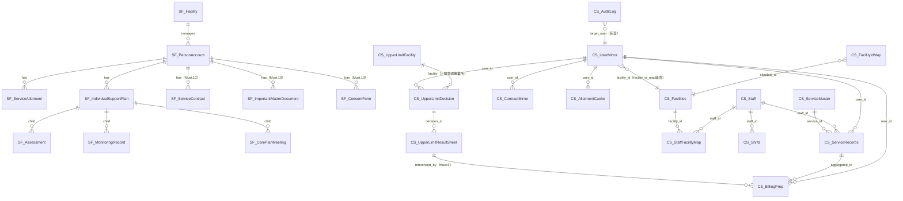

# 02. データモデル（ER図・エンティティ定義）

> 対応 spec.md: §6.Must.1（利用者マスタ）/ §6.Must.2（個別支援計画）/ §6.Must.3（日次サービス提供記録）/ §6.Must.5（スタッフ・シフト）/ §6.Must.10（契約管理）/ §6.Must.11（上限管理）/ §4（SoR単一化）
>
> **正スキーマの所在**: Salesforce オブジェクトの正スキーマは `04-salesforce-objects.md`、CloudSQL の正スキーマは `03-cloudsql-ddl.sql` に置く。本ファイルは概念モデルおよび属性仕様。
>
> **Cycle 2 主要変更**:
> - C-01: 受給者証番号の暗号化は `AES_ENCRYPT(?, @@global.secure_file_priv)` から Cloud KMS Application-level 暗号化へ変更
> - C-03/Must.11: 上限管理 3 エンティティ新設（`upper_limit_facility` / `upper_limit_decision` / `upper_limit_result_sheet`）
> - C-04: AppSheet は SF 直参照禁止。全 SF 由来データは CloudSQL ミラー経由のみ
> - C-06: `facility_id_map` テーブル新設（SF Facility ID ↔ CloudSQL Facility ID 変換テーブル）
> - Must.10: 契約管理 3 エンティティ新設（Salesforce 側 SoR）

---

## 1. ER図（Mermaid）— 全体概念



**凡例**:
- `SF_` プレフィックス → Salesforce オブジェクト（正スキーマ: `04-salesforce-objects.md`）
- `CS_` プレフィックス → CloudSQL テーブル（正スキーマ: `03-cloudsql-ddl.sql`）

---

## 2. エンティティ一覧

### 2.1 Salesforce エンティティ（System of Record: マスタ系）

#### SF_PersonAccount（利用者マスタ）— spec §6.Must.1 対応

| 属性名（API名）| 型 | 必須 | PII区分 | 説明 |
|---|---|---|---|---|
| `Id` | ID(18) | ○ | - | SF 標準主キー（同期キー） |
| `LastName` | Text(80) | ○ | 基本 | 姓 |
| `FirstName` | Text(40) | ○ | 基本 | 名 |
| `LastNameKana__c` | Text(40) | - | 基本 | 姓（フリガナ） |
| `FirstNameKana__c` | Text(40) | - | 基本 | 名（フリガナ） |
| `PersonBirthdate` | Date | - | 基本 | 生年月日 |
| `PersonMailingStreet` | TextArea | - | 基本 | 住所（番地） |
| `PersonMailingCity` | Text(40) | - | 基本 | 市区町村 |
| `PersonMailingState` | Text(80) | - | 基本 | 都道府県 |
| `PersonMobilePhone` | Phone | - | 基本 | 携帯電話 |
| `DisabilityType__c` | Picklist | ○ | **要配慮** | 障害種別（CloudSQL ENUM 対応表: §4 参照）|
| `DisabilityGrade__c` | Text(10) | - | **要配慮** | 障害等級 |
| `DisabilityCategory__c` | Picklist | - | **要配慮** | 障害程度区分 |
| `RecipientCertNo__c` | Text(20) | ○ | **特定機微** | 受給者証番号 — **Cloud KMS Application-level 暗号化対象**（C-01） |
| `RecipientCertExpiry__c` | Date | ○ | **特定機微** | 受給者証有効期限 |
| `EmergencyContactName__c` | Text(80) | - | 基本 | 緊急連絡先氏名 |
| `EmergencyContactPhone__c` | Phone | - | 基本 | 緊急連絡先電話番号 |
| `EmergencyContactRelation__c` | Picklist | - | 基本 | 緊急連絡先続柄 |
| `FacilityId__c` | Lookup(Facility__c) | ○ | - | 所属事業所（SF Facility__c） |
| `IsActive__c` | Checkbox | ○ | - | 在籍フラグ |

**PII 3分類**:
- 基本: 氏名・住所・電話番号・生年月日・緊急連絡先
- 要配慮: 障害種別・等級・程度区分（個人情報保護法 第2条第3項）
- 特定機微: 受給者証番号（障害者総合支援法上の識別子）— ⚠️ L-01 法務レビュー要

**disability_type 値域対応表**（C-14 解消 / spec §6.Must.1 受入基準）:

| SF Picklist 値 | CloudSQL ENUM 値 | 表示名 |
|---|---|---|
| `physical` | `physical` | 身体障害 |
| `intellectual` | `intellectual` | 知的障害 |
| `mental` | `mental` | 精神障害 |
| `developmental` | `developmental` | 発達障害 |
| `other` | `other` | その他 |

---

#### SF_ServiceAllotment（支給決定情報）— spec §6.Must.1 対応

> **SoR = Salesforce**。AppSheet は CloudSQL `user_allotment_cache` 経由でのみ参照（C-04）。

| 属性名（API名）| 型 | 必須 | PII区分 | 説明 |
|---|---|---|---|---|
| `Id` | ID(18) | ○ | - | 主キー（同期キー） |
| `PersonAccount__c` | Lookup(PersonAccount) | ○ | - | 利用者 |
| `ServiceType__c` | Picklist | ○ | - | サービス種別 |
| `AllotmentQty__c` | Number(6,1) | ○ | - | 支給量（時間/回数/日） |
| `AllotmentUnit__c` | Picklist | ○ | - | hour / times / day |
| `ValidFrom__c` | Date | ○ | **特定機微** | 有効開始日 |
| `ValidTo__c` | Date | ○ | **特定機微** | 有効終了日 |
| `CopaymentLimitPeriodFrom__c` | Date | - | - | 負担上限管理期間 開始（C-17 先行対応）|
| `CopaymentLimitPeriodTo__c` | Date | - | - | 負担上限管理期間 終了（C-17 先行対応）|

---

#### SF_IndividualSupportPlan（個別支援計画）— spec §6.Must.2 対応

> 親オブジェクト。子: Assessment__c / MonitoringRecord__c / CarePlanMeeting__c（C-08 解消）

| 属性名（API名）| 型 | 必須 | PII区分 | 説明 |
|---|---|---|---|---|
| `Id` | ID(18) | ○ | - | 主キー |
| `Name` | AutoNumber | ○ | - | 計画番号（SP-{0000000}）|
| `PersonAccount__c` | Lookup(PersonAccount) | ○ | - | 利用者 |
| `PlanStartDate__c` | Date | ○ | - | 計画開始日 |
| `PlanEndDate__c` | Date | ○ | - | 計画終了日 |
| `ServiceManager__c` | Lookup(User) | ○ | - | サービス管理責任者（SF User）|
| `MonitoringCycle__c` | Picklist | ○ | - | 月次/2か月/3か月/6か月/12か月 |
| `Status__c` | Picklist | ○ | - | draft / active / closed |
| `LongTermGoal__c` | LongTextArea(1000) | - | **要配慮** | 長期目標 |
| `ShortTermGoal__c` | LongTextArea(1000) | - | **要配慮** | 短期目標 |

**バリデーション**（C-15 解消）:
- `PlanEndDate__c >= PlanStartDate__c` — Validation Rule で強制
- 同一利用者・同一期間の重複 active 計画を **SOQL ベース Validation Rule** で禁止（VLOOKUP ではなく SOQL ベースに変更）:
  ```
  -- Apex Trigger または SOQL ベース Validation Rule（推奨: Apex Trigger）
  -- 実装案: BeforeInsert/BeforeUpdate Trigger で
  --   SELECT COUNT() FROM IndividualSupportPlan__c
  --   WHERE PersonAccount__c = :newPlan.PersonAccount__c
  --     AND Status__c = 'active'
  --     AND Id != :newPlan.Id
  --     AND PlanStartDate__c <= :newPlan.PlanEndDate__c
  --     AND PlanEndDate__c >= :newPlan.PlanStartDate__c
  -- COUNT > 0 の場合はエラー
  ```

---

#### SF_Assessment（アセスメント）— spec §6.Must.2 対応（C-08）

| 属性名（API名）| 型 | 必須 | 説明 |
|---|---|---|---|
| `Id` | ID(18) | ○ | 主キー |
| `IndividualSupportPlan__c` | MasterDetail(IndividualSupportPlan__c) | ○ | 親計画 |
| `AssessmentDate__c` | Date | ○ | アセスメント実施日 |
| `Assessor__c` | Lookup(User) | ○ | アセスメント担当者（サビ管）|
| `NeedsAssessment__c` | LongTextArea(2000) | ○ | **要配慮** ニーズ分析内容 |
| `EnvironmentalFactors__c` | LongTextArea(1000) | - | **要配慮** 環境因子 |
| `Status__c` | Picklist | ○ | draft / finalized |

**実地指導減算リスク対応**: `Status__c = 'finalized'` のアセスメントが個別支援計画に紐付いていない場合、`audit_log` に警告記録（GAS バッチで定期チェック）。

---

#### SF_MonitoringRecord（モニタリング記録）— spec §6.Must.2 対応（C-08）

| 属性名（API名）| 型 | 必須 | 説明 |
|---|---|---|---|
| `Id` | ID(18) | ○ | 主キー |
| `IndividualSupportPlan__c` | MasterDetail(IndividualSupportPlan__c) | ○ | 親計画 |
| `MonitoringDate__c` | Date | ○ | モニタリング実施日 |
| `MonitoringBy__c` | Lookup(User) | ○ | 実施者（サビ管）|
| `GoalProgress__c` | LongTextArea(1000) | ○ | **要配慮** 目標達成状況 |
| `NextMonitoringDate__c` | Date | ○ | 次回モニタリング予定日 |
| `PlanRevisionNeeded__c` | Checkbox | ○ | 計画見直し要否フラグ |

---

#### SF_CarePlanMeeting（サービス担当者会議）— spec §6.Must.2 対応（C-08）

| 属性名（API名）| 型 | 必須 | 説明 |
|---|---|---|---|
| `Id` | ID(18) | ○ | 主キー |
| `IndividualSupportPlan__c` | MasterDetail(IndividualSupportPlan__c) | ○ | 親計画 |
| `MeetingDate__c` | Date | ○ | 会議実施日 |
| `Attendees__c` | LongTextArea(500) | ○ | 参加者（氏名・役職）|
| `Agenda__c` | LongTextArea(1000) | - | 議題 |
| `Minutes__c` | LongTextArea(2000) | ○ | **要配慮** 議事録 |

---

#### SF_ServiceContract（契約書）— spec §6.Must.10 対応（新規）

> ⚠️ L-14 法務レビュー必須: 利用者署名の電子化には電子署名法の確認が必要。

| 属性名（API名）| 型 | 必須 | 説明 |
|---|---|---|---|
| `Id` | ID(18) | ○ | 主キー |
| `Name` | AutoNumber | ○ | 契約番号（CT-{0000000}）|
| `PersonAccount__c` | Lookup(PersonAccount) | ○ | 利用者（Person Account）|
| `ContractStartDate__c` | Date | ○ | 契約開始日 |
| `ContractEndDate__c` | Date | - | 契約終了日（NULLは継続）|
| `ServiceType__c` | Picklist | ○ | 対象サービス種別 |
| `FacilityId__c` | Lookup(Facility__c) | ○ | 契約事業所 |
| `Status__c` | Picklist | ○ | draft / active / expired / terminated |
| `SignedDate__c` | Date | - | 署名日 ⚠️ L-14 |
| `DocumentUrl__c` | URL | - | 契約書スキャンファイルURL |

**バリデーション**:
- `ContractEndDate__c >= ContractStartDate__c`（NULLは許可）
- 契約満了前 30 日アラート: `ContractEndDate__c <= TODAY() + 30` を GAS バッチが検出して通知

---

#### SF_ImportantMatterDocument（重要事項説明書）— spec §6.Must.10 対応（新規）

| 属性名（API名）| 型 | 必須 | 説明 |
|---|---|---|---|
| `Id` | ID(18) | ○ | 主キー |
| `PersonAccount__c` | Lookup(PersonAccount) | ○ | 利用者 |
| `ServiceContract__c` | Lookup(ServiceContract__c) | ○ | 対応する契約書 |
| `ExplainedDate__c` | Date | ○ | 説明実施日 |
| `ExplainedBy__c` | Lookup(User) | ○ | 説明担当者 |
| `AcknowledgedDate__c` | Date | - | 利用者確認日 |
| `DocumentVersion__c` | Text(10) | ○ | 書類バージョン番号 |
| `DocumentUrl__c` | URL | - | スキャンファイルURL |

---

#### SF_ConsentForm（同意書）— spec §6.Must.10 対応（新規）

| 属性名（API名）| 型 | 必須 | 説明 |
|---|---|---|---|
| `Id` | ID(18) | ○ | 主キー |
| `PersonAccount__c` | Lookup(PersonAccount) | ○ | 利用者 |
| `ServiceContract__c` | Lookup(ServiceContract__c) | ○ | 対応する契約書 |
| `ConsentType__c` | Picklist | ○ | 同意種別（個人情報取扱 / サービス内容 / 緊急時対応 等） |
| `ConsentDate__c` | Date | ○ | 同意日 ⚠️ L-14 |
| `SignedBy__c` | Text(80) | ○ | 署名者氏名（本人 or 後見人）|
| `IsRevoked__c` | Checkbox | ○ | 同意撤回フラグ |
| `RevokedDate__c` | Date | - | 撤回日 |

---

### 2.2 CloudSQL エンティティ（System of Record: トランザクション系）

> 正スキーマ（DDL）は `03-cloudsql-ddl.sql` を参照。本節は属性仕様の補足。

#### CS_Facilities（事業所マスタ）

| 列名 | 型 | 必須 | 説明 |
|---|---|---|---|
| `id` | BIGINT UNSIGNED AUTO_INCREMENT | ○ | CloudSQL 内部主キー |
| `sf_account_id` | VARCHAR(18) | - | Salesforce Account Id（事業所が SF にある場合）|
| `facility_code` | VARCHAR(20) | ○ | 指定事業所番号（UNIQUE）|
| `facility_name` | VARCHAR(100) | ○ | 事業所名 |
| `service_type` | VARCHAR(30) | ○ | 対象サービス種別 |
| `prefecture` | VARCHAR(10) | ○ | 都道府県 |
| `is_active` | TINYINT(1) | ○ | 稼働フラグ |

---

#### CS_FacilityIdMap（Facility ID マッピング）— spec §4「Facility マスタの連携」/ C-06 解消

> SF `Facility__c.Id` ↔ CloudSQL `facilities.id` の変換テーブル。全 FK 参照の正規化に使用。

| 列名 | 型 | 必須 | 説明 |
|---|---|---|---|
| `id` | BIGINT UNSIGNED AUTO_INCREMENT | ○ | 主キー |
| `salesforce_id` | VARCHAR(18) | ○ | Salesforce Facility__c.Id（UNIQUE）|
| `cloudsql_id` | BIGINT UNSIGNED | ○ | CloudSQL facilities.id（UNIQUE）|
| `facility_name` | VARCHAR(100) | ○ | 事業所名（参照用キャッシュ）|
| `is_active` | TINYINT(1) | ○ | 有効フラグ |
| `sf_synced_at` | DATETIME | ○ | 最終同期日時 |

---

#### CS_UserMirror（利用者ミラー）— spec §6.Must.1 対応

> Salesforce PersonAccount の CloudSQL 同期先。`facility_id` は `facility_id_map.cloudsql_id` 経由で解決（C-06）。
> `recipient_cert_no` は **Cloud KMS Application-level 暗号化**（`AES_ENCRYPT(?, @@global.secure_file_priv)` の擬似実装は廃止 — C-01）。

| 列名 | 型 | 必須 | PII区分 | 説明 |
|---|---|---|---|---|
| `id` | BIGINT UNSIGNED AUTO_INCREMENT | ○ | - | CloudSQL 内部主キー |
| `sf_account_id` | VARCHAR(18) | ○ | - | **同期キー**（Salesforce Id 18桁）|
| `last_name` | VARCHAR(80) | ○ | 基本 | 姓 |
| `first_name` | VARCHAR(40) | ○ | 基本 | 名 |
| `disability_type` | ENUM('physical','intellectual','mental','developmental','other') | ○ | **要配慮** | 障害種別（SF picklist と対応表一致 — C-14）|
| `recipient_cert_no` | VARBINARY(256) | ○ | **特定機微** | 受給者証番号（**Cloud KMS 暗号化済みバイト列**。AppSheet 表示は末尾4桁マスク — C-01）|
| `recipient_cert_expiry` | DATE | ○ | **特定機微** | 受給者証有効期限 |
| `facility_id` | BIGINT UNSIGNED | ○ | - | FK → `facilities.id`（`facility_id_map` 経由で解決済み）|
| `is_active` | TINYINT(1) | ○ | - | 在籍フラグ |
| `sf_synced_at` | DATETIME | ○ | - | 最終 SF 同期日時（JST）|
| `created_at` | DATETIME | ○ | - | 作成日時 |
| `updated_at` | DATETIME | ○ | - | 更新日時 |

---

#### CS_Staff（スタッフ基本情報）— spec §6.Must.5 対応（C-16）

| 列名 | 型 | 必須 | PII区分 | 説明 |
|---|---|---|---|---|
| `id` | BIGINT UNSIGNED AUTO_INCREMENT | ○ | - | 主キー |
| `sf_user_id` | VARCHAR(18) | - | - | Salesforce User.Id（同期キー）|
| `last_name` | VARCHAR(40) | ○ | 基本 | 姓 |
| `first_name` | VARCHAR(40) | ○ | 基本 | 名 |
| `email` | VARCHAR(100) | ○ | 基本 | メールアドレス（UNIQUE）|
| `role` | ENUM('service_manager','service_provider_lead','support_worker','billing_officer','facility_admin') | ○ | - | 役職（C-16 解消）|
| `qualification` | VARCHAR(50) | - | - | 資格区分 |
| `is_active` | TINYINT(1) | ○ | - | 在職フラグ |
| `created_at` | DATETIME | ○ | - | 作成日時 |
| `updated_at` | DATETIME | ○ | - | 更新日時 |

**role enum 値説明**（C-16 解消）:
- `service_manager`: サービス管理責任者（サビ管）
- `service_provider_lead`: サービス提供責任者（サ提責）
- `support_worker`: 生活支援員
- `billing_officer`: 請求担当
- `facility_admin`: 事業所管理者

---

#### CS_StaffFacilityMap（スタッフ × 事業所 兼務テーブル）— spec §6.Must.5 対応

> C-05 の Security Filter 参照元テーブル。AppSheet Security Filter は `[facility_id] IN SELECT(staff_facility_map[facility_id], [email] = USEREMAIL())` で参照。

| 列名 | 型 | 必須 | 説明 |
|---|---|---|---|
| `id` | BIGINT UNSIGNED AUTO_INCREMENT | ○ | 主キー |
| `staff_id` | BIGINT UNSIGNED | ○ | FK → `staff.id` |
| `facility_id` | BIGINT UNSIGNED | ○ | FK → `facilities.id` |
| `email` | VARCHAR(100) | ○ | スタッフメールアドレス（AppSheet Security Filter 参照用）|
| `primary_flag` | TINYINT(1) | ○ | 1=主所属、0=兼務 |
| `start_date` | DATE | ○ | 兼務開始日 |
| `end_date` | DATE | - | 兼務終了日（NULLは継続中）|

UNIQUE KEY: `(staff_id, facility_id)`

---

#### CS_Shifts（シフト）— spec §6.Must.3 / §6.Must.5 対応（C-07 解消）

> `is_overnight` フラグで夜勤日跨ぎを表現。`chk_shift_time` 制約は `end_time != start_time` のみに緩和（C-07）。

| 列名 | 型 | 必須 | 説明 |
|---|---|---|---|
| `id` | BIGINT UNSIGNED AUTO_INCREMENT | ○ | 主キー |
| `staff_id` | BIGINT UNSIGNED | ○ | FK → `staff.id` |
| `facility_id` | BIGINT UNSIGNED | ○ | FK → `facilities.id` |
| `shift_date` | DATE | ○ | シフト開始日（is_overnight=1 の場合は翌日が終了日）|
| `start_time` | TIME | ○ | 開始時刻（Asia/Tokyo） |
| `end_time` | TIME | ○ | 終了時刻（Asia/Tokyo）。夜勤の場合 start_time > end_time 許容 |
| `is_overnight` | TINYINT(1) | ○ | **夜勤フラグ（C-07）**: 1=日跨ぎシフト |
| `shift_type` | ENUM('normal','overnight','holiday') | ○ | シフト種別 |
| `created_at` | DATETIME | ○ | 作成日時 |
| `updated_at` | DATETIME | ○ | 更新日時 |

**制約変更（C-07）**: Cycle 1 の `CHECK (end_time > start_time)` を `CHECK (end_time != start_time)` に緩和。`is_overnight = 1` かつ `start_time > end_time` が GH 夜勤の正常パターン。

---

#### CS_ServiceRecords（日次サービス提供記録）— spec §6.Must.3 対応

| 列名 | 型 | 必須 | PII区分 | 説明 |
|---|---|---|---|---|
| `id` | BIGINT UNSIGNED AUTO_INCREMENT | ○ | - | 主キー |
| `user_id` | BIGINT UNSIGNED | ○ | - | FK → `user_mirror.id` |
| `staff_id` | BIGINT UNSIGNED | ○ | - | FK → `staff.id` |
| `service_id` | BIGINT UNSIGNED | ○ | - | FK → `service_master.id` |
| `facility_id` | BIGINT UNSIGNED | ○ | - | FK → `facilities.id` |
| `service_date` | DATE | ○ | - | 提供日（Asia/Tokyo）— INDEX 対象 |
| `shift_date` | DATE | - | - | 参照シフト日（夜勤の場合 shift_date と service_date が異なる可能性）|
| `start_time` | TIME | ○ | - | 開始時刻（Asia/Tokyo）|
| `end_time` | TIME | ○ | - | 終了時刻 |
| `duration_minutes` | SMALLINT UNSIGNED | ○ | - | 提供時間（分）|
| `location_type` | ENUM('facility','home','other') | ○ | - | 提供場所 |
| `location_note` | VARCHAR(100) | - | - | 場所補足 |
| `notes` | TEXT | - | **要配慮** | 特記事項 |
| `is_approved` | TINYINT(1) | ○ | - | 承認フラグ |
| `approved_by` | BIGINT UNSIGNED | - | - | FK → `staff.id` |
| `approved_at` | DATETIME | - | - | 承認日時 |
| `created_at` | DATETIME | ○ | - | 作成日時 |
| `updated_at` | DATETIME | ○ | - | 更新日時（楽観ロック） |

INDEX: `(user_id, service_date)` — spec §6.Must.3 受入基準。

---

#### CS_UserAllotmentCache（支給決定キャッシュ）— spec §6.Must.4 対応

> Salesforce ServiceAllotment__c の CloudSQL キャッシュ。`v_allotment_usage` ビューの集計基礎データ。

| 列名 | 型 | 必須 | 説明 |
|---|---|---|---|
| `id` | BIGINT UNSIGNED AUTO_INCREMENT | ○ | 主キー |
| `user_id` | BIGINT UNSIGNED | ○ | FK → `user_mirror.id` |
| `sf_allotment_id` | VARCHAR(18) | - | Salesforce ServiceAllotment__c.Id（同期キー）|
| `service_type` | VARCHAR(30) | ○ | サービス種別 |
| `allotment_qty` | DECIMAL(10,2) | ○ | 支給量 |
| `allotment_unit` | ENUM('hour','times','day') | ○ | 支給単位 |
| `valid_from` | DATE | ○ | 有効開始日 |
| `valid_to` | DATE | - | 有効終了日（NULLは継続）|
| `service_year_month` | CHAR(6) | - | 月次集計パーティション列（YYYYMM）|
| `sf_synced_at` | DATETIME | ○ | 最終同期日時 |
| `created_at` | DATETIME | ○ | 作成日時 |
| `updated_at` | DATETIME | ○ | 更新日時 |

---

#### CS_ContractMirror（契約ミラー）— spec §6.Must.10 対応（新規）

> Salesforce ServiceContract__c のキャッシュ。AppSheet の契約確認 View 用。

| 列名 | 型 | 必須 | 説明 |
|---|---|---|---|
| `id` | BIGINT UNSIGNED AUTO_INCREMENT | ○ | 主キー |
| `sf_contract_id` | VARCHAR(18) | ○ | Salesforce ServiceContract__c.Id（同期キー）|
| `user_id` | BIGINT UNSIGNED | ○ | FK → `user_mirror.id` |
| `facility_id` | BIGINT UNSIGNED | ○ | FK → `facilities.id` |
| `contract_start_date` | DATE | ○ | 契約開始日 |
| `contract_end_date` | DATE | - | 契約終了日 |
| `service_type` | VARCHAR(30) | ○ | 対象サービス種別 |
| `status` | ENUM('draft','active','expired','terminated') | ○ | 契約ステータス |
| `has_important_matter_doc` | TINYINT(1) | ○ | 重要事項説明書交付済みフラグ |
| `has_consent_form` | TINYINT(1) | ○ | 同意書取得済みフラグ |
| `sf_synced_at` | DATETIME | ○ | 最終同期日時 |

---

#### CS_UpperLimitFacility（上限管理事業所マスタ）— spec §6.Must.11 対応（新規 / C-03 解消）

> 利用者の負担上限管理を担う事業所（当事業所または他事業所）のマスタ。

| 列名 | 型 | 必須 | 説明 |
|---|---|---|---|
| `id` | BIGINT UNSIGNED AUTO_INCREMENT | ○ | 主キー |
| `facility_number` | VARCHAR(20) | ○ | 指定事業所番号（UNIQUE）|
| `facility_name` | VARCHAR(100) | ○ | 事業所名 |
| `prefecture` | VARCHAR(10) | ○ | 都道府県 |
| `contact_person` | VARCHAR(80) | - | 担当者名 |
| `contact_phone` | VARCHAR(20) | - | 連絡先電話番号 |
| `is_own_facility` | TINYINT(1) | ○ | 1=当事業所、0=他事業所 |
| `is_active` | TINYINT(1) | ○ | 有効フラグ |
| `created_at` | DATETIME | ○ | 作成日時 |
| `updated_at` | DATETIME | ○ | 更新日時 |

---

#### CS_UpperLimitDecision（利用者負担上限月額決定）— spec §6.Must.11 対応（新規 / C-03 解消）

> 利用者ごとの負担上限月額と管理事業所を記録するエンティティ。

| 列名 | 型 | 必須 | 説明 |
|---|---|---|---|
| `id` | BIGINT UNSIGNED AUTO_INCREMENT | ○ | 主キー |
| `user_id` | BIGINT UNSIGNED | ○ | FK → `user_mirror.id` |
| `upper_limit_facility_id` | BIGINT UNSIGNED | ○ | FK → `upper_limit_facility.id`（上限管理事業所）|
| `monthly_upper_limit` | DECIMAL(10,2) | ○ | 利用者負担上限月額（円）|
| `copayment_type` | ENUM('none','family_income_based','flat') | ○ | 負担区分（0円/収入応分/定額）|
| `valid_from` | DATE | ○ | 適用開始日 |
| `valid_to` | DATE | - | 適用終了日（NULLは継続）|
| `created_at` | DATETIME | ○ | 作成日時 |
| `updated_at` | DATETIME | ○ | 更新日時 |

UNIQUE KEY: `(user_id, valid_from)` — 同一利用者・同一開始日の重複を防止。

---

#### CS_UpperLimitResultSheet（上限管理結果票）— spec §6.Must.11 対応（新規 / C-03 解消）

> 月次に他事業所との間で授受する結果票を記録。Must.6 の請求準備データが本テーブルを参照（C-03）。

| 列名 | 型 | 必須 | 説明 |
|---|---|---|---|
| `id` | BIGINT UNSIGNED AUTO_INCREMENT | ○ | 主キー |
| `user_id` | BIGINT UNSIGNED | ○ | FK → `user_mirror.id` |
| `upper_limit_decision_id` | BIGINT UNSIGNED | ○ | FK → `upper_limit_decision.id` |
| `billing_year_month` | CHAR(6) | ○ | 対象年月（YYYYMM）|
| `direction` | ENUM('sent','received') | ○ | 発行=sent（当事業所が管理）/ 受信=received（他事業所が管理）|
| `total_cost_all_facilities` | DECIMAL(12,2) | ○ | 全事業所合算費用（円）|
| `own_facility_cost` | DECIMAL(12,2) | ○ | 当事業所費用（円）|
| `adjusted_copayment` | DECIMAL(10,2) | ○ | 調整後利用者負担額（円）|
| `received_evidence_url` | VARCHAR(500) | - | 受信エビデンスファイルURL（⚠️ L-13）|
| `is_confirmed` | TINYINT(1) | ○ | 確認済みフラグ |
| `confirmed_at` | DATETIME | - | 確認日時 |
| `confirmed_by` | BIGINT UNSIGNED | - | FK → `staff.id` |
| `created_at` | DATETIME | ○ | 作成日時 |
| `updated_at` | DATETIME | ○ | 更新日時 |

UNIQUE KEY: `(user_id, billing_year_month, direction)` — 月次1件制約。

---

#### CS_BillingPrep（請求準備データ）— spec §6.Must.6 対応

| 列名 | 型 | 必須 | 説明 |
|---|---|---|---|
| `id` | BIGINT UNSIGNED AUTO_INCREMENT | ○ | 主キー |
| `user_id` | BIGINT UNSIGNED | ○ | FK → `user_mirror.id` |
| `facility_id` | BIGINT UNSIGNED | ○ | FK → `facilities.id` |
| `billing_year_month` | CHAR(6) | ○ | 対象年月（YYYYMM）|
| `service_id` | BIGINT UNSIGNED | ○ | FK → `service_master.id` |
| `upper_limit_result_sheet_id` | BIGINT UNSIGNED | - | FK → `upper_limit_result_sheet.id`（Must.11 反映）|
| `service_days` | TINYINT UNSIGNED | ○ | 提供日数 |
| `total_units` | DECIMAL(10,2) | ○ | 基本単位数合計 |
| `addition_units` | DECIMAL(10,2) | ○ | 加算単位数 |
| `deduction_units` | DECIMAL(10,2) | ○ | 減算単位数 |
| `net_units` | DECIMAL(10,2) | ○ | 請求単位数（= total + addition - deduction）|
| `adjusted_copayment` | DECIMAL(10,2) | - | 上限管理後利用者負担額（Must.11 反映）|
| `batch_run_id` | VARCHAR(50) | ○ | バッチ実行ID（冪等性キー）|
| `status` | ENUM('draft','confirmed','submitted') | ○ | ステータス |
| `created_at` | DATETIME | ○ | 作成日時 |
| `updated_at` | DATETIME | ○ | 更新日時 |

UNIQUE KEY: `(user_id, billing_year_month, service_id, batch_run_id)`

---

#### CS_AuditLog（監査ログ）— spec §6.Must.8 / C-10 対応

> **append-only**: UPDATE / DELETE 権限を全アプリケーションユーザーから剥奪。INSERT のみ許可（C-10）。
> Cloud Storage WORM バケットへのストリーム書出し: `08-security-and-privacy.md` §5 参照。

| 列名 | 型 | 必須 | 説明 |
|---|---|---|---|
| `id` | BIGINT UNSIGNED AUTO_INCREMENT | ○ | 主キー |
| `event_type` | VARCHAR(50) | ○ | CREATE/UPDATE/DELETE/LOGIN/EXPORT/SYNC_SF 等 |
| `table_name` | VARCHAR(50) | - | 操作対象テーブル |
| `record_id` | VARCHAR(50) | - | 操作対象レコード ID |
| `actor_type` | ENUM('staff','gas_batch','cloud_run_job','system') | ○ | 操作者種別 |
| `actor_id` | VARCHAR(50) | ○ | 操作者 ID |
| `before_json` | JSON | - | 変更前スナップショット |
| `after_json` | JSON | - | 変更後スナップショット |
| `ip_address` | VARCHAR(45) | - | クライアント IP |
| `created_at` | DATETIME | ○ | ログ記録日時 |

保持期間: 最低 **5年**（⚠️ L-15 法務レビュー要）

---

## 3. 同期キー一覧（Salesforce ⇄ CloudSQL）

> spec §7「データ整合性」/ spec §4「SoR 単一化」対応（C-04）

| Salesforce オブジェクト | SF フィールド | CloudSQL テーブル | CloudSQL 列 |
|---|---|---|---|
| PersonAccount | `Id` (18桁) | `user_mirror` | `sf_account_id` |
| ServiceAllotment__c | `Id` (18桁) | `user_allotment_cache` | `sf_allotment_id` |
| Facility__c | `Id` (18桁) | `facility_id_map` | `salesforce_id` |
| User（SF スタッフ）| `Id` (18桁) | `staff` | `sf_user_id` |
| ServiceContract__c | `Id` (18桁) | `contract_mirror` | `sf_contract_id` |

**競合解決ルール**: Salesforce を SoR とする。`sf_synced_at` と SF `LastModifiedDate` を比較し、SF の方が新しい場合のみ CloudSQL を上書き（last-write-wins）。逆方向への書き戻しはしない。

---

## 4. 法務レビュー要フラグ一覧

| # | 対象 | フラグ理由 |
|---|---|---|
| L-01 | `RecipientCertNo__c`（受給者証番号）| 障害者総合支援法上の識別情報。保管・提供の法的根拠確認要 |
| L-02 | `DisabilityType__c`（障害種別）| 個人情報保護法 §2-3 要配慮個人情報。収集時の本人同意取得要 |
| L-13 | `upper_limit_result_sheet.received_evidence_url` | 上限管理結果票の電子授受方式。紙運用との並行可否を国保連確認要 |
| L-14 | 契約 3 点セット署名日 | 利用者署名の電子化。電子署名法・サービス提供責任者要件の確認要 |
| L-15 | `audit_log` 保持期間（5年）| 個人情報保護法/障害者総合支援法の記録保存義務との整合確認要 |
