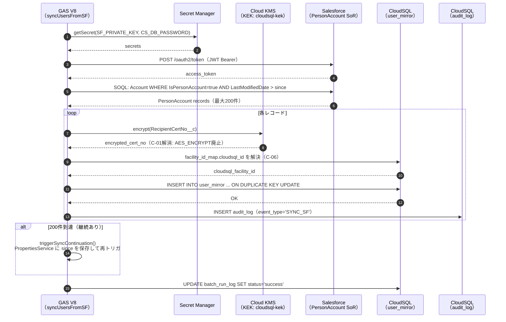
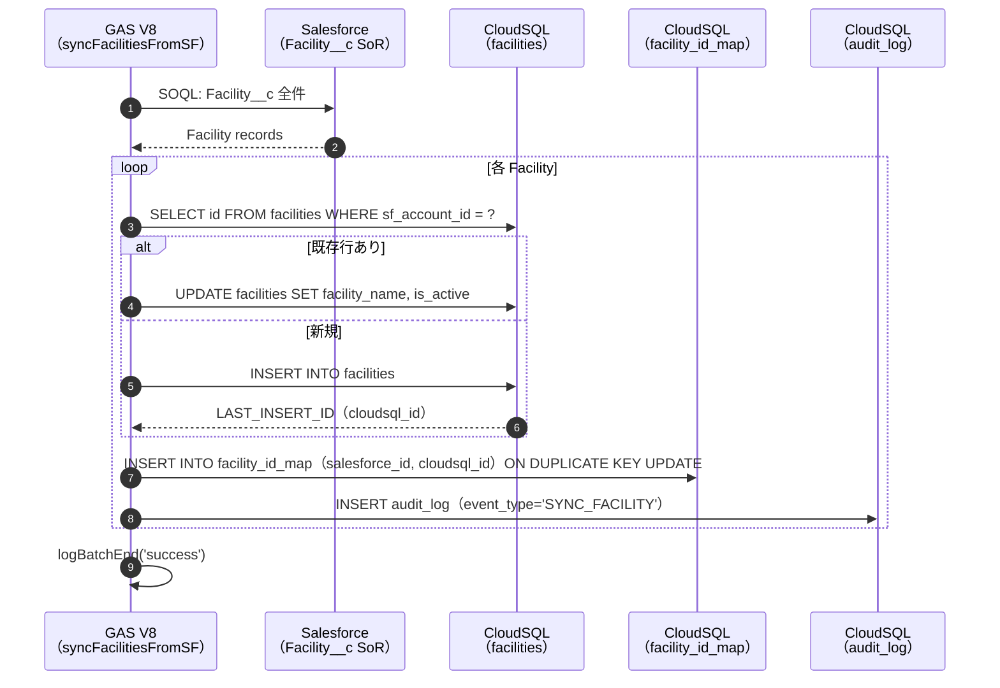
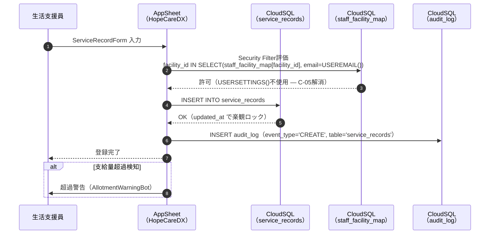
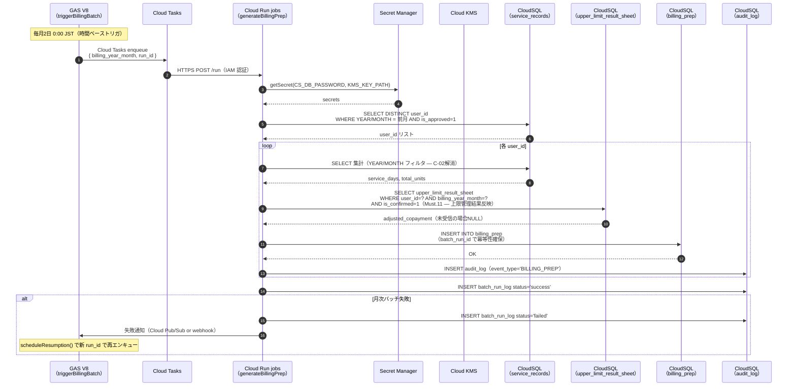
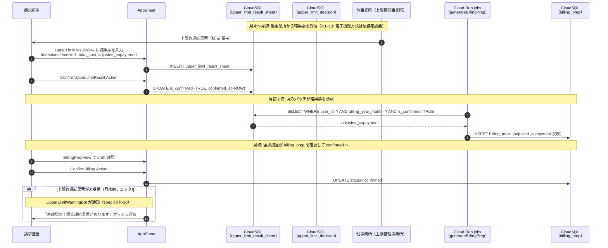
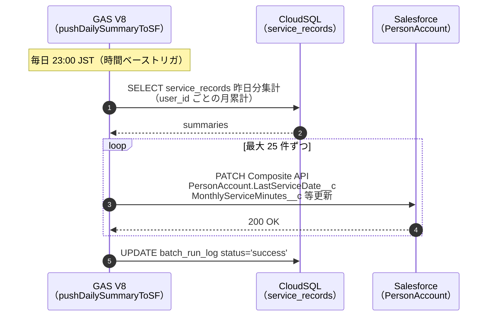
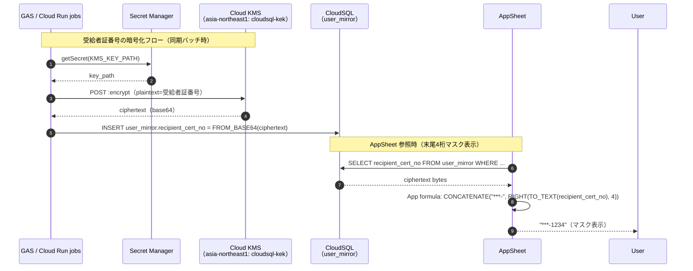

# 07. 連携シーケンス図（Integration Flows）

> 対応 spec.md: §4（連携経路）/ §6.Must.6（請求準備バッチ）/ §6.Must.7（Salesforce ⇄ CloudSQL 同期）/ §6.Must.11（上限管理月次フロー）/ §4（Cloud Run jobs 分離 C-20）
>
> **Cycle 2 主要変更**:
> - C-04: AppSheet の Salesforce 直参照経路を全廃。全フローは CloudSQL 経由のみ。
> - C-06: `syncFacilitiesFromSF` フローを新設（Facility マスタ連携）。
> - C-20: 月次請求準備バッチを Cloud Run jobs に分離。GAS は Cloud Tasks 経由でキック。
> - Must.11: 上限管理結果票の月次フローを追加。billing_prep が upper_limit_result_sheet を参照。

---

## 1. Salesforce → CloudSQL 差分同期フロー（1 時間ごと）

**リトライ方針**:
- `batch_run_log.status = 'failed'` → 次回の時間ベーストリガで `since` = 最終成功タイムスタンプから再試行
- 3 回連続失敗 → GAS 失敗メール通知 → 管理者が `syncUsersFullFromSF()` を手動実行
- **競合解決**: SF の `LastModifiedDate` > `sf_synced_at` の場合のみ上書き（last-write-wins）

**冪等性確保**: `sf_account_id` UNIQUE KEY + ON DUPLICATE KEY UPDATE

---

## 2. Facility マスタ同期フロー（日次 — C-06 新設）

**重要**: `user_mirror.facility_id` など全 FK 参照は `facility_id_map.cloudsql_id` 経由で解決済みの値を格納（C-06 解消）。

---

## 3. AppSheet → CloudSQL サービス記録入力フロー（リアルタイム）

---

## 4. 月次請求準備バッチフロー（Cloud Run jobs — C-20 解消）

> spec §6.Must.6「Cloud Run jobs `generateBillingPrep` の I/O 仕様・冪等性・エラー再実行」対応
> spec §6.Must.11「Must.6 が upper_limit_result_sheet の値を参照して単位数調整する」ことが本フロー図で明示。

**冪等性**: UNIQUE KEY `(user_id, billing_year_month, service_id, batch_run_id)` — 再実行しても重複 INSERT せず
**上限管理結果反映**: `upper_limit_result_sheet.adjusted_copayment` が `billing_prep.adjusted_copayment` に転写される（spec §6.Must.11 受入基準）

---

## 5. 上限管理月次授受フロー（Must.11 — C-03 解消）

> spec §6.Must.11「Must.6（請求準備）が `upper_limit_result_sheet` の値を参照して単位数調整することが `07` の月次フロー図に明示」対応。

---

## 6. CloudSQL → Salesforce 日次集計フロー

---

## 7. 鍵管理フロー（C-01 解消）

---

## 8. リトライ方針まとめ

| フロー | リトライ手段 | 冪等性確保 |
|---|---|---|
| SF → CloudSQL 差分同期 | 次回時間ベーストリガ（1時間後）で `since` を最終成功時刻に設定 | `sf_account_id` / `sf_allotment_id` UNIQUE |
| Facility マスタ同期 | 次回日次トリガ | `salesforce_id` UNIQUE |
| 月次請求準備（Cloud Run jobs）| GAS が新 `run_id` で Cloud Tasks に再エンキュー | `(user_id, billing_year_month, service_id, batch_run_id)` UNIQUE |
| AppSheet → CloudSQL CRUD | AppSheet アプリ内の楽観ロック（`updated_at` 比較）+ 再送 | `updated_at` 楽観ロック |

---

## 9. エラーハンドリング方針

| シナリオ | 検知方法 | 対処 |
|---|---|---|
| GAS バッチ失敗 | `batch_run_log.status = 'failed'` / GAS 失敗メール通知 | 管理者がスクリプトエディタでログ確認 → 原因修正 → 手動実行 |
| Cloud Run jobs 失敗 | `batch_run_log.status = 'failed'` / Cloud Logging アラート | `scheduleResumption()` で新 `run_id` 再エンキュー（`09-operational-runbook.md` §3 参照）|
| Cloud KMS 障害 | CloudSQL 接続エラー / GAS encrypt 失敗 | 鍵キャッシュ（有効期間内）で継続 → `09-operational-runbook.md` §3「シナリオ E」参照 |
| 上限管理結果票 未受信 | `UpperLimitWarningBot`（月末 5 日前）| 請求担当が手動対応。`billing_prep.adjusted_copayment = NULL` で draft を作成し後から更新可 |
