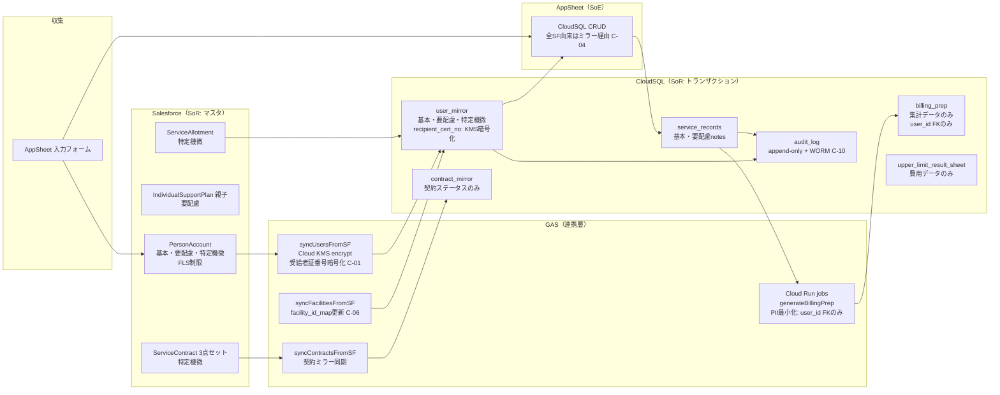

# 08. セキュリティ・個人情報保護方針

> 対応 spec.md: §6.Must.8（セキュリティ・PII 保護方針）/ §7 受入基準（セキュリティ観点）/ §4（鍵管理経路 C-01）/ §4（USERSETTINGS 全廃 C-05）/ §8 R-05 / R-09 / R-14 / R-15
>
> **Cycle 2 主要変更（C-01 / C-05 / C-09 / C-10 解消）**:
> - C-01: `AES_ENCRYPT(?, @@global.secure_file_priv)` を全廃。Cloud KMS + CMEK に一本化。鍵管理フルパスを明文化。
> - C-05: `USERSETTINGS()` を全廃。Security Filter は `USEREMAIL() + staff_facility_map` 参照に変更。
> - C-09: CloudSQL 行レベル制御（AppSheet 非経由の直接 SQL アクセス時の PII 保護）を新設。
> - C-10: `audit_log` テーブルを append-only + Cloud Storage WORM バケット書出しに変更。
>
> **⚠️ 法務レビュー必須**: 本ドキュメントは設計上の方針を示すもの。個別条文の法的解釈は専門家（弁護士・個人情報保護コンサルタント等）のレビューが必要。

---

## 1. 鍵管理経路（C-01 完全解消）

> spec §6.Must.8 受入基準「鍵管理パス」/ spec §4「鍵管理経路（C-01 解消 / R7 採用）」対応。
> **DDL / GAS / Runbook の 3 箇所で完全に同一の KEK 文字列を使用すること（C-01 受入基準）。**

### 1.1 KEK パス（全ファイル共通）

```
projects/{p}/locations/asia-northeast1/keyRings/welfare/cryptoKeys/cloudsql-kek/cryptoKeyVersions/{v}
```

> `{p}` = GCP プロジェクト ID、`{v}` = 現在の KEK バージョン番号（ローテーション毎に増加）

### 1.2 鍵管理フロー

```
Secret Manager（接続情報・サービスアカウント鍵）
   │ secrets 取得
   ↓
GAS V8 / Cloud Run jobs（実行環境）
   │ Cloud KMS API encrypt/decrypt
   ↓
Cloud KMS（asia-northeast1）
   KeyRing: welfare
   CryptoKey: cloudsql-kek
   ├─ [1] CloudSQL CMEK（at-rest 全体暗号化）
   │       インスタンス起動時 --disk-encryption-key で指定
   │       バックアップも同 KEK で暗号化
   │       KEK ローテーション: 90 日（GCP デフォルト / R7）
   └─ [2] Application-level 暗号化（受給者証番号等の決め打ち項目）
           encrypt: GAS `kmsEncrypt()` → VARBINARY(256) に格納
           decrypt: GAS / Cloud Run jobs `kmsDecrypt()` → 平文復元
           AppSheet 表示: 末尾 4 桁マスク（CONCATENATE("***-", RIGHT(..., 4))）
```

**廃止した実装（C-01 解消）**:
- `AES_ENCRYPT(?, @@global.secure_file_priv)` — MySQL 関数による擬似暗号化は全廃
- GAS Script Properties への秘密情報平文格納 — Secret Manager 経由に変更

### 1.3 KEK ローテーション手順

1. Cloud KMS コンソールで新しい KEK バージョンを作成（自動ローテーション 90 日）
2. CloudSQL インスタンスが自動的に新 KEK バージョンで暗号化を継続
3. Application-level 暗号化: 既存の暗号化済みデータは古い KEK バージョンで復号可（Cloud KMS が旧バージョン保持）
4. **KEK バージョン destroy 前**に必ず暗号化データを再暗号化 or バックアップ取得（`09-operational-runbook.md` §3「シナリオ E」参照）

---

## 2. 個人情報 3 分類と保管位置

> spec §7 受入基準「要配慮個人情報の保管位置一覧」対応

| 分類 | 定義 | 対象データ例 | 主な保管場所 | 暗号化 |
|---|---|---|---|---|
| **基本個人情報** | 氏名・住所・電話番号・生年月日 | 利用者氏名、緊急連絡先、スタッフ氏名・メール | Salesforce PersonAccount / CloudSQL user_mirror | GCP/SF 標準 AES-256 |
| **要配慮個人情報** | 個人情報保護法 §2-3 該当 | 障害種別・等級・程度区分・支援内容詳細（notes）・長期/短期目標・アセスメント | Salesforce（FLS 制限）/ CloudSQL（列レベル制限）| GCP/SF 標準 |
| **特定機微情報** | 障害者総合支援法上の識別子 | 受給者証番号・支給量・有効期間・契約情報 | Salesforce（FLS 制限 + Field History）/ CloudSQL（**Cloud KMS Application-level 暗号化**）| CloudSQL CMEK + **Application-level 暗号化（C-01）**|

---

## 3. PII フィールド一覧（全層横断）

> spec §7 受入基準「PII フィールド一覧 / 各層権限境界 / 暗号化方式」対応

| フィールド | 分類 | 保管場所 | 暗号化方式 | アクセス制限 |
|---|---|---|---|---|
| `LastName` / `FirstName` | 基本 | SF + CloudSQL `user_mirror` | GCP/SF 標準 | 全ロール参照可 |
| `PersonMobilePhone` / `PersonMailingStreet` 等 | 基本 | Salesforce | SF 標準 | 全ロール参照可 |
| `EmergencyContactName/Phone` | 基本 | Salesforce | SF 標準 | 全ロール参照可 |
| `DisabilityType__c` / `DisabilityGrade__c` | **要配慮** ⚠️ | SF + CloudSQL `user_mirror.disability_type` | GCP/SF 標準 | サ管・管理者のみ（FLS / Security Filter）|
| `service_records.notes` | **要配慮** ⚠️ | CloudSQL のみ | GCP 標準 + CMEK | 担当スタッフ + サ管 + 管理者 |
| `LongTermGoal__c` / `ShortTermGoal__c` | **要配慮** ⚠️ | SF（IndividualSupportPlan）| SF 標準 | サ管・管理者のみ |
| `Assessment__c.NeedsAssessment__c` | **要配慮** ⚠️ | Salesforce | SF 標準 | サ管・管理者のみ |
| `RecipientCertNo__c` | **特定機微** ⚠️ | SF + CloudSQL `user_mirror.recipient_cert_no` | SF 標準 / **Cloud KMS Application-level 暗号化（C-01）** | 管理者・サ管・請求担当 |
| `RecipientCertExpiry__c` | **特定機微** ⚠️ | SF + CloudSQL | SF 標準 / CMEK | 管理者・サ管・請求担当 |
| `ServiceAllotment__c`（支給量）| **特定機微** ⚠️ | SF + CloudSQL `user_allotment_cache` | SF 標準 / CMEK | 管理者・サ管・請求担当 |
| 契約書類 3 点セット | **特定機微** ⚠️ | Salesforce SoR + CloudSQL `contract_mirror` | SF 標準 / CMEK | 管理者・サ管のみ |
| `staff.email` | 基本 | CloudSQL | CMEK | 管理者・本人 |

---

## 4. 暗号化方針（保存時・通信時）

### 4.1 保存時暗号化（Encryption at Rest）

| 層 | 方式 | CMEK 採否 | 備考 |
|---|---|---|---|
| **CloudSQL**（全体）| GCP AES-256 + **CMEK（KEK = cloudsql-kek）** | **採用（C-01 解消）** | インスタンス起動時に KEK 指定。バックアップも同 KEK |
| **CloudSQL**（受給者証番号等）| CMEK 上に **Application-level 暗号化（Cloud KMS encrypt API）** | **追加採用（C-01）** | DDL: `VARBINARY(256)`。AppSheet 表示は末尾 4 桁マスク |
| **Salesforce** | SF プラットフォーム標準暗号化（AES-256）| Shield Platform Encryption は **不採用（Cycle 2）** ⚠️ L-17 | Classic Encryption（無償・175 文字上限）で RecipientCertNo__c を保護 |
| **Secret Manager** | Google 管理鍵 | — | SF_PRIVATE_KEY / CS_DB_PASSWORD 等を保管 |
| **Cloud Storage WORM**（監査ログ）| GCP 標準 + Bucket Lock | — | 監査ログの改竄防止（C-10）|

### 4.2 通信時暗号化（Encryption in Transit）

| 通信経路 | 方式 | TLS バージョン |
|---|---|---|
| AppSheet ↔ CloudSQL | Cloud SQL Auth Proxy（内部 TLS）or SSL 証明書 | TLS 1.2 以上 |
| GAS ↔ Salesforce | HTTPS（JWT Bearer + UrlFetchApp）| TLS 1.2 以上 |
| GAS ↔ CloudSQL | Cloud SQL Auth Proxy | TLS 1.2 以上 |
| Cloud Run jobs ↔ CloudSQL | Cloud SQL Auth Proxy + CMEK | TLS 1.2 以上 |
| GAS ↔ Cloud KMS | HTTPS（REST API）| TLS 1.3 |
| GAS ↔ Secret Manager | HTTPS（REST API）| TLS 1.3 |
| ブラウザ ↔ AppSheet | Google インフラ HTTPS | TLS 1.3 推奨 |
| Cloud Tasks ↔ Cloud Run jobs | HTTPS（IAM 認証）| TLS 1.3 |

---

## 5. CloudSQL 行レベル制御（C-09 解消）

> spec §6.Must.8 受入基準「CloudSQL 行レベル制御: AppSheet を経由しない直接 SQL アクセス時の PII 保護方針」対応

### 5.1 接続制御

- **Cloud SQL Auth Proxy 必須**: IAM 認証を経由しない直接 TCP 接続は禁止
- **ユーザー分離**: 用途別 MySQL ユーザーを作成し最小権限を付与

| ユーザー名 | 用途 | 権限 |
|---|---|---|
| `welfare_app_user` | AppSheet（主データソース）| SELECT / INSERT / UPDATE / DELETE（audit_log は INSERT のみ）|
| `welfare_gas_user` | GAS バッチ | SELECT / INSERT / UPDATE on 全テーブル（audit_log は INSERT のみ）|
| `welfare_job_user` | Cloud Run jobs | SELECT / INSERT / UPDATE on billing_prep, audit_log, batch_run_log |
| `welfare_admin_user` | 管理者（手動操作）| GRANT OPTION なし / DDL 実行権限は別付与 |

### 5.2 ロールベース VIEW（`v_user_for_staff_{role}`）

> AppSheet を経由しない直接 SQL アクセス時（管理ツール・レポートクエリ等）に PII を保護するためのロール別 VIEW。

```sql
-- service_manager ロール用: 要配慮 PII を含む全フィールド参照可
CREATE OR REPLACE VIEW v_user_for_staff_service_manager AS
SELECT
  id, sf_account_id, last_name, first_name,
  disability_type, recipient_cert_expiry, facility_id, is_active
FROM user_mirror
WHERE is_active = 1;
-- recipient_cert_no は KMS 復号が必要なため VIEW では除外

-- support_worker ロール用: 要配慮 PII（disability_type）を除外
CREATE OR REPLACE VIEW v_user_for_staff_support_worker AS
SELECT
  id, sf_account_id, last_name, first_name,
  facility_id, is_active
FROM user_mirror
WHERE is_active = 1;

-- billing_officer ロール用: 受給者証期限は参照可（番号は KMS 復号が別途必要）
CREATE OR REPLACE VIEW v_user_for_staff_billing_officer AS
SELECT
  id, sf_account_id, last_name, first_name,
  recipient_cert_expiry, facility_id, is_active
FROM user_mirror
WHERE is_active = 1;
```

### 5.3 `audit_log` append-only 設定（C-10 解消）

```sql
-- welfare_app_user / welfare_gas_user から UPDATE / DELETE 権限を剥奪
REVOKE UPDATE, DELETE ON welfare_db.audit_log FROM 'welfare_app_user'@'%';
REVOKE UPDATE, DELETE ON welfare_db.audit_log FROM 'welfare_gas_user'@'%';
REVOKE UPDATE, DELETE ON welfare_db.audit_log FROM 'welfare_job_user'@'%';
-- INSERT のみ許可（Cloud SQL Auth Proxy 接続のみ有効）
GRANT INSERT ON welfare_db.audit_log TO 'welfare_app_user'@'%';
GRANT INSERT ON welfare_db.audit_log TO 'welfare_gas_user'@'%';
GRANT INSERT ON welfare_db.audit_log TO 'welfare_job_user'@'%';
```

**物理削除の禁止**: `audit_log` への DELETE は `welfare_admin_user` のみ許可（かつ必ずバックアップ後に実施）。

---

## 6. 監査ログ要件（C-10 解消）

> spec §6.Must.8 受入基準「`audit_log` テーブル append-only + Cloud Storage WORM（Bucket Lock + retention 5 年）」対応

### 6.1 CloudSQL 監査ログ（`audit_log` テーブル）

| イベント種別 | 記録タイミング | 記録内容 |
|---|---|---|
| `CREATE` | `service_records` / `user_mirror` 新規 INSERT | before=null, after=新レコード JSON |
| `UPDATE` | `service_records` / `user_mirror` UPDATE | before=変更前 JSON, after=変更後 JSON |
| `APPROVE` | `service_records.is_approved = TRUE` | actor=承認者 staff_id |
| `EXPORT` | `exportBillingCSV` 呼出時 | actor=請求担当, ym=対象年月 |
| `SYNC_SF` | GAS 同期バッチ完了時 | actor=gas_batch, records_processed |
| `BILLING_PREP` | Cloud Run jobs 請求準備完了時 | actor=cloud_run_job, billing_year_month |
| `CONTRACT_EXPIRY_WARNING` | 契約満了前 30 日検出時 | actor=gas_batch, contract_id |
| `AUTH_FAIL` | GAS 認証失敗時 | actor=gas_batch, error_message |
| `KMS_ERROR` | Cloud KMS 暗号化/復号失敗時 | actor=gas_batch or cloud_run_job, error_message |

**append-only 実現**: `welfare_app_user` / `welfare_gas_user` の UPDATE / DELETE 権限を剥奪（§5.3 参照）。

### 6.2 Cloud Storage WORM バケット書出し（C-10 解消）

```
バケット名: gs://welfare-audit-logs-{project_id}
Bucket Lock: 有効
Retention Policy: 5 年（⚠️ L-15 法務レビュー要）
書出し頻度: 1 時間ごと（GAS バッチ or Cloud Scheduler + Cloud Run jobs）
書出し形式: JSON Lines（YYYY/MM/DD/HH/audit_log_{timestamp}.jsonl）
書出し範囲: 前回書出し以降の未エクスポート行（audit_log.id > last_exported_id）
```

**書出し擬似コード（GAS）**:
```javascript
function exportAuditLogsToGcs() {
  const conn    = getCloudSqlConnection();
  const lastId  = Number(PropertiesService.getScriptProperties().getProperty('AUDIT_LOG_LAST_ID') || 0);
  const stmt    = conn.prepareStatement(
    'SELECT * FROM audit_log WHERE id > ? ORDER BY id ASC LIMIT 1000'
  );
  stmt.setInt(1, lastId);
  const rs      = stmt.executeQuery();
  const rows    = [];
  let maxId     = lastId;
  while (rs.next()) {
    rows.push(rsRowToJson(rs));
    maxId = Math.max(maxId, rs.getInt('id'));
  }
  if (rows.length > 0) {
    const blob = Utilities.newBlob(rows.map(r => JSON.stringify(r)).join('\n'), 'application/json');
    const gcsUrl = `https://storage.googleapis.com/upload/storage/v1/b/welfare-audit-logs-${getSecret('GCP_PROJECT_ID')}/o?uploadType=media&name=...`;
    UrlFetchApp.fetch(gcsUrl, {
      method: 'POST',
      headers: { Authorization: 'Bearer ' + ScriptApp.getOAuthToken() },
      payload: blob,
      muteHttpExceptions: true
    });
    PropertiesService.getScriptProperties().setProperty('AUDIT_LOG_LAST_ID', String(maxId));
  }
  conn.close();
}
```

### 6.3 Salesforce 監査ログ

| 機能 | 対象 | 保持期間 |
|---|---|---|
| Field History Tracking | `DisabilityType__c`, `RecipientCertNo__c`, `Status__c`（SupportPlan / ServiceContract）| 18ヶ月（SF 標準）|
| Setup Audit Trail | 設定変更（プロファイル・権限・オブジェクト設定）| 6ヶ月 |

---

## 7. アクセス制御マトリクス（5 ロール × 11 主要オブジェクト）

> spec §7 受入基準「アクセス制御マトリクス（5 ロール × 主要オブジェクト 11 種）」対応

凡例: ○=閲覧可 / ●=編集可 / ×=不可 / △=一部のみ（要配慮 PII 除外等）

| ロール | 利用者マスタ | 個別支援計画 | サービス提供記録 | スタッフ・シフト | 請求準備データ | 契約書類 | 上限管理 | アセスメント | モニタリング | 担当者会議 | 監査ログ |
|---|---|---|---|---|---|---|---|---|---|---|---|
| **事業所管理者** | ○● | ○● | ○● | ○● | ○● | ○● | ○● | ○● | ○● | ○● | ○（読取のみ）|
| **サービス管理責任者** | ○●（要配慮含む）| ○● | ○●（全スタッフ分）| ○（参照）| ○（参照）| ○● | ○（参照）| ○● | ○● | ○● | × |
| **生活支援員** | △（要配慮 PII 非表示）| ○（参照）| ●（自分の記録のみ）| ○（自分のシフト）| × | × | × | ○（参照）| ○（参照）| × | × |
| **シフト管理者** | △（基本情報のみ）| × | ○（参照）| ○● | × | × | × | × | × | × | × |
| **請求担当** | △（受給者証含む）| × | ○（集計参照）| × | ○●（draft→confirmed）| △（契約有効確認のみ）| ○●（結果票入力）| × | × | × | × |

**AppSheet での実装手段**（C-05 解消 — USERSETTINGS 全廃）:
- Security Filter: `USEREMAIL() + staff_facility_map` 参照（全テーブル共通）
- ロール判定: `LOOKUP(USEREMAIL(), "staff", "email", "role")` で `staff.role` を参照
- Salesforce: Profile + Permission Set + FLS（フィールドレベルセキュリティ）

---

## 8. PII フロー図（Cycle 2 更新）



---

## 9. 個人情報管理方針

### 9.1 最小化原則

- `billing_prep` には氏名・障害種別等の PII を含めない（`user_id` FK のみ）
- CloudSQL `user_mirror` は SF PersonAccount の必要最小限の列のみを同期
- GAS バッチは処理に必要な列のみを SOQL で取得（`SELECT *` 禁止）
- Claude API（将来 Cycle 3）へは PII を**送信しない**。PII マスキング基盤を Cycle 3 で整備（spec §8 R-09）

### 9.2 保持期間方針

| データ種別 | 保持期間 | 削除方法 | 法務フラグ |
|---|---|---|---|
| サービス提供記録（`service_records`）| 5 年（法務確認要）| 論理削除後に物理削除 | ⚠️ L-15 |
| 請求準備データ（`billing_prep`）| 5 年（法務確認要）| 物理削除 | ⚠️ L-15 |
| 監査ログ（`audit_log`）| **5 年**（WORM で保護）| 物理削除（WORM バケットは Retention Policy 期間後）| ⚠️ L-15 |
| 利用者ミラー（`user_mirror`）| 在籍中 + 退所後 5 年 | `is_active=0` 後、期間経過で物理削除 | ⚠️ L-15 |
| 契約ミラー（`contract_mirror`）| 契約終了後 5 年 | 物理削除 | ⚠️ L-14/L-15 |

---

## 10. インシデント対応方針

| ステップ | 内容 | 担当 |
|---|---|---|
| 1. 検知 | `audit_log` の異常 IP / 異常 actor / GCP Security Command Center アラート | 事業所管理者 |
| 2. 初期対応 | 対象スタッフ・GAS サービスアカウントのアクセス停止。CloudSQL 疑わしいユーザー無効化 | 事業所管理者 |
| 3. 影響範囲確認 | `audit_log` で漏洩可能性のあるレコードを特定。PII 種類（要配慮 / 特定機微）を確認 | 事業所管理者 + 担当開発者 |
| 4. 報告義務確認 | 要配慮個人情報が漏洩した場合は個人情報保護委員会への報告義務（72時間以内）が発生しうる ⚠️ | 法務担当 |
| 5. 再発防止 | アクセス制御見直し・API キーローテーション・GAS 認証再設定・Secret Manager の鍵更新 | 担当開発者 |

---

## 11. 法務レビュー要フラグ一覧（本ファイル内）

| # | 対象 | フラグ理由 |
|---|---|---|
| L-13 | `upper_limit_result_sheet.received_evidence_url` | 上限管理結果票の電子授受方式（紙運用との並行可否を国保連確認要）|
| L-14 | 契約書類署名日（SignedDate__c / ConsentDate__c）| 電子署名法・サービス提供責任者要件の確認要 |
| L-15 | 監査ログ・各データの保持期間（5年）| 個人情報保護法 / 障害者総合支援法の記録保存義務との整合確認要 |
| L-16 | Claude API（Cycle 3 以降）| 要配慮 PII の AI API 送信時の法的根拠・委託契約・処理地（US）確認要 |
| L-17 | Salesforce Shield Platform Encryption 非採用 | 「適切な安全管理措置」説明責任。DPO / 監査法人レビュー要（R-15）|
